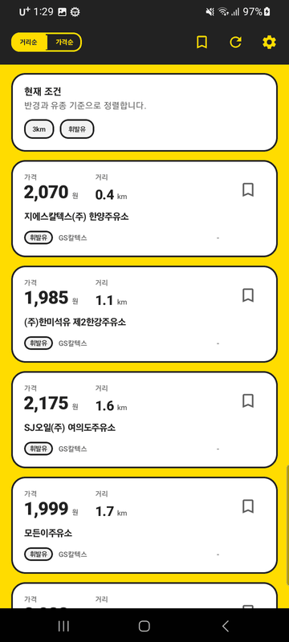
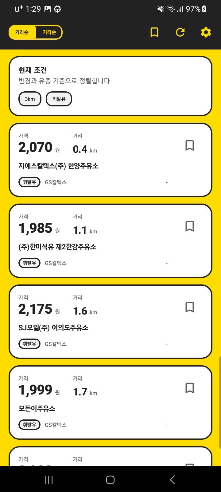
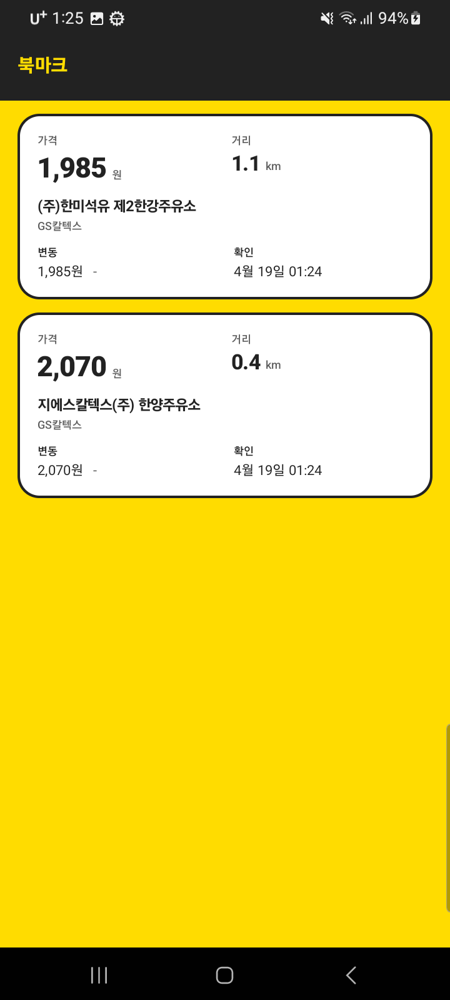
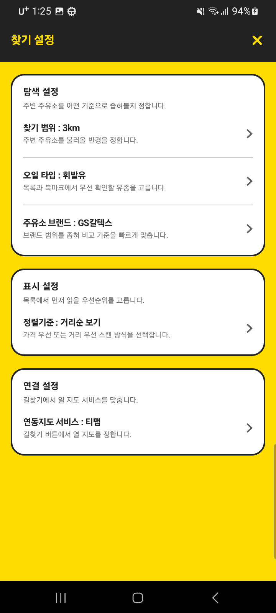
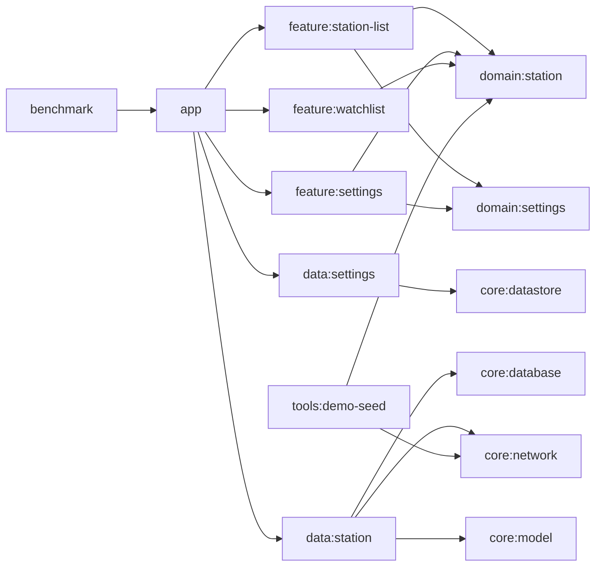

# 주유주유소

현재 위치 기반 주유소 목록, stale 캐시 fallback, watchlist(북마크) 비교, 외부 지도 연동을 한 흐름으로 묶은 멀티모듈 Compose Android 프로젝트입니다. `demo`는 재현 가능한 고정 실행 경로를, `prod`는 실제 Opinet 조회 경로를 제공합니다.

## 미리보기

`prod` 기준 주요 화면입니다.

<p align="center">
  
  
  
  
</p>

## 빠른 요약

| 항목 | 내용 |
| --- | --- |
| 사용자 플로우 | 현재 위치 조회 -> 목록 확인 -> 북마크 저장 -> watchlist 비교 -> 외부 지도 열기 |
| 구조 | `app / feature / domain / data / core / tools / benchmark` 멀티모듈 |
| 런타임 | 재현 가능한 `demo`, 실제 API 키 기반 `prod` |
| 저장 | `station_cache`, `station_cache_snapshot`, `station_price_history`, `watched_station` |
| 데이터 | `prod`는 Opinet, `demo`는 승인된 seed JSON 자산 |
| 검증 | 단위 테스트, Compose/Robolectric, 기기 UI 테스트, 매크로벤치마크 |

## 이 저장소가 보여주는 것

- `app`은 조립만 담당하고, 화면 상태는 `feature`, 계약은 `domain`, 저장소 구현은 `data`, 공유 인프라는 `core`에 둡니다.
- `station_cache_snapshot`과 `StationSearchResult.hasCachedSnapshot`으로 "성공한 빈 결과"와 "캐시 자체가 없음"을 구분합니다.
- 목록은 stale 결과를 유지하고, watchlist는 최신 캐시가 없어도 저장 항목과 가격 히스토리로 비교 화면을 복원합니다.
- 설정 메인 화면과 상세 선택 화면은 route는 다르지만 같은 `SettingsViewModel` 상태를 공유합니다.
- `prod` 검색 파이프라인은 로컬 KATEC 좌표 변환 + Opinet 호출만 사용하고, `demo`는 같은 규칙을 seed 데이터로 재현합니다.

## 아키텍처 한눈에



구조와 데이터 흐름 상세 설명은 [아키텍처 문서](docs/architecture.md)에 정리했습니다.

## 핵심 사용자 플로우

1. `StationListRoute`가 권한 상태와 GPS 상태를 관찰하고 `StationListViewModel`에 반영합니다.
2. ViewModel은 현재 좌표와 `UserPreferences`를 합쳐 `StationQuery`를 만들고 저장소 읽기 모델을 구독합니다.
3. `prod` 새로고침 성공 시 Room 스냅샷과 가격 히스토리가 갱신되고, 실패 시 기존 스냅샷은 유지됩니다. `demo`는 startup 시 적재된 seed 스냅샷으로 같은 규칙을 재현합니다.
4. 목록에서 저장한 주유소는 watchlist 화면에서 가격 변화와 거리 기준으로 다시 비교할 수 있습니다.
5. 주유소 카드 클릭 시 사용자가 선택한 외부 지도 앱으로 길찾기를 엽니다.

## 실행 모드

| 모드 | 목적 | 런타임 특징 | 빌드 |
| --- | --- | --- | --- |
| `demo` | 같은 시작 상태를 반복 재현 | 앱 시작 시 seed DB 적재, 선호 초기화, 강남역 2번 출구 고정 좌표 | `./gradlew :app:assembleDemoDebug` |
| `prod` | 실제 API 키와 기기 상태로 동작 | 앱 시작 시 `opinet.apikey` 존재 확인, 실제 위치/네트워크 사용 | `./gradlew :app:assembleProdDebug` |

`prod` 앱을 실제로 실행하려면 `opinet.apikey`가 필요합니다. 빌드는 빈 값으로도 가능하지만, 앱 시작 시 `ProdSecretsStartupHook`가 누락을 바로 실패로 처리합니다.

```properties
# ~/.gradle/gradle.properties 또는 프로젝트 gradle.properties
opinet.apikey=your-opinet-key
```

demo seed를 다시 생성하려면 아래 태스크를 사용합니다.

```bash
./gradlew :tools:demo-seed:generateDemoSeed
```

seed 생성과 `prod` 런타임 검색은 모두 `opinet.apikey`만 사용합니다.

## 문서 지도

- [프로젝트 읽기 가이드](docs/project-reading-guide.md): 처음 읽을 때 어떤 문서와 어떤 코드부터 볼지 정리합니다.
- [아키텍처](docs/architecture.md): 모듈 책임, 런타임 흐름, flavor 차이를 설명합니다.
- [모듈 계약](docs/module-contracts.md): 각 모듈의 소유 범위와 변경 경계를 고정합니다.
- [상태 모델](docs/state-model.md): 영속 상태, 세션 상태, 읽기 모델, UI effect를 구분해 설명합니다.
- [오프라인 전략](docs/offline-strategy.md): 캐시 스냅샷, stale 판정, refresh 실패, watchlist fallback을 다룹니다.
- [테스트 전략](docs/test-strategy.md): 어떤 층을 어떤 테스트로 검증하는지 설명합니다.
- [검증 매트릭스](docs/verification-matrix.md): 실제로 어떤 Gradle 명령을 돌리면 되는지 정리합니다.

## 검증

빠른 로컬 확인:

```bash
./gradlew :app:assembleDemoDebug :app:testDemoDebugUnitTest :benchmark:assemble
```

기기 기반 UI 확인:

```bash
./gradlew :app:connectedDemoDebugAndroidTest
```

전체 명령과 상황별 기준은 [검증 매트릭스](docs/verification-matrix.md)를 따릅니다.
