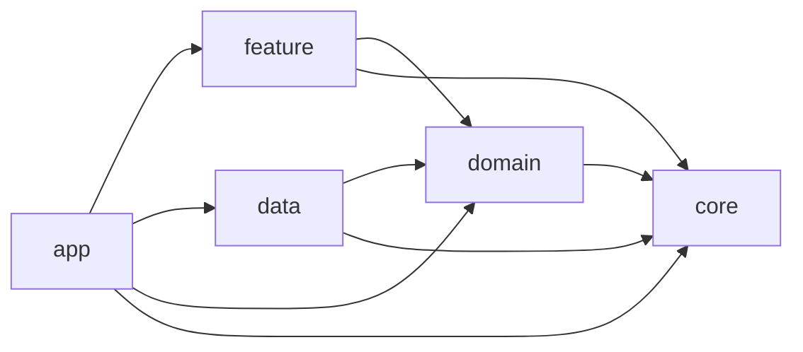

# 주유주유소

위치 권한, 실시간 주유소 조회, 오프라인 fallback, 관심 주유소 비교를 한 흐름으로 묶은 멀티모듈 Compose Android 프로젝트입니다.

## 미리보기

`prod` 기준 주요 화면입니다.

<p align="center">
  
  
  
</p>

## 빠른 포인트

| 항목 | 내용 |
| --- | --- |
| UI | Compose 기반 목록, 설정, 북마크 비교 흐름 |
| 구조 | `app / feature / domain / data / core` 멀티모듈 분리 |
| 데이터 | Opinet 조회 결과 + Room snapshot/history + watchlist |
| 실행 경로 | 재현 가능한 `demo`, 실제 키 기반 `prod` |
| 검증 | 단위 테스트, UI 테스트, benchmark 문서화 |

## 이 프로젝트가 보여주는 것

- `app / feature / domain / data / core` 책임 분리를 코드와 문서에 맞춰 유지합니다.
- `demo`와 `prod`를 분리해 재현 가능한 실행 경로와 실제 실행 경로를 함께 설명합니다.
- Room snapshot + price history 조합으로 stale fallback과 watchlist 비교를 구현합니다.
- 테스트 전략, benchmark 범위, 검증 기준을 문서로 고정합니다.

## 아키텍처 한눈에



상세 그래프와 책임 설명은 [아키텍처 문서](docs/architecture.md)에 정리했습니다.

## 핵심 사용자 플로우

1. 현재 위치 기준 주유소 검색
2. 가격 변화와 관심 주유소 저장
3. 관심 주유소 비교 화면 진입

## 기술 판단 포인트

- `demo`는 고정 위치와 seed 자산으로 재현 가능한 시작 상태를 제공하고, `prod`는 실제 API 키와 기기 상태를 그대로 사용합니다.
- 조회 결과는 Room snapshot과 price history를 함께 저장해 "마지막 성공 결과 유지"와 "가격 변화 표시"를 동시에 만족시킵니다.
- 검색 반경과 유종은 캐시 키에 반영하고, 브랜드 필터와 정렬은 읽기 모델에서 적용해 재조회 비용과 UI 반응성을 분리합니다.

## 실행 모드

| 모드 | 목적 | 빌드 |
| --- | --- | --- |
| `demo` | API 키 없이 같은 시작 상태를 재현하는 고정 실행 경로 | `./gradlew :app:assembleDemoDebug` |
| `prod` | 실제 API 키와 기기 상태로 동작하는 실행 경로 | `./gradlew :app:assembleProdDebug` |

`demo` flavor는 강남역 2번 출구 고정 위치와 승인된 seed 자산으로 같은 시작 상태를 만듭니다. `prod` flavor는 `opinet.apikey`가 필요합니다.

예시:

```properties
# ~/.gradle/gradle.properties 또는 프로젝트 gradle.properties
opinet.apikey=your-opinet-key
```

시드를 다시 생성하려면 `./gradlew :tools:demo-seed:generateDemoSeed`를 실행합니다. seed 생성과 앱 런타임 검색은 현재 `opinet.apikey`만 사용합니다.

## 문서

- [프로젝트 읽기 가이드](docs/project-reading-guide.md)
- [아키텍처](docs/architecture.md)
- [모듈 계약](docs/module-contracts.md)
- [상태 모델](docs/state-model.md)
- [오프라인 전략](docs/offline-strategy.md)
- [테스트 전략](docs/test-strategy.md)
- [검증 매트릭스](docs/verification-matrix.md)

## 검증

| 범위 | 설명 |
| --- | --- |
| Unit | 가격 변화 계산, 캐시 정책, 설정/도메인 상태 전이 검증 |
| UI | 대표 데모 플로우에서 저장 후 비교 화면 진입 확인 |
| Benchmark | `demo` 기준 cold start와 주요 경로 assemble/측정 지원 |

- 모든 Gradle 검증은 Java 17 기준입니다.
- 빠른 assemble 확인은 `./benchmark/run-demo-benchmark.sh`로 수행합니다.
- 전체 신뢰 기준과 상세 명령은 [검증 매트릭스](docs/verification-matrix.md)에 고정합니다.

## 완료 기준 점검표

- [x] `demo` flavor는 API 키 없이 실행할 수 있다
- [x] `prod` flavor 문서에 필요한 로컬 시크릿이 정리되어 있다
- [x] 아키텍처 다이어그램이 현재 모듈 그래프를 반영한다
- [x] 오프라인 / 오래된 데이터 동작이 문서화되어 있다
- [x] 가격 변화, 관심 저장, 비교 화면까지 포함한 대표 사용자 흐름이 있다
