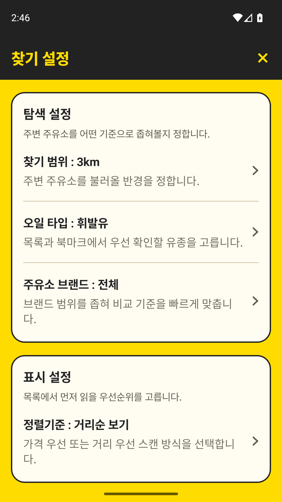
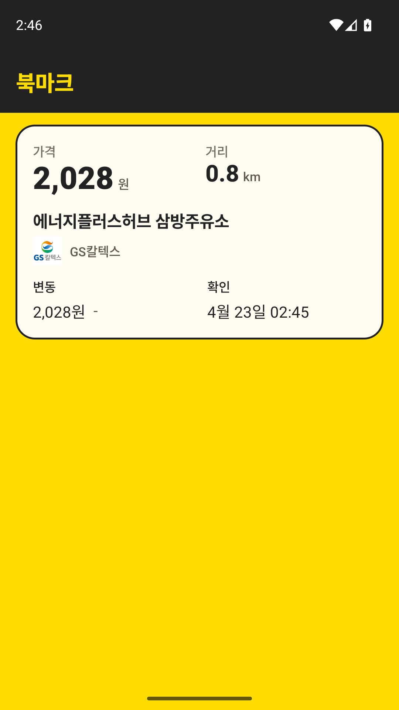
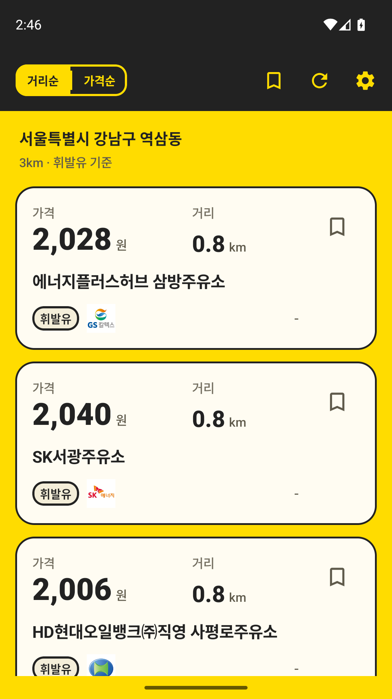
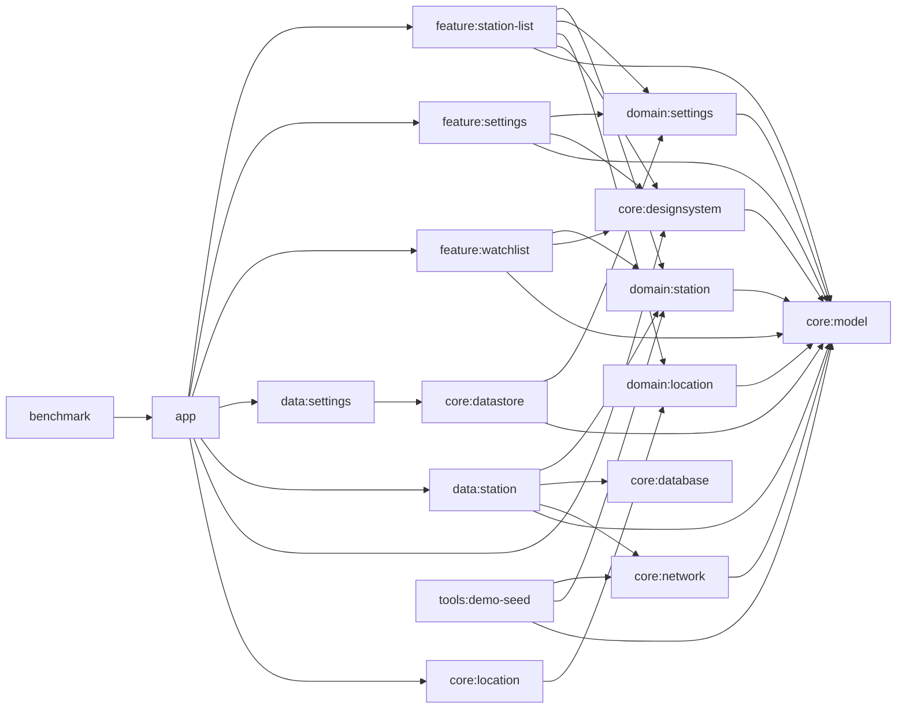

# 주유주유소

주유주유소는 Jetpack Compose, Hilt, Coroutines, Flow, Room, ViewModel, Material Design, MVVM 아키텍처를 활용해 현재 위치 기반 주유소 탐색부터 stale 캐시 fallback, watchlist(북마크) 비교, 외부 지도 연동까지 하나의 흐름으로 구현한 멀티모듈 Android 프로젝트입니다. `demo`는 재현 가능한 고정 실행 경로를, `prod`는 실제 Opinet Open API 연동 경로를 제공합니다.

## 미리보기

`prod` 기준 주요 화면입니다.

<p align="center">
  
  
  
</p>

## 빠른 요약

| 항목 | 내용 |
| --- | --- |
| 사용자 플로우 | 현재 위치 조회 -> 목록 확인 -> 북마크 저장 -> watchlist 비교 -> 외부 지도 열기 |
| 구조 | `app / feature / domain / data / core / tools / benchmark` 멀티모듈 |
| 런타임 | 재현 가능한 `demo`, 실제 Opinet Open API 키 기반 `prod` |
| 저장 | `station_cache`, `station_cache_snapshot`, `station_price_history`, `watched_station` |
| 데이터 | `prod`는 실시간 Opinet API 응답, `demo`는 승인된 seed JSON 자산 |
| 검증 | 단위 테스트, Compose/Robolectric, 기기 UI 테스트, 매크로벤치마크 |

## 이 저장소가 보여주는 것

- `app`은 조립만 담당하고, 화면 상태는 `feature`, 계약은 `domain`, 저장소 구현은 `data`, 공유 인프라는 `core`에 둡니다.
- 위치 경계는 `domain:location` 계약과 `core:location` 구현으로 나눠, `feature:station-list`가 Android 위치 인프라를 직접 알지 않게 유지합니다.
- 현재 위치 주소는 지오코더가 반환한 전체 주소를 그대로 노출하지 않고, 행정동 단위의 짧은 라벨로 정규화해 목록 상단에 표시합니다.
- `station_cache_snapshot`과 `StationSearchResult.hasCachedSnapshot`으로 "성공한 빈 결과"와 "캐시 자체가 없음"을 구분합니다.
- 목록은 stale 결과를 유지하고, 일시적 `Timeout`/`Network` 실패는 `data:station`에서 1회 재시도합니다. 성공한 refresh는 7일 보관 기준으로 오래된 캐시를 정리하고, watchlist는 최신 캐시가 없어도 저장 항목과 가격 히스토리로 비교 화면을 복원합니다.
- `StationListViewModel`은 최종 UI state/effect 조합에 집중하고, 위치 상태는 `LocationStateMachine`, query/cache/failure 판단은 `StationSearchOrchestrator`, refresh retry는 `StationRetryPolicy`가 맡습니다.
- `StationEventLogger`는 refresh 성공, watch toggle, watchlist 비교 표시, 외부 지도 handoff 요청, refresh 실패, 위치 실패, retry 결과를 구조화된 이벤트로 남깁니다. 로깅 중 일반 예외는 사용자 흐름을 실패로 바꾸지 않게 격리하지만, cancellation과 fatal error는 삼키지 않습니다.
- 주유소 목록 카드는 가격과 거리 가독성을 우선하고, 유종 chip 옆에는 브랜드 텍스트 없이 브랜드 아이콘만 배치합니다.
- `Brand`, `FuelType`, `SearchRadius` 같은 공유 enum vocabulary는 `core:model`에 두어 settings, network, designsystem이 `domain:station`을 거치지 않고 사용합니다.
- `core:designsystem`의 metric, supporting-info, row, guidance primitive와 브랜드 표시 라벨을 station list, watchlist, settings가 공유해 같은 정보 위계를 반복합니다.
- 설정 메인 화면과 상세 선택 화면은 route는 다르지만 같은 `SettingsViewModel` 상태를 공유하고, 쓰기는 explicit domain use case로만 흘립니다.
- `prod` 검색 파이프라인은 로컬 KATEC 좌표 변환 + Opinet 호출만 사용하고, `demo`는 같은 규칙을 seed 데이터로 재현합니다.

## 아키텍처 한눈에



구조와 데이터 흐름 상세 설명은 [아키텍처 문서](docs/architecture.md)에 정리했습니다.

## 핵심 사용자 플로우

1. `StationListRoute`가 권한 상태를 전달하고 foreground 구간에서 위치 availability를 수집해 `StationListViewModel`에 반영합니다.
2. ViewModel은 `domain:location` 유스케이스와 `UserPreferences`를 조합해 검색 입력만 담는 `StationQuery`를 만들고 저장소 읽기 모델을 구독합니다. 현재 좌표가 유지된 상태에서 반경, 유종, 브랜드, 정렬 조건이 바뀌면 active query를 새 조건으로 갱신하고 refresh를 요청합니다.
3. 현재 주소 라벨은 `core:location`에서 행정동 중심으로 정규화하고, 목록 화면은 `대한민국`, `KR`, 건물 동 같은 지오코더 잡음을 다시 걸러 짧게 보여줍니다.
4. `prod` 새로고침 성공 시 Room 스냅샷과 가격 히스토리가 갱신되고 오래된 캐시는 정리되며, 실패 시 기존 스냅샷은 유지됩니다. `Timeout`/`Network` 실패는 500ms 뒤 한 번 재시도하고, `demo`는 고정 좌표 + seed 기반 remote source로 같은 갱신 규칙을 재현합니다.
5. 목록에서 저장한 주유소는 watchlist 화면에서 가격 변화와 거리 기준으로 다시 비교할 수 있습니다.
6. 주유소 카드 클릭 시 사용자가 선택한 외부 지도 앱으로 길찾기 handoff를 요청합니다.

## 실행 모드

| 모드 | 목적 | 런타임 특징 | 빌드 |
| --- | --- | --- | --- |
| `demo` | 같은 시작 상태를 반복 재현 | 앱 시작 시 seed DB 적재, 선호 초기화, 강남역 2번 출구 고정 좌표. API 키가 필요 없습니다. | `./gradlew :app:assembleDemoDebug` |
| `prod` | 실제 API 키와 기기 상태로 동작 | 앱 시작 시 사용자 로컬 `opinet.apikey` 존재 확인, 실제 위치/네트워크 사용 | `./gradlew :app:assembleProdDebug` |

`prod` 앱을 실제로 실행하려면 발급받은 `opinet.apikey`가 필요합니다. `demo` 실행에는 키가 필요 없고, `prod` 빌드는 빈 값으로도 가능하지만 앱 시작 시 `ProdSecretsStartupHook`가 누락을 바로 실패로 처리합니다. 키는 버전 관리되는 프로젝트 루트 `gradle.properties`에 쓰지 말고 사용자별 `~/.gradle/gradle.properties`에 두거나 Gradle 실행 시 `-Popinet.apikey=<issued-key>`로 전달합니다. 참고할 공식 페이지는 [오피넷 홈페이지](https://www.opinet.co.kr)와 [오피넷 Open API 소개](https://www.opinet.co.kr/user/custapi/openApiIntro.do)입니다.

현재 `prod` 키는 Android 클라이언트 `BuildConfig`로 주입되므로 APK 내부의 완전한 비밀 경계가 아닙니다. 포트폴리오/reference 앱에서는 이 단순화를 수용하지만, 공개 배포나 quota 비용이 큰 운영 환경에서는 backend proxy, key restriction, quota monitoring을 먼저 설계해야 합니다. 앱은 로컬 캐시, 가격 히스토리, watchlist, 설정을 Android backup/data extraction 대상으로 내보내지 않도록 backup을 비활성화합니다.

```properties
# ~/.gradle/gradle.properties
opinet.apikey=
```

demo seed를 다시 생성하려면 아래 태스크를 사용합니다.

```bash
./gradlew :tools:demo-seed:generateDemoSeed
```

seed 생성과 `prod` 런타임 검색은 모두 `opinet.apikey`만 사용합니다.

## 문서 지도

- [디자인 컨텍스트](.impeccable.md): 포트폴리오/review 성격, yellow/black/white 정보 위계, UI 유지 기준을 설명합니다.
- [프로젝트 읽기 가이드](docs/project-reading-guide.md): 처음 읽을 때 어떤 문서와 어떤 코드부터 볼지 정리합니다.
- [아키텍처](docs/architecture.md): 모듈 책임, 런타임 흐름, flavor 차이를 설명합니다.
- [모듈 계약](docs/module-contracts.md): 각 모듈의 소유 범위와 변경 경계를 고정합니다.
- [상태 모델](docs/state-model.md): 영속 상태, 세션 상태, 읽기 모델, UI effect를 구분해 설명합니다.
- [오프라인 전략](docs/offline-strategy.md): 캐시 스냅샷, stale 판정, refresh 실패, watchlist fallback을 다룹니다.
- [테스트 전략](docs/test-strategy.md): 어떤 층을 어떤 테스트로 검증하는지 설명합니다.
- [검증 매트릭스](docs/verification-matrix.md): 실제로 어떤 Gradle 명령을 돌리면 되는지 정리합니다.
- `docs/superpowers/specs/`, `docs/superpowers/plans/`: 완료되었거나 진행했던 설계/구현 계획의 이력을 보관합니다.

## 검증

빠른 로컬 확인:

```bash
./gradlew \
  :core:designsystem:testDebugUnitTest \
  :feature:station-list:testDebugUnitTest \
  :feature:watchlist:testDebugUnitTest \
  :feature:settings:testDebugUnitTest \
  :app:assembleDemoDebug \
  :app:testDemoDebugUnitTest \
  :benchmark:assemble
```

기기 기반 UI 확인:

```bash
./gradlew :app:connectedDemoDebugAndroidTest
```

전체 명령과 상황별 기준은 [검증 매트릭스](docs/verification-matrix.md)를 따릅니다.
