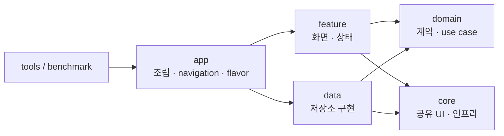

# 주유주유소 (GasStation)

[](https://github.com/beyondwin/GasStation/actions/workflows/android.yml)
[](LICENSE)
[](https://kotlinlang.org)
[](https://developer.android.com/jetpack/compose/bom)
[](https://developer.android.com/about/versions)

한국 운전자가 가까운 주유소를 가격, 거리, 브랜드, 유종, 관심 목록으로 비교하고 외부 지도로 보내는 Android 앱이다. 18-module 구조이며 `demo`는 같은 시작 상태를 반복하고, `prod`는 실제 Opinet Open API를 쓴다.

## 미리보기

<p align="center">
  
  
  
</p>

## 한눈에

| 항목 | 내용 |
| --- | --- |
| 흐름 | 위치 → 주변 비교 → 관심 저장 → 관심 비교 → 외부 지도 |
| 구조 | `app / feature / domain / data / core / tools / benchmark` |
| 실행 | 재현 가능한 `demo`, Opinet 키 기반 `prod` |
| 버전 | `1.5.0` (`versionCode` 11) |
| 저장 | `station_cache`, `station_cache_snapshot`, `station_price_history`, `watched_station` |

가격이 카드의 첫 읽기 대상이다. 거리, 역명, 브랜드, 유종, 관심, freshness는 그 결정을 돕는 정보다.

실패해도 마지막 성공 목록을 버리지 않는다.

<!-- station-data-policy-ref: retry -->[오프라인 전략의 구조화된 `retry` 계약](docs/offline-strategy.md#기계-판독-정책-계약)

목록 상태는 `LocationStateMachine`, `StationSearchOrchestrator`, `RefreshCoordinator`, `StationListCommandQueue`가 나누고, `StationListStateAssembler`가 최종 화면 상태를 만든다.

<!-- station-list-state-contract-ref -->[상태 모델의 구조화된 station-list 계약](docs/state-model.md#station-list-결정적-상태-계약)

## 레이어

자주 바뀌지 않는 방향만 그린다. 18개 모듈의 직접 의존은 [아키텍처](docs/architecture.md#모듈-그래프)가 맞는다.


```mermaid
flowchart LR
    App["app<br/>조립 · navigation · flavor"] --> Feature["feature<br/>화면 · 상태"]
    App --> Data["data<br/>저장소 구현"]
    Feature --> Domain["domain<br/>계약 · use case"]
    Data --> Domain
    Feature --> Core["core<br/>공유 UI · 인프라"]
    Data --> Core
    Tools["tools / benchmark"] --> App
```

## 실행

| 모드 | 쓰는 이유 | 특징 | 빌드 |
| --- | --- | --- | --- |
| `demo` | 같은 시작 상태를 반복 | 권한 허용 뒤에만 강남역 2번 출구 고정 좌표. API 키 없음 | `./gradlew :app:assembleDemoDebug` |
| `prod` | 실제 위치와 API | 시작 시 `opinet.apikey`가 없으면 바로 실패 | `./gradlew :app:assembleProdDebug` |

`prod` 실행에는 발급받은 키가 필요하다. 저장소 `gradle.properties`에 넣지 말고 `~/.gradle/gradle.properties`나 `-Popinet.apikey=<issued-key>`로 넘긴다. [오피넷](https://www.opinet.co.kr), [Open API](https://www.opinet.co.kr/user/custapi/openApiIntro.do).

키는 Android `BuildConfig`로 들어간다. 한계와 승격 조건은 [보안](docs/security-trade-offs.md)을 본다. 앱은 로컬 캐시/설정을 Android backup으로 내보내지 않는다.

공개 배포용 proxy 빌드는 `-Pgasstation.stationEndpointMode=proxy -Pgasstation.proxyBaseUrl=<https-url>`이다. 체크인된 기본값은 `direct`다.

```properties
# ~/.gradle/gradle.properties
opinet.apikey=
```

체크인된 demo seed는 키 없이 검사한다.

```bash
./gradlew :tools:demo-seed:verifyDemoSeedAsset
```

실제 Opinet 데이터로 seed를 다시 만들 때만 아래를 쓴다.

```bash
./gradlew :tools:demo-seed:generateDemoSeed
```

키가 없을 때 기존 asset으로 조용히 넘어가지 않는다.

새로고침이 실패해도 기존 스냅샷은 유지한다.

<!-- station-data-policy-ref: retry -->[오프라인 전략의 구조화된 `retry` 계약](docs/offline-strategy.md#기계-판독-정책-계약)

## 릴리스

지금 버전은 `1.5.0`이다. 요약은 [CHANGELOG](CHANGELOG.md), APK는 [GitHub Releases](https://github.com/beyondwin/GasStation/releases), 발행은 [배포](docs/deployment.md)를 본다.

- [Unreleased](CHANGELOG.md#unreleased)
- [1.5.0](docs/release-notes/2026-08-29-v1.5.0.md)
- [1.4.0](docs/release-notes/2026-07-31-v1.4.0.md)
- [1.3.0](docs/release-notes/2026-07-25-v1.3.0.md)

이전 노트는 [릴리스 노트](docs/release-notes/README.md)다.

## 문서

전체 지도는 [문서 허브](docs/README.md)다. 코드는 [읽기 가이드](docs/project-reading-guide.md), 작업 순서는 [작업 절차](docs/agent-workflow.md)를 본다.

`docs/superpowers/`, `docs/history/`, `docs/improvements/`는 이력이다. 지금 계약을 여기서 판단하지 않는다.

## 성능

숫자는 물리 기기 `demoBenchmark` 결과다. 에뮬레이터는 smoke만 한다. 재현 명령은 [성능](docs/performance.md)에 있다.

| Hero journey | Primary metric | p50 | p95 |
| --- | --- | --- | --- |
| Startup to first content | startup (`timeToInitialDisplayMs`) | 347 ms | 393 ms |
| Startup to first content | startup (`timeToFullDisplayMs`) | 546 ms | 622 ms |
| List scroll | frame (`frameDurationCpuMs`) | 3.84 ms/frame | 6.83 ms/frame |
| Refresh | frame (`frameDurationCpuMs`) | 3.83 ms/frame | 6.05 ms/frame |

Samsung Galaxy S20+ 5G (`SM-G986N`, Android 13 / API 33), `demoBenchmark`, 2026-05-18.

## 검증

어떤 명령을 돌릴지는 [검증 매트릭스](docs/verification-matrix.md)가 맞는다. 기기, 빌드 입력, 릴리스, 성능은 [런북](docs/runbooks/README.md)을 본다.

GitHub Actions `Android CI`는 PR에서 `agent-contracts`, `static-analysis`, `unit-tests`, `screenshot-tests`, `assemble`, `coverage`, `mutation`을 돌린다. `v*` 태그에서는 이 job이 모두 성공한 뒤에만 GitHub Release에 demo debug APK, unsigned prod release APK, SHA-256 checksum을 올린다.
