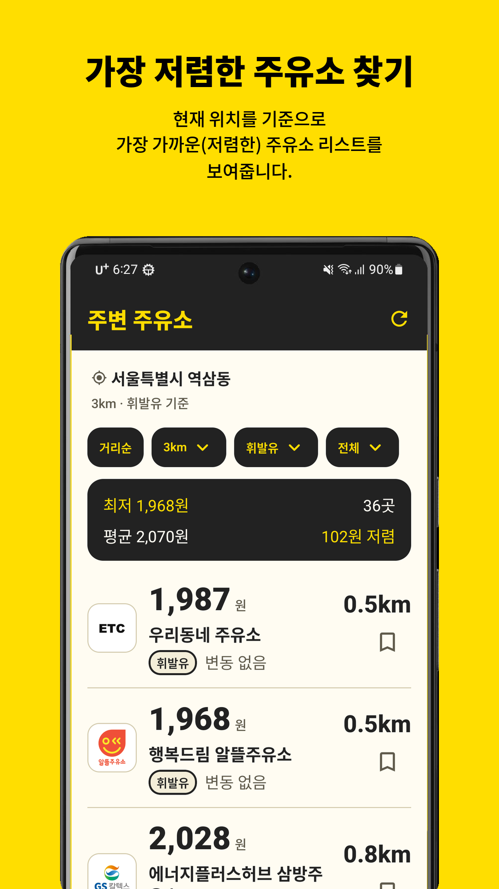
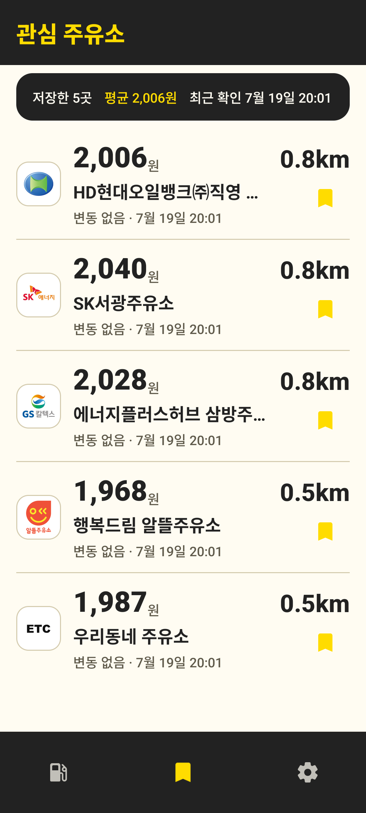
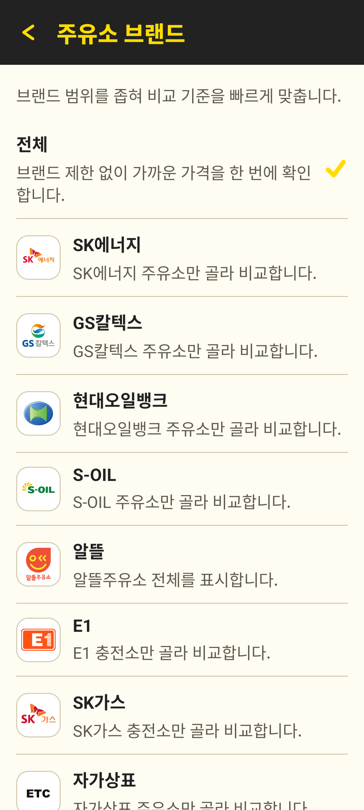
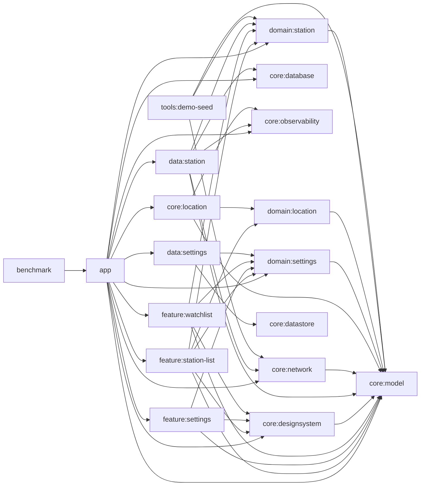

# 주유주유소 (GasStation)

[](https://github.com/beyondwin/GasStation/actions/workflows/android.yml)
[](LICENSE)
[](https://kotlinlang.org)
[](https://developer.android.com/jetpack/compose/bom)
[](https://developer.android.com/about/versions)

> GasStation is a Korean Android app that helps drivers compare nearby gas stations by current location, price, distance, brand, fuel type, and watchlist state, then hands off to the user's preferred external map for turn-by-turn navigation. The codebase ships an 18-module Clean Architecture setup with Jetpack Compose, Hilt, Room, and a deterministic `demo` flavor that mirrors the real Opinet API path.

---

주유주유소는 Jetpack Compose, Hilt, Coroutines, Flow, Room, ViewModel, Material Design, MVVM 아키텍처를 활용해 현재 위치 기반 주유소 탐색부터 stale 캐시 fallback, watchlist(북마크) 비교, 외부 지도 연동까지 하나의 흐름으로 구현한 멀티모듈 Android 프로젝트입니다. `demo`는 재현 가능한 고정 실행 경로를, `prod`는 실제 Opinet Open API 연동 경로를 제공합니다.

## 미리보기

재현 가능한 `demo` 경로의 Urban Signal UI와 외부 지도 handoff를 담은 랜딩형 미리보기입니다.

<p align="center">
  
  
  
</p>

## 빠른 요약

| 항목 | 내용 |
| --- | --- |
| 사용자 플로우 | 현재 위치 조회 -> 주변 목록 확인 -> 관심 저장 -> 관심 목록 비교 -> 외부 지도 열기 |
| 구조 | `app / feature / domain / data / core / tools / benchmark` 멀티모듈 |
| 런타임 | 재현 가능한 `demo`, 실제 Opinet Open API 키 기반 `prod` |
| 현재 앱 버전 | `1.4.0` (`versionCode` 10) |
| 저장 | `station_cache`, `station_cache_snapshot`, `station_price_history`, `watched_station` |
| 데이터 | `prod`는 실시간 Opinet API 응답, `demo`는 승인된 seed JSON 자산 |
| 검증 | 단위 테스트, Compose/Robolectric, 기기 UI 테스트, 매크로벤치마크 |

## 이 저장소가 보여주는 것

- `app`은 조립만 담당하고, 화면 상태는 `feature`, 계약은 `domain`, 저장소 구현은 `data`, 공유 인프라는 `core`에 둡니다.
- 위치 경계는 `domain:location` 계약과 `core:location` 구현으로 나눠, `feature:station-list`가 Android 위치 인프라를 직접 알지 않게 유지합니다.
- `demo`와 `prod`는 같은 위치 권한 상태기를 사용합니다. 권한 거부는 demo 고정 좌표, 기존 좌표, 캐시 결과, 자동/수동 refresh보다 먼저 Nearby를 권한 안내로 전환하며, approximate 또는 precise grant 뒤에만 demo 고정 좌표가 공급됩니다.
- 현재 위치 주소는 지오코더가 반환한 전체 주소를 그대로 노출하지 않고, `domain:location`의 순수 정규화 규칙으로 행정동 단위의 짧은 라벨을 만들어 목록 상단에 표시합니다.
- `station_cache_snapshot`과 `StationSearchResult.hasCachedSnapshot`으로 "성공한 빈 결과"와 "캐시 자체가 없음"을 구분합니다.
- 목록은 stale 결과와 실패 시 기존 스냅샷을 유지합니다. 성공한 refresh는 보관 정책에 따라 오래된 캐시를 정리하고, watchlist는 최신 캐시가 없어도 저장 항목과 가격 히스토리로 비교 화면을 복원합니다.
  <!-- station-data-policy-ref: retry -->[오프라인 전략의 구조화된 `retry` 계약](docs/offline-strategy.md#기계-판독-정책-계약)
- `StationListViewModel`은 최종 UI state/effect 조합에 집중하고, 위치 상태는 `LocationStateMachine`, query/cache/failure 판단은 `StationSearchOrchestrator`, refresh retry는 `StationRetryPolicy`가 맡습니다.
- `StationEventLogger`는 refresh 성공, watch toggle, watchlist 비교 표시, 외부 지도 handoff 요청, refresh 실패, 위치 실패, retry 결과를 구조화된 이벤트로 남깁니다. `CrashReporter` 같은 비치명 예외 보고 계약은 `core:observability`가 소유하고, 앱이 flavor별 구현을 바인딩합니다.
- 주변 주유소는 테두리 없는 price-first row로 보여주며, 가격을 32sp hero로 두고 거리·역명·유종·실제 브랜드 로고를 보조 정보로 배치합니다. 상단 요약은 최저가·검색 건수와 평균가·절약액을 두 줄로 압축하고, 반경·유종·브랜드 chip은 같은 anchored menu 패턴을 사용합니다. 가격 이력은 보조 `가격` label이나 `-` 대신 `가격 이력 없음`, `변동 없음`, `▲ N원`, `▼ N원`을 명시합니다.
- `#FFFCF2` canvas, `#222222` black chrome, `#FFDC00` yellow signal을 공통 토큰으로 사용하고 icon-only `주변·관심·설정` bottom navigation을 유지합니다. 탭 이름, 선택/비활성 상태, 48dp touch target은 접근성 semantics로 보존하고 설정 상세에서는 bottom navigation을 숨깁니다.
- 관심 목록은 108–116dp 기본 row에 28sp 가격과 실제 브랜드 로고를 배치해 360dp × 800dp에서 다섯 개 완전한 행을 보여줍니다. 200% 글꼴에서는 행이 확장되고 화면이 스크롤됩니다.
- `Coordinates.distanceTo`, `Brand.fromCode`, `Brand`, `FuelType`, `SearchRadius` 같은 값 객체 행동과 공유 vocabulary는 `core:model`에 두어 data, settings, network, designsystem이 `domain:station`을 거치지 않고 사용합니다.
- `core:designsystem`의 Urban Signal token, metric, row, guidance primitive와 실제 브랜드 drawable mapping을 station list, watchlist, settings가 공유해 같은 정보 위계를 반복합니다. 실제 주유소 identity인 RTO/RTX/NHO는 유지하면서 필터와 설정에서는 `알뜰` 하나로 묶고, `자가상표`는 마지막에 둡니다. RTO/RTX/NHO는 `ic_rtx`, ETC는 `ic_etc`를 사용합니다.
- 설정 메인 화면과 상세 선택 화면은 route는 다르지만 같은 `SettingsViewModel` 상태를 공유하고, 쓰기는 explicit domain use case로만 흘립니다.
- `prod` 검색 파이프라인은 로컬 KATEC 좌표 변환 + Opinet 호출만 사용하고, `demo`는 같은 규칙을 seed 데이터로 재현합니다.

## 아키텍처 한눈에

아래 그래프는 Gradle 프로젝트 간 직접 의존성을 기준으로 그린 모듈 그래프입니다.


```mermaid
flowchart LR
    app["app"] --> fstation["feature:station-list"]
    app --> fsettings["feature:settings"]
    app --> fwatch["feature:watchlist"]
    app --> dstation["data:station"]
    app --> dsettings["data:settings"]
    app --> cdesign["core:designsystem"]
    app --> clocation["core:location"]
    app --> cnetwork["core:network"]
    app --> cdatabase["core:database"]
    app --> cmodel["core:model"]
    app --> cobserve["core:observability"]
    app --> domSettings["domain:settings"]
    app --> domStation["domain:station"]

    fstation --> domSettings
    fstation --> domStation
    fstation --> domLocation["domain:location"]
    fstation --> cdesign
    fstation --> cmodel

    fsettings --> domSettings
    fsettings --> cdesign
    fsettings --> cmodel

    fwatch --> domStation
    fwatch --> domSettings
    fwatch --> cmodel
    fwatch --> cdesign
    cdesign --> cmodel

    dstation --> domStation
    dstation --> cnetwork
    dstation --> cdatabase
    dstation --> cmodel
    dstation --> cobserve

    dsettings --> domSettings
    dsettings --> cstore["core:datastore"]

    cnetwork --> cmodel

    clocation --> domLocation
    clocation --> cmodel
    clocation --> cobserve
    domSettings --> cmodel
    domLocation --> cmodel
    domStation --> cmodel

    tools["tools:demo-seed"] --> cnetwork
    tools --> domStation
    tools --> cmodel
    benchmark["benchmark"] --> app
```

구조와 데이터 흐름 상세 설명은 [아키텍처 문서](docs/architecture.md)에 정리했습니다.

## 핵심 사용자 플로우

1. `StationListRoute`가 권한 상태를 전달하고 foreground 구간에서 위치 availability를 수집해 `StationListViewModel`에 반영합니다. 앱 진입만으로 Android 권한 dialog를 열지 않으며, 사용자가 권한 안내의 CTA를 누를 때만 요청합니다. terminal denial이 반복되면 CTA는 Android 앱 설정 열기로 바뀝니다.
2. DataStore의 첫 `UserPreferences` emission이 Nearby와 Settings의 readiness 경계입니다. 두 화면은 그 emission 전 `UserPreferences.default()`를 렌더링하거나 action에 사용하지 않습니다. Nearby ViewModel은 permission, GPS, 좌표, 선호값이 모두 준비된 뒤에만 검색 입력을 담은 `StationQuery`를 만들고 저장소 읽기 모델을 구독합니다. permission denial은 GPS 비활성화와 별도 안내이며, 어느 flavor에서도 retained coordinate나 캐시 목록을 우회 표시하지 않습니다. 현재 좌표가 유지된 상태에서 반경, 유종, 브랜드, 정렬 조건이 바뀌면 active query를 새 조건으로 갱신하고 refresh를 요청합니다.
3. 현재 주소 라벨은 `domain:location`의 `AddressLabelNormalizer`가 행정동 중심으로 정규화하고, `core:location`은 Android 지오코더 후보를 그 규칙에 통과시킵니다.
4. `prod` 새로고침 성공 시 Room 스냅샷과 가격 히스토리가 갱신되고 오래된 캐시는 정리되며, 실패 시 기존 스냅샷을 유지합니다. `demo`는 고정 좌표 + seed 기반 remote source로 같은 갱신 규칙을 재현합니다.
   <!-- station-data-policy-ref: retry -->[오프라인 전략의 구조화된 `retry` 계약](docs/offline-strategy.md#기계-판독-정책-계약)
5. 목록에서 저장한 주유소는 `주변·관심·설정` bottom navigation의 관심 화면에서 선택 유종의 가격 변화와 거리 기준으로 다시 비교할 수 있습니다. 관심 화면은 반경·브랜드·Nearby 정렬과 무관하게 저장 항목을 유지하며, 선택 유종의 캐시와 이력이 없으면 행을 제거하지 않고 `선택 유종 가격 없음`을 표시합니다.
6. 주유소 행 클릭 시 사용자가 선택한 외부 지도 앱으로 길찾기 handoff를 요청합니다. TMAP·카카오맵·네이버 지도 intent는 대상 package를 명시하고, 네이버 지도에는 runtime application ID를 `appname`으로 전달합니다. 앱 route를 열지 못하면 Play Store app URI, HTTPS Store 순으로 시도하며 최종 실패는 화면 feedback으로 돌아옵니다.

카카오 provider의 현재 이름은 `KAKAO_MAP`입니다. 과거 저장값 `KAKAO_NAVI`는 읽을 때 카카오맵으로 복원하고, 다음 설정 쓰기부터 `KAKAO_MAP`으로 저장합니다.

## 실행 모드

| 모드 | 목적 | 런타임 특징 | 빌드 |
| --- | --- | --- | --- |
| `demo` | 같은 시작 상태를 반복 재현 | 앱 시작 시 seed DB 적재, 선호 초기화. 위치 권한 grant 뒤에만 강남역 2번 출구 고정 좌표를 공급합니다. API 키가 필요 없습니다. | `./gradlew :app:assembleDemoDebug` |
| `prod` | 실제 API 키와 기기 상태로 동작 | 앱 시작 시 사용자 로컬 `opinet.apikey` 존재 확인, 실제 위치/네트워크 사용 | `./gradlew :app:assembleProdDebug` |

`prod` 앱을 실제로 실행하려면 발급받은 `opinet.apikey`가 필요합니다. `demo` 실행에는 키가 필요 없고, `prod` 빌드는 빈 값으로도 가능하지만 앱 시작 시 `ProdSecretsStartupHook`가 누락을 바로 실패로 처리합니다. 키는 버전 관리되는 프로젝트 루트 `gradle.properties`에 쓰지 말고 사용자별 `~/.gradle/gradle.properties`에 두거나 Gradle 실행 시 `-Popinet.apikey=<issued-key>`로 전달합니다. 참고할 공식 페이지는 [오피넷 홈페이지](https://www.opinet.co.kr)와 [오피넷 Open API 소개](https://www.opinet.co.kr/user/custapi/openApiIntro.do)입니다.

> `prod` 키는 Android 클라이언트 `BuildConfig`로 주입되며, 그 한계와 승격 조건은 [`docs/security-trade-offs.md`](docs/security-trade-offs.md)에 정리되어 있습니다. 앱은 로컬 캐시/설정을 Android backup 대상으로 내보내지 않습니다.
> 앱은 향후 공개 배포를 위해 proxy endpoint mode로 빌드할 수 있습니다(`-Pgasstation.stationEndpointMode=proxy -Pgasstation.proxyBaseUrl=<https-url>`). 체크인된 기본값은 `gasstation.stationEndpointMode=direct`로, Android 중심 `demo`/`prod` 경로의 direct Opinet 접근을 유지합니다.

```properties
# ~/.gradle/gradle.properties
opinet.apikey=
```

체크인된 demo seed가 생성기 계약과 일치하는지는 키나 네트워크 없이 검증합니다. 이 명령은 15개 query matrix, origin/version, history 정합성, 알뜰/자가상표 portfolio station을 확인하며 `:tools:demo-seed:test` CI 경로에서도 같은 asset을 검사합니다.

```bash
./gradlew :tools:demo-seed:verifyDemoSeedAsset
```

실제 Opinet 데이터를 다시 수집해 demo seed를 갱신할 때만 아래 live refresh 태스크를 사용합니다.

```bash
./gradlew :tools:demo-seed:generateDemoSeed
```

live seed refresh와 `prod` 런타임 검색은 모두 `opinet.apikey`만 사용합니다. 키가 없을 때 기존 asset으로 조용히 fallback하지 않으며, deterministic verification은 위 별도 태스크가 담당합니다.

## 릴리즈

- [CHANGELOG](CHANGELOG.md): 버전별 주요 변경 사항을 요약합니다.
- [GitHub Releases](https://github.com/beyondwin/GasStation/releases): 태그별 릴리즈 노트, demo APK, unsigned prod APK, SHA-256 checksum을 게시합니다.
- [배포 절차](docs/deployment.md): release branch, 검증, tag push, GitHub Release 자동 게시, signing/secret 경계를 정리합니다.
- [Unreleased](CHANGELOG.md#unreleased): v1.4.0 이후 변경 사항을 추적합니다.
- [1.4.0 릴리즈 노트](docs/release-notes/2026-07-31-v1.4.0.md): refined droplet launcher/splash, reduced-motion-safe signal pulse, navigation inset 수정, GitHub Release 자동화를 정리합니다.
- [1.3.0 릴리즈 노트](docs/release-notes/2026-07-25-v1.3.0.md): Urban Signal UI, 설정·권한 상태 무결성, 선택 유종 기반 관심 비교, 외부 지도 계약, toolchain·CI 보강을 정리합니다.
- [1.2.0 릴리즈 노트](docs/release-notes/2026-06-07-v1.2.0.md): proxy readiness, DB/remote 입력 검증, refresh transaction, module boundary guard, mutation gate, release-readiness fixes를 정리합니다.
- [1.1.3 릴리즈 노트](docs/release-notes/2026-05-18-v1.1.3.md): hero benchmark evidence, first usable content startup reporting, backend proxy ADR, physical-device performance snapshot, 배포 절차 문서화를 정리합니다.
- [1.1.2 릴리즈 노트](docs/release-notes/2026-05-14-v1.1.2.md): build/test 속도 개선, CI 메모리 안정화, 검증 경로 분리를 정리합니다.
- [1.1.1 릴리즈 노트](docs/release-notes/2026-05-13-v1.1.1.md): clean architecture remediation, observability 경계, station-list/data 분리, CI scope 조정을 정리합니다.
- [1.1.0 릴리즈 노트](docs/release-notes/2026-05-11-v1.1.0.md): production baseline, CI, i18n, screenshot regression, coverage 기반 변경과 검증 결과를 정리합니다.
- [1.0.2 릴리즈 노트](docs/release-notes/2026-05-05-v1.0.2.md): 2026-05-05 deep analysis required fixes와 검증 결과를 정리합니다.
- [1.0.1 릴리즈 노트](docs/release-notes/2026-05-05-v1.0.1.md): 2026-05-05 backlog risk resolution 변경의 상세 내용과 검증 결과를 정리합니다.

## 문서 지도

현재 구조와 실행 명령의 기준은 live 문서와 실제 코드입니다. `docs/superpowers/`, `docs/history/`, `docs/improvements/`는 설계와 분석 이력을 보관하지만 현재 계약을 판단할 때는 아래 live 문서와 `settings.gradle.kts`를 우선합니다.

### 시작과 학습

- [프로젝트 읽기 가이드](docs/project-reading-guide.md): 사람과 에이전트가 목적별로 무엇을 먼저 읽을지 고르는 라우터입니다.
- [개발자 온보딩 가이드](docs/onboarding/developer-onboarding-guide.md): 처음 프로젝트를 맡은 개발자를 위해 제품 목적, 기술 선택 이유, 실제 로직 흐름, 수정 위치, 검증 방법을 순서대로 설명합니다.
- [기여 가이드](CONTRIBUTING.md): 새 기여자가 처음 실행할 명령, 머지 전 검증, 커밋 메시지 기준을 설명합니다.

### 현재 계약

- [작업자 운영 계약](AGENTS.md): 모든 변경에 적용되는 짧은 운영 계약입니다.
- [작업 절차](docs/agent-workflow.md): 변경 목적별 작업 순서, 테스트 선택, 문서 갱신 기준을 설명합니다.
- [아키텍처](docs/architecture.md): 모듈 책임, 런타임 흐름, flavor 차이를 설명합니다.
- [모듈 계약](docs/module-contracts.md): 각 모듈의 소유 범위와 변경 경계를 고정합니다.
- [상태 모델](docs/state-model.md): 영속 상태, 세션 상태, 읽기 모델, UI effect를 구분해 설명합니다.
- [오프라인 전략](docs/offline-strategy.md): 캐시 스냅샷, stale 판정, refresh 실패, watchlist fallback을 다룹니다.
- [테스트 전략](docs/test-strategy.md): 어떤 층을 어떤 테스트로 검증하는지 설명합니다.
- [검증 매트릭스](docs/verification-matrix.md): 실제로 어떤 Gradle 명령을 돌리면 되는지 정리합니다.
- [보안 trade-off](docs/security-trade-offs.md): API key, cleartext, backup, certificate pinning, proxy 승격 조건을 설명합니다.
- [디자인 컨텍스트](.impeccable.md): yellow/black/white 정보 위계, UI 유지 기준을 설명합니다.

### 운영, 릴리스, 성능

- [배포 절차](docs/deployment.md): 릴리스 준비, GitHub PR/tag 흐름, Android release 산출물과 공개 배포 전 보안 gate를 설명합니다.
- [성능](docs/performance.md): hero macrobenchmark 정의, 실기기 측정값, baseline profile 경로와 제약을 정리합니다.
- [Backend proxy ADR](docs/adr/2026-05-18-backend-proxy-escalation.md): Opinet API key를 backend proxy로 승격해야 하는 조건을 기록합니다.
- [CHANGELOG](CHANGELOG.md): 버전별 주요 변경 사항을 요약합니다.
- [릴리즈 노트](docs/release-notes/): 릴리스별 사용자 영향, 개발자 영향, 검증 결과를 보관합니다.

### 이력과 근거

- [심층 분석 리포트](docs/history/deep-analysis-report.md): 완료된 필수 수정과 조건부 승격 항목을 요약합니다.
- [개선 분석](docs/history/improvement-analysis.md): 완료된 backlog 항목과 남은 개선 후보의 기준을 보관합니다.
- `docs/superpowers/specs/`, `docs/superpowers/plans/`: 완료되었거나 진행했던 설계/구현 계획의 이력을 보관합니다.
- `docs/improvements/`: 특정 개선 패스의 설계와 구현 기록을 보관합니다.

## 5분 코드 투어

처음 보는 사람이 코드 흐름을 빠르게 따라가는 권장 경로입니다.

1. `app/src/main/java/com/gasstation/App.kt` — Hilt 진입과 startup hook.
2. `app/src/main/java/com/gasstation/MainActivity.kt` — Compose host와 system bar 정책.
3. `app/src/main/java/com/gasstation/navigation/GasStationNavHost.kt` — destination 그래프.
4. `feature/station-list/src/main/kotlin/com/gasstation/feature/stationlist/StationListRoute.kt` -> `StationListViewModel.kt` — 화면 진입과 ViewModel.
5. `feature/station-list/src/main/kotlin/com/gasstation/feature/stationlist/LocationStateMachine.kt` + `StationSearchOrchestrator.kt` — 위치 상태와 쿼리/캐시/실패 책임 분리.
6. `feature/station-list/src/main/kotlin/com/gasstation/feature/stationlist/StationListScreen.kt`, `StationListCards.kt`, `StationListStates.kt`, `StationListQuerySummary.kt`, `StationListBodyState.kt` — 화면 scaffold, 카드, 상태 화면, query context 분리.
7. `data/station/src/main/kotlin/com/gasstation/data/station/DefaultStationRepository.kt`, `StationSearchResultAssembler.kt`, `WatchlistSummaryAssembler.kt` — Room snapshot + remote fetch orchestration과 읽기 모델 조립.
8. `core/network/src/main/kotlin/com/gasstation/core/network/station/NetworkStationFetcher.kt` — Opinet API와 KATEC 좌표 변환.

각 단계의 책임 분리 근거는 [`docs/architecture.md`](docs/architecture.md)에 있습니다.

## Performance Snapshot

GasStation publishes performance numbers from the deterministic `demo` flavor running hero macrobenchmarks on a physical device. Emulator measurements are used only as smoke checks. The numbers below are the latest committed physical-device run; scenario definitions, device information, and reproduction commands live in [Performance](docs/performance.md).

| Hero journey | Primary metric | p50 | p95 |
| --- | --- | --- | --- |
| Startup to first content | startup (`timeToInitialDisplayMs`) | 347 ms | 393 ms |
| Startup to first content | startup (`timeToFullDisplayMs`) | 546 ms | 622 ms |
| List scroll | frame (`frameDurationCpuMs`) | 3.84 ms/frame | 6.83 ms/frame |
| Refresh | frame (`frameDurationCpuMs`) | 3.83 ms/frame | 6.05 ms/frame |

Measured on Samsung Galaxy S20+ 5G (`SM-G986N`, Android 13 / API 33) with the `demoBenchmark` variant on 2026-05-18. See [Performance](docs/performance.md) for the full table, frame-overrun numbers, selector contracts, physical-device rerun requirements, and the exact commands to reproduce the run.

## 검증

빠른 로컬 확인:

```bash
./gradlew \
  :core:model:test \
  :domain:location:test \
  :core:observability:test \
  :core:designsystem:testDebugUnitTest \
  :feature:station-list:testDebugUnitTest \
  :feature:watchlist:testDebugUnitTest \
  :feature:settings:testDebugUnitTest \
  :app:assembleDemoDebug \
  :app:testDemoDebugUnitTest \
  :app:testProdDebugUnitTest \
  :benchmark:assemble
```

기기 기반 UI 확인:

```bash
ANDROID_SERIAL=<connected-serial> ./gradlew :app:connectedDemoDebugAndroidTest
```

권한 진입/거부/grant와 Android permission controller 상호작용만 집중 확인할 때는 다음 connected class를 실행합니다.

```bash
./gradlew :app:connectedDemoDebugAndroidTest \
  -Pandroid.testInstrumentationRunnerArguments.class=com.gasstation.DemoPermissionFlowTest \
  --warning-mode fail
```

설정의 유종·지도 provider가 관심 화면과 Nearby handoff에 실제로 소비되는지만 집중 확인할 때는 다음 connected class를 실행합니다.

```bash
ANDROID_SERIAL=<connected-serial> ./gradlew :app:connectedDemoDebugAndroidTest \
  -Pandroid.testInstrumentationRunnerArguments.class=com.gasstation.StationPortfolioFlowTest \
  --warning-mode fail
```

전체 명령과 상황별 기준은 [검증 매트릭스](docs/verification-matrix.md)를 따릅니다.
GitHub Actions `Android CI`는 PR에서 `agent-contracts`, `static-analysis`, `unit-tests`, `screenshot-tests`, `assemble`을 실행합니다. `assemble`은 demo/prod debug와 benchmark를 확인하고, `main`/`v*` tag push에서 `release-assemble`과 `coverage`를 추가 실행합니다. `v*` tag에서는 모든 job 성공 뒤 `release-publish`가 demo debug APK, unsigned prod release APK, SHA-256 checksum을 GitHub Release에 게시합니다.
