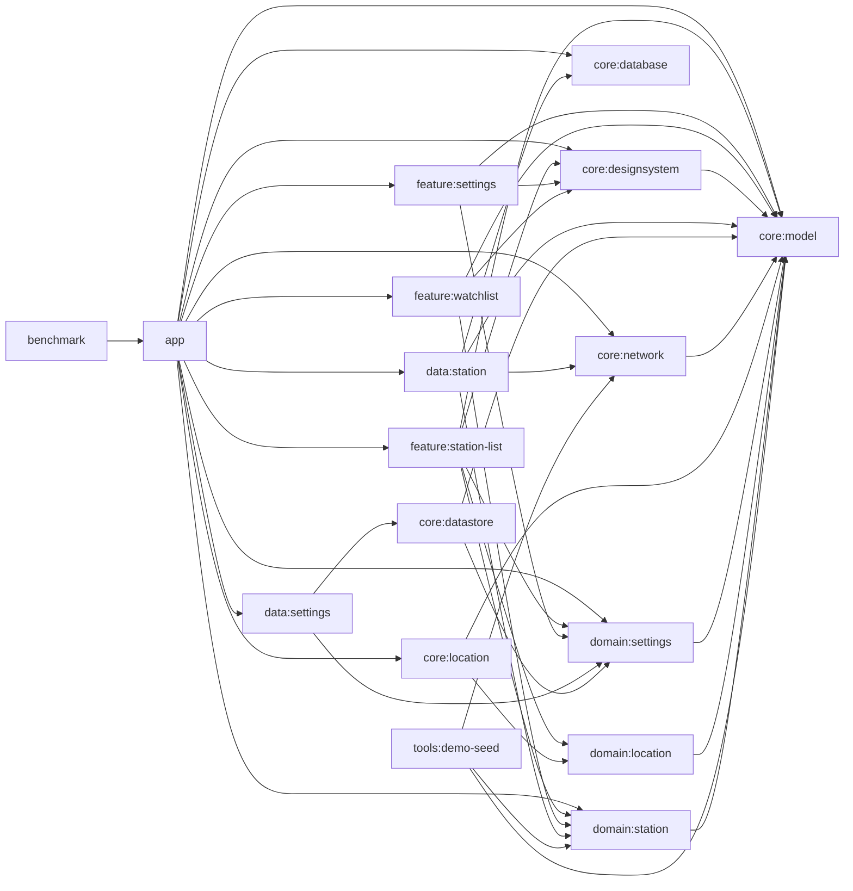

# 아키텍처

이 문서는 현재 코드 기준 GasStation의 모듈 그래프와 런타임 흐름을 설명하는 단일 출처입니다. 제품 소개나 검증 명령은 `README.md`와 `docs/verification-matrix.md`에 두고, 여기서는 "어디가 무엇을 소유하는가"와 "데이터가 어떻게 흐르는가"에 집중합니다.

## 용어 정리

| 용어 | 뜻 |
| --- | --- |
| watchlist(북마크) | UI에서 저장한 주유소를 비교하는 기능. 코드와 모듈 이름은 `watchlist`, 화면 문구는 주로 "북마크"를 사용 |
| 스냅샷 | 특정 캐시 버킷에 대해 마지막으로 저장한 주유소 목록 |
| 스냅샷 마커 | `station_cache_snapshot` 한 행. 빈 결과도 "성공한 조회"로 구분하기 위해 따로 유지 |
| stale | 저장된 결과는 있지만 `StationCachePolicy` 기준 5분을 넘긴 상태 |
| 주소 라벨 | 현재 좌표를 지오코더로 변환한 표시용 주소. 목록에서는 `서울특별시 강남구 역삼동`처럼 행정동까지만 보여줌 |

## 모듈 그래프

## 모듈별 책임

| 모듈 | 책임 |
| --- | --- |
| `app` | Hilt 조립, startup hook 실행, navigation, flavor별 바인딩, 외부 지도 런처 연결, Logcat 기반 이벤트 로거 연결 |
| `feature:station-list` | 권한/GPS/위치/새로고침을 포함한 목록 화면 상태와 effect 처리 |
| `feature:settings` | 설정 요약 목록과 상세 선택 화면 렌더링, 같은 `SettingsViewModel` 공유 |
| `feature:watchlist` | 저장한 주유소 비교 화면 렌더링 |
| `domain:location` | `LocationRepository`, 위치 permission/result 모델, 위치 조회/availability 유스케이스 |
| `domain:settings` | `SettingsRepository`, `UserPreferences`, 관찰/업데이트 유스케이스 |
| `domain:station` | `StationRepository`, 검색/비교 유스케이스, 도메인 모델, 이벤트 계약 |
| `data:settings` | DataStore 기반 설정 저장소 구현 |
| `data:station` | Room 스냅샷/히스토리/watchlist와 원격 조회를 조합하는 저장소 구현, 일시적 refresh 실패 1회 재시도 |
| `core:model` | `Coordinates`, `DistanceMeters`, `MoneyWon` 값 객체와 `Brand`, `BrandFilter`, `FuelType`, `MapProvider`, `SearchRadius`, `SortOrder` 공유 enum vocabulary |
| `core:designsystem` | `GasStationTheme`, 색상/타이포 token, 카드/배너/탑바, metric/supporting-info/row/guidance 공유 UI primitive, 브랜드 아이콘 리소스 매핑 |
| `core:location` | `domain:location` 구현체, Android 위치 provider, availability flow, 주소 표시 라벨 정규화, `DemoLocationOverride` 계약, repository/provider Hilt 바인딩 |
| `core:network` | Opinet Retrofit 서비스, 로컬 KATEC 변환, 원격 fetcher. `FuelType`, `SearchRadius` 같은 공유 검색 입력만 받아 원격 DTO를 정규화 |
| `core:database` | Room DB, DAO, migration |
| `core:datastore` | `UserPreferences` 전용 DataStore와 커스텀 serializer. 선호값 타입은 `core:model`의 유종/브랜드/정렬/지도 enum vocabulary를 직렬화 |
| `tools:demo-seed` | Opinet 결과를 기준으로 demo seed JSON을 다시 생성하는 JVM CLI |
| `benchmark` | `demo` 경로를 대상으로 cold start, watchlist 이동, baseline profile 측정 |

## 의존성 해석 기준

문서의 모듈 그래프는 Gradle 프로젝트 간 연결(`implementation(project(...))`, benchmark의 `targetProjectPath`)을 기준으로 맞춥니다. `core:model`은 좌표/거리/가격 값 객체와 브랜드/유종/설정 enum vocabulary를 공유하므로 `core:datastore`, `core:network`, `core:designsystem`, `domain:settings`가 `domain:station`을 거치지 않고 이 모듈에 직접 의존합니다. `core:designsystem`은 `Brand`를 리소스에 매핑하지만 주유소 검색 정책이나 화면 상태는 소유하지 않습니다. 반대로 저장소 구현(`data:station`)은 위치 인프라를 직접 알 필요가 없으므로 `core:location`에 의존하지 않고, 위치는 `feature:station-list -> domain:location -> core:location` 경로로만 들어옵니다.

## Presentation hierarchy

화면 정보 위계는 `core:designsystem`의 공통 primitive를 먼저 통과합니다. 가격과 거리처럼 비교 판단에 쓰이는 숫자는 `GasStationMetricBlock`과 `GasStationMetricEmphasis`를 사용하고, 보조 정보는 `GasStationSupportingInfo`, 설정 행은 `GasStationRow`, 권한/GPS/loading/empty/failure 안내는 `GasStationGuidanceCard`, stale/approximate 같은 목록 상단 상태는 `GasStationStatusBanner`로 표현합니다.

이 primitive들은 배치와 텍스트 역할만 소유합니다. "브랜드 label을 목록에서는 숨기고 watchlist에서는 보인다", "GPS가 loading보다 먼저 보인다", "어떤 실패 문구를 쓴다" 같은 화면별 판단은 계속 `feature:*`가 소유합니다.

화면별 핵심 계약:

- `feature:station-list`: 가격을 첫 번째 읽기 대상으로 두고, 거리와 역명을 이어 보여줍니다. 브랜드는 유종 chip 옆 아이콘 중심으로만 노출하고 visible brand label은 렌더링하지 않습니다.
- `feature:watchlist`: 같은 metric 위계를 쓰지만 저장 항목 식별을 위해 brand icon과 visible brand label을 함께 보여줍니다.
- `feature:settings`: 설정 main/detail 모두 shared row rhythm을 쓰되, 값 저장은 기존 `domain:settings` update use case 경로를 유지합니다.

## 런타임 흐름

### 1. 목록 화면

1. `GasStationNavHost`가 시작 화면으로 `StationListRoute`를 띄웁니다.
2. Route는 위치 권한 상태를 `StationListViewModel` 액션으로 전달하고, started 구간에서 위치 availability 수집을 시작합니다.
3. ViewModel은 `LocationStateMachine`을 통해 `ObserveLocationAvailabilityUseCase`와 새로고침 시점의 `GetCurrentLocationUseCase`를 다루고, 별도로 `ObserveUserPreferencesUseCase`를 구독합니다.
4. 위치 조회가 성공하면 현재 좌표를 먼저 검색에 연결하고, `GetCurrentAddressUseCase` 주소 라벨 조회는 non-blocking 표시용 context로 뒤따릅니다. `core:location`은 행정동 단위 주소를 우선 만들고, 화면은 지오코더가 섞어 보낸 국가 코드나 건물 동 표기를 다시 방어합니다.
5. `StationSearchOrchestrator`는 현재 좌표와 검색 입력(`radius`, `fuelType`, `brandFilter`, `sortOrder`)으로 active `StationQuery`를 만들고 `ObserveNearbyStationsUseCase` 결과, cache snapshot state, pending blocking refresh failure를 조합합니다.
6. 현재 좌표가 유지된 상태에서 반경, 유종, 브랜드, 정렬 조건이 바뀌면 ViewModel은 active query를 새 조건으로 전환하고 `RefreshNearbyStationsUseCase`를 호출합니다. 브랜드 필터와 정렬은 캐시 키에는 없지만, 화면은 새 조건으로 즉시 읽기 모델을 다시 만들고 원격 성공 시 같은 버킷 스냅샷을 최신 데이터로 교체합니다.
7. `DefaultStationRepository.observeNearbyStations()`는 Room 스냅샷, watch 상태, 가격 히스토리를 결합해 `StationSearchResult`를 만듭니다.
8. ViewModel은 loading flag, 사용자 action dispatch, one-shot effect, 최종 `StationListUiState` 조합을 맡고, UI는 목록, stale 배너, 전면 오류, snackbar, 외부 지도 effect를 구분해 렌더링합니다. 목록 카드의 브랜드 영역은 유종 chip과 브랜드 아이콘만 보여주고 브랜드 텍스트는 생략합니다.

### 2. 새로고침과 실패 처리

1. 새로고침은 먼저 현재 위치를 얻습니다.
2. 위치 조회 계약은 `domain:location`의 `GetCurrentLocationUseCase`가 담당하고, 실제 구현은 `core:location`의 `DefaultLocationRepository`가 제공합니다.
3. `demo`에서는 `DemoLocationOverride`가 좌표를 공급하고, 새로고침 자체는 seed 기반 `SeedStationRemoteDataSource`를 통해 같은 저장소 갱신 경로를 탑니다.
4. `prod`에서는 `ForegroundLocationProvider`가 성공, timeout, unavailable, permission denied, 예외를 `LocationLookupResult`로 돌려줍니다.
5. `refreshNearbyStations()`는 원격 조회를 `StationRetryPolicy`로 감싸고, `Timeout`/`Network` 실패만 500ms 뒤 한 번 재시도합니다. `InvalidPayload`, `Unknown`, cancellation은 재시도하지 않습니다.
6. 성공 시 저장소는 스냅샷과 가격 히스토리를 갱신합니다.
7. 최종 실패 시 `StationRefreshException(reason)`이 올라오고, 기존 캐시는 그대로 유지됩니다.
8. 전면 실패 여부는 `StationListUiState.blockingFailure`와 `StationSearchResult.hasCachedSnapshot` 조합으로 결정합니다.

중요한 점은 `fetchedAt`만으로 캐시 존재를 판단하지 않는다는 것입니다. 코드가 실제로 보는 기준은 `StationSearchResult.hasCachedSnapshot`이며, 이 값은 `station_cache_snapshot` 행 존재 여부와 맞물립니다.

### 3. 설정 화면

1. `SettingsRoute`는 설정 요약 목록을, `SettingsDetailRoute`는 항목별 상세 선택 화면을 렌더링합니다.
2. 상세 화면은 별도 ViewModel을 만들지 않고, `GasStationNavHost`에서 settings back stack owner를 공유받아 같은 `SettingsViewModel`을 사용합니다.
3. 사용자가 값을 바꾸면 `UpdateFuelTypeUseCase`, `UpdateSearchRadiusUseCase`, `UpdateBrandFilterUseCase`, `UpdateMapProviderUseCase`, `UpdatePreferredSortOrderUseCase` 같은 명시적 설정 유스케이스를 통해 `UserPreferences`가 갱신되고, 목록 화면도 같은 값을 즉시 반영합니다.

### 4. watchlist(북마크) 화면

1. 목록 화면은 현재 좌표를 nav argument로 넘겨 `WatchlistRoute`로 이동합니다.
2. `WatchlistViewModel`은 `SavedStateHandle`에서 기준 좌표를 읽고 `ObserveWatchlistUseCase`를 바로 구독합니다.
3. 저장소는 `watched_station`, 최신 캐시, 가격 히스토리를 조합해 `WatchedStationSummary`를 만듭니다.
4. 화면은 별도 세션 상태 없이 요약 카드만 렌더링합니다.

## flavor와 startup hook

| flavor | startup hook | 실제 동작 |
| --- | --- | --- |
| `demo` | `DemoSeedStartupHook` | DB 비우기 -> seed 적재 -> `UserPreferences.default()`로 재설정 |
| `prod` | `ProdSecretsStartupHook` | `opinet.apikey` 존재 확인 |

추가로 `demo`는 다음 두 바인딩이 함께 들어갑니다.

- `DemoLocationModule`: 강남역 2번 출구 고정 좌표를 위치로 공급
- `DemoStationRemoteDataSourceModule`: seed 자산 기반 원격 데이터 소스를 optional binding으로 주입

## 핵심 구현 결정

- 스냅샷 저장은 `station_cache`와 `station_cache_snapshot` 두 테이블로 나눕니다.
  이유: 빈 결과도 "성공한 마지막 조회"로 남겨야 하기 때문입니다.
- 캐시 키는 위치 버킷(250m), 반경, 유종만 포함합니다.
  브랜드 필터와 정렬은 읽기 모델에서 적용해 캐시 재사용률을 높입니다.
- 위치 좌표는 앱 안에서 WGS84 -> KATEC으로 변환한 뒤 Opinet에 넘깁니다.
  별도 좌표 변환 API를 호출하지 않습니다.
- 현재 주소는 검색 입력이 아니라 표시용 컨텍스트입니다. 지오코더가 도로명, 국가 코드, 건물 동을 섞어 주더라도 목록 상단에는 행정동 단위 라벨만 노출합니다.
- `UserPreferences`는 Proto가 아니라 커스텀 key-value serializer를 쓰는 DataStore로 저장합니다.
- `StationEvent` 계약은 `SearchRefreshed`, `WatchToggled`, `CompareViewed`, `ExternalMapOpened`, `RefreshFailed`, `LocationFailed`, `RetryAttempted`를 정의합니다. 현재 코드에서 실제로 emit하는 이벤트는 watch toggle, refresh 실패, 위치 실패, retry 결과이며, Logcat 구현은 모든 variant를 문자열로 매핑합니다.
