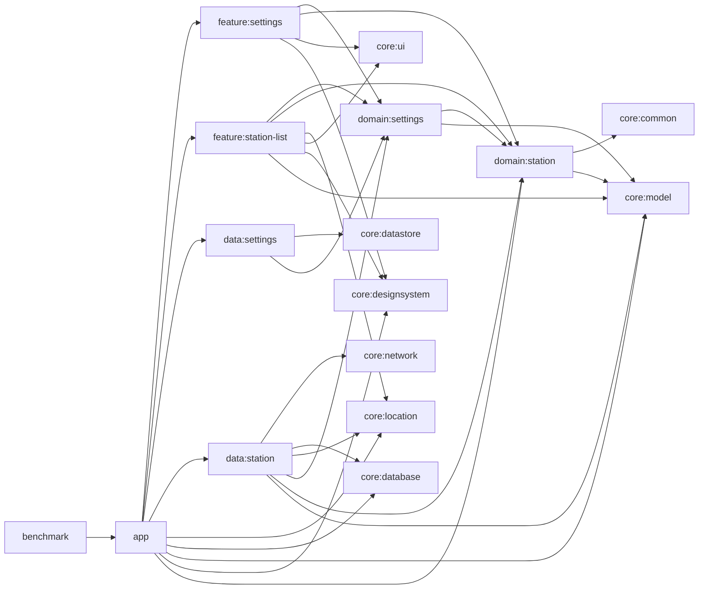

# Architecture

GasStation is split by product responsibility rather than by file type. `app` owns Android startup, navigation, and flavor-specific onboarding hooks; feature modules own Compose screens and state translation; domain modules own contracts and domain models; data/core modules own persistence, networking, and shared primitives.

## Module ownership

- `core:*` holds shared primitives and infrastructure: `core:model` value objects, `core:location` provider contract, `core:database` Room cache, `core:network` Retrofit services, `core:datastore` persisted settings storage, `core:designsystem` and `core:ui` shared Compose building blocks.
- `domain:settings` and `domain:station` define the contract surface that features and data modules depend on.
- `data:settings` persists long-lived user preferences in DataStore.
- `data:station` owns the station query pipeline, cache writes, cache freshness, and stale/offline semantics.
- `feature:station-list` and `feature:settings` map domain flows into screen state and user actions.
- `app` wires Hilt, startup, navigation, demo/prod flavors, and reviewer onboarding defaults.
- `benchmark` is a self-instrumenting macrobenchmark module that targets `:app` and pins the `demo` flavor through `missingDimensionStrategy("environment", "demo")`.

## Run modes

- `demo` is the default reviewer path. It seeds deterministic cache data and returns a fixed Seoul coordinate so the reference UI can be explored without API keys.
- `prod` keeps the same module graph, but expects `opinet.apikey` and `kakao.apikey` from local Gradle properties before running against live services.
- `benchmark` follows the `demo` path, so benchmark assembly stays API-key-free and exercises the same reviewer onboarding surface as local verification.
