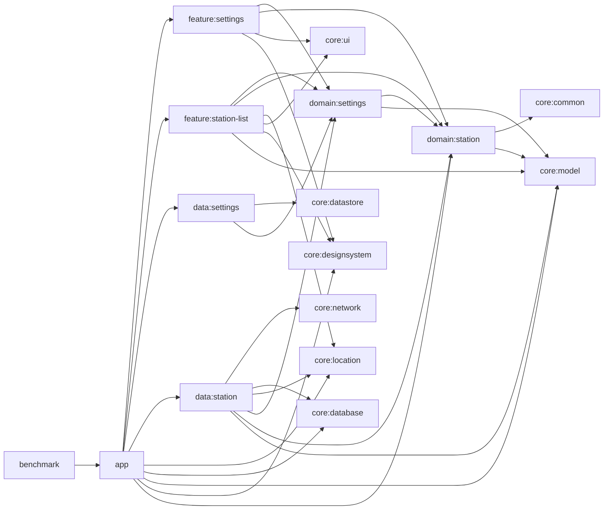

# 아키텍처

GasStation은 파일 종류가 아니라 제품 책임을 기준으로 모듈을 나눕니다. `app`은 안드로이드 시작 지점, 내비게이션, flavor별 온보딩 훅을 담당하고, feature 모듈은 Compose 화면과 상태 변환을 담당합니다. domain 모듈은 계약과 도메인 모델을 소유하고, data/core 모듈은 저장소, 네트워크, 공통 인프라를 담당합니다.

## 모듈 책임

- `core:*`는 공통 원시 타입과 인프라를 담습니다. `core:model` 값 객체, `core:location` 위치 제공 계약, `core:database` Room 캐시, `core:network` Retrofit 서비스, `core:datastore` 설정 저장소, `core:designsystem`과 `core:ui` 공용 Compose 구성 요소가 여기에 포함됩니다.
- `domain:settings`와 `domain:station`은 feature와 data 모듈이 의존하는 계약 계층을 정의합니다.
- `data:settings`는 DataStore에 장기 사용자 선호값을 저장합니다.
- `data:station`은 주유소 조회 파이프라인, 캐시 쓰기, 캐시 신선도, 오래된 데이터 및 오프라인 의미 체계를 담당합니다.
- `feature:station-list`와 `feature:settings`는 도메인 Flow를 화면 상태와 사용자 액션으로 변환합니다.
- `app`은 Hilt, 앱 시작, 내비게이션, `demo`/`prod` flavor, 검토자 온보딩 기본값을 연결합니다.
- `benchmark`는 `:app`을 대상으로 하는 자체 계측 매크로벤치마크 모듈이며 `missingDimensionStrategy("environment", "demo")`를 통해 `demo` flavor를 고정합니다.

## 실행 모드

- `demo`는 기본 검토 경로입니다. 결정적인 캐시 데이터를 미리 넣고 고정된 서울 좌표를 반환하므로 API 키 없이도 레퍼런스 UI를 탐색할 수 있습니다.
- `prod`는 동일한 모듈 그래프를 유지하지만 실제 서비스 호출 전 로컬 Gradle 속성의 `opinet.apikey`, `kakao.apikey`가 필요합니다.
- `benchmark`는 `demo` 경로를 따르므로 벤치마크 빌드는 API 키 없이도 가능하며 로컬 검증과 같은 검토자 온보딩 화면을 대상으로 합니다.
