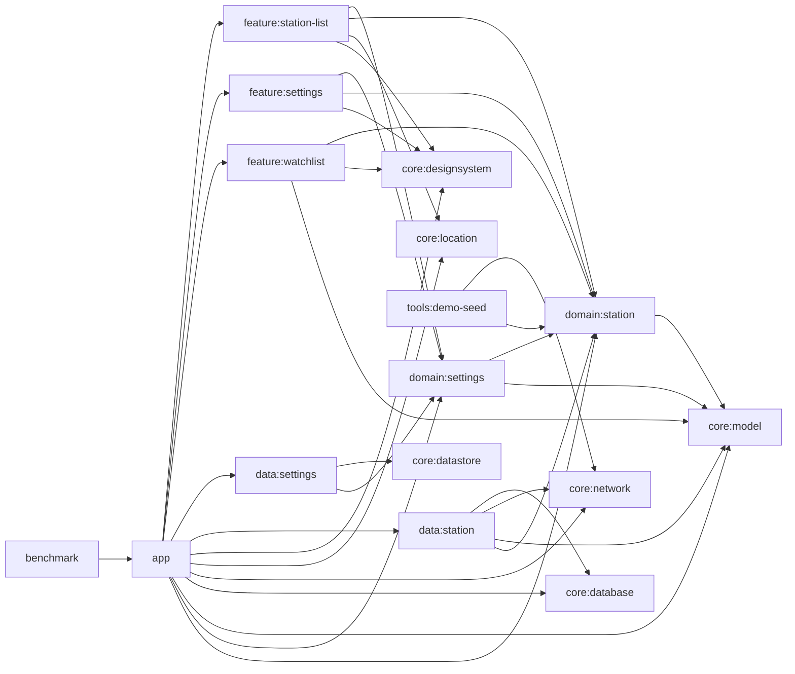

# 아키텍처

GasStation은 책임 기준으로 멀티모듈을 나눈 Compose 안드로이드 앱이다. `app`은 composition root와 실행 환경 연결만 담당하고, 화면 상태는 `feature`, 계약은 `domain`, 저장소 구현은 `data`, 공유 인프라와 값 객체는 `core`에 둔다.

이 프로젝트는 현재 `demo`와 `prod` 경로만 지원한다. 과거 버전 호환 분기는 유지하지 않고, 현재 시연/실행 경로의 명확성과 검증 가능성을 우선한다.

## 핵심 구조 요약

| 축 | 역할 |
| --- | --- |
| `app` | DI 조립, startup hook, navigation, flavor 연결 |
| `feature` | 화면 상태와 사용자 액션 처리 |
| `domain` | 저장소 계약, 유스케이스, 순수 모델 |
| `data` | Room/Network/DataStore 구현과 읽기 모델 조합 |
| `core` | 여러 모듈이 공유하는 인프라와 값 객체 |

이 문서에서 먼저 볼 핵심은 세 가지다.

- 화면 상태와 비즈니스 규칙을 `feature`와 `domain/data`로 분리했다.
- `demo`와 `prod`를 나눠 시연 안정성과 실제 실행 경로를 함께 보장했다.
- 목록, stale fallback, watchlist 비교를 같은 저장소 읽기 모델 위에서 설명한다.

## 모듈 책임

- `app`
  앱 시작점과 조립 계층입니다. `App.kt`, `MainActivity.kt`, `GasStationNavHost.kt`, startup hook, Hilt 모듈, `ExternalMapLauncher`, flavor별 바인딩이 여기에 있습니다. 설정 화면은 요약 목록(`SettingsRoute`)과 상세 선택 화면(`SettingsDetailRoute`)으로 분리되지만 둘 다 `feature:settings`의 같은 상태를 공유하도록 `app` 내비게이션이 back stack owner를 연결합니다.
- `feature:station-list`
  현재 위치, 권한, GPS 상태, 새로고침 액션을 묶어 목록 UI 상태를 만듭니다. 외부 지도 열기, 위치 설정 열기, 스낵바 같은 단발성 효과도 여기서 발생합니다.
- `feature:settings`
  `UserPreferences`를 섹션형 설정 화면으로 노출합니다. 상위 목록은 현재 선택값 요약만 보여주고, 상세 화면은 반경, 유종, 브랜드, 정렬, 외부 지도 앱을 각각 독립 라우트로 수정합니다.
- `feature:watchlist`
  관심 주유소 비교 화면입니다. 현재 목록에서 넘겨받은 기준 좌표를 nav argument로 받아 거리와 최근 가격 변화가 포함된 비교 읽기 모델을 렌더링합니다.
- `domain:settings`
  `SettingsRepository`, `ObserveUserPreferencesUseCase`, `UpdatePreferredSortOrderUseCase`, `UserPreferences`를 소유합니다.
- `domain:station`
  `StationRepository`, 검색/비교 유스케이스, 이벤트 계약(`StationEvent`, `StationEventLogger`), 검색/캐시/정렬/필터 모델을 소유합니다. 새로고침 실패는 이 경계에서 `StationRefreshFailureReason`과 `StationRefreshException`으로 표준화해 data 계층이 timeout/network/payload/unknown을 구분해 올리고, use case/UI는 캐시 유지 여부와 별개로 사용자 메시지를 선택할 수 있습니다.
- `data:settings`
  DataStore 기반 설정 저장소 구현체입니다.
- `data:station`
  Room 스냅샷, 가격 히스토리, 관심 주유소, 원격 조회 결과를 조합해 `StationSearchResult`와 `WatchedStationSummary`를 만드는 저장소 구현체입니다.
- `core:model`
  `Coordinates`, `DistanceMeters`, `MoneyWon` 같은 값 객체를 제공합니다.
- `core:designsystem`
  `GasStationTheme`와 색상/타이포그래피 토큰, 그리고 현재 화면들이 사용하는 `GasStationTopBar`, `GasStationCard`, `GasStationSectionHeading`, `GasStationStatusBanner`, `GasStationBackground` 같은 UI primitive를 소유합니다.
- `core:location`
  `ForegroundLocationProvider`, `LocationPermissionState`, `DemoLocationOverride`, 안드로이드 위치 구현을 포함합니다. 현재 위치 조회는 nullable 좌표 대신 `LocationLookupResult`를 반환해 성공, timeout, unavailable, permission denied, 예외를 명시적으로 구분합니다.
- `core:network`
  Opinet Retrofit 서비스, `NetworkRuntimeConfig`, 좌표 변환 로직을 제공합니다. 실제 주유소 검색 파이프라인은 로컬 좌표 변환과 Opinet 호출만 사용합니다.
- `core:database`
  `GasStationDatabase`, `station_cache`, `station_price_history`, `watched_station` 테이블과 DAO, migration 테스트를 소유합니다.
- `core:datastore`
  `UserPreferences` serializer와 DataStore data source를 제공합니다.
- `tools:demo-seed`
  승인된 강남역 기준 질의 매트릭스를 실제 API로 한 번 수집해 `app/src/demo/assets/demo-station-seed.json`을 다시 생성하는 JVM CLI입니다.
- `benchmark`
  `demo` flavor를 기준으로 cold start와 주요 플로우를 측정하는 매크로벤치마크 모듈입니다.

## 핵심 데이터 흐름

1. `StationListRoute`가 권한 상태를 감시하고, 화면이 foreground(`Lifecycle.State.STARTED`)에 있는 동안에는 broadcast-backed `gpsAvailabilityFlow()`로 GPS/provider 변화를 계속 관찰해 `StationListViewModel`로 보냅니다. GPS 사용 가능 여부는 더 이상 resume 시점에만 다시 읽지 않습니다.
2. `StationListViewModel`은 `UserPreferences`와 세션 상태를 결합해 `StationQuery`를 만들고 `ObserveNearbyStationsUseCase`를 구독합니다. 위치 조회는 `ForegroundLocationProvider.currentLocation()`의 `LocationLookupResult`를 받아 timeout과 generic failure를 별도 분기합니다.
3. `DefaultStationRepository`는 Room 스냅샷을 관찰하면서 관심 목록과 가격 히스토리를 합쳐 화면용 읽기 모델을 만듭니다. `fetchedAt != null`이면 적어도 한 번 저장된 캐시 스냅샷이 남아 있다는 뜻이고, `fetchedAt`만으로 every empty 결과의 성공 여부를 단정하지는 않습니다.
4. 새로고침 시 `RefreshNearbyStationsUseCase`가 실행되고, 성공하면 캐시 스냅샷과 가격 히스토리가 교체됩니다. 실패하면 data 계층이 `StationRefreshException(reason)`을 던져 timeout과 generic refresh failure를 보존한 채 상위 계층으로 전달합니다.
5. 목록 UI는 `StationListUiState.blockingFailure`를 통해 "캐시를 유지할 수 없는 실패"만 전면 오류로 표시합니다. 이미 캐시 스냅샷이 있으면 결과는 계속 보이고 stale/fetchedAt 정보와 snackbar만 바뀌며, 캐시가 전혀 없을 때만 location 실패나 refresh 실패가 blocking 화면으로 승격됩니다.
6. watchlist 화면은 저장된 관심 목록과 최신 캐시/히스토리를 다시 조합해 비교 뷰를 만듭니다.

## startup 과 flavor

- `demo`
  `DemoSeedStartupHook`이 앱 시작 시 Room을 비우고 demo seed 자산을 다시 적재합니다. 같은 시점에 `SettingsRepository`도 `UserPreferences.default()`로 초기화해 검토자 시작 상태를 항상 고정합니다. 위치는 `DemoLocationOverride`가 강남역 2번 출구 좌표를 강제로 공급합니다.
- `prod`
  `ProdSecretsStartupHook`이 `opinet.apikey` 존재만 강제합니다. 현재 런타임 검색 파이프라인은 Opinet API 키만 사용합니다.
- `benchmark`
  `missingDimensionStrategy("environment", "demo")`로 `demo` 데이터를 고정해 반복 가능한 측정을 수행합니다.

## 운영 메모

- 캐시 키는 위치 버킷(250m), 검색 반경, 유종만으로 결정됩니다.
- 브랜드 필터와 정렬 순서는 캐시를 읽은 뒤 클라이언트에서 적용합니다.
- `StationCachePolicy`의 stale 기준은 5분입니다.
- `StationEventLogger`는 `app`에서 `LogcatStationEventLogger`로 바인딩되며, 현재는 목록 화면의 watch toggle 이벤트를 로그캣으로 기록합니다.
- 빈 결과와 실패는 같은 상태가 아닙니다. `fetchedAt != null`은 캐시 스냅샷이 남아 있다는 증거일 뿐이고, 모든 successful empty 결과의 공통 마커는 아닙니다. UI가 전면 실패를 판단하는 기준은 `StationListUiState.blockingFailure`이며, location/refresh 실패로 화면에 남길 캐시조차 없을 때만 이 값이 채워집니다.
