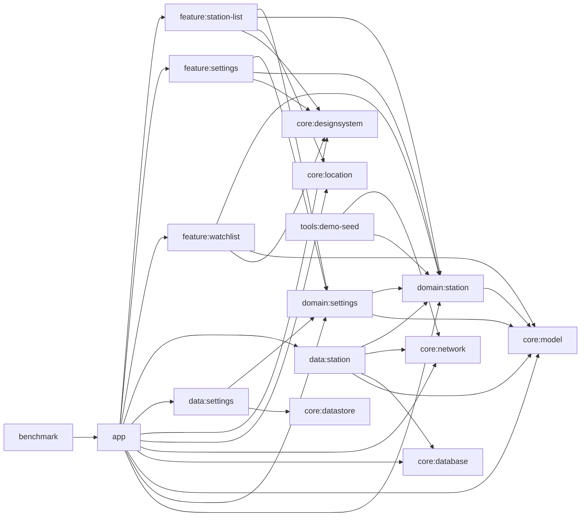

# 아키텍처

이 문서는 현재 코드 기준으로 GasStation의 모듈 책임, 런타임 흐름, flavor 차이를 설명합니다. 제품 소개나 검증 명령은 `README.md`와 `docs/verification-matrix.md`에 두고, 여기서는 "어디가 무엇을 소유하는가"와 "데이터가 어떻게 흐르는가"에 집중합니다.

## 용어 정리

| 용어 | 뜻 |
| --- | --- |
| watchlist(북마크) | UI에서 저장한 주유소를 비교하는 기능. 코드와 모듈 이름은 `watchlist`, 화면 문구는 주로 "북마크"를 사용 |
| 스냅샷 | 특정 캐시 버킷에 대해 마지막으로 저장한 주유소 목록 |
| 스냅샷 마커 | `station_cache_snapshot` 한 행. 빈 결과도 "성공한 조회"로 구분하기 위해 따로 유지 |
| stale | 저장된 결과는 있지만 `StationCachePolicy` 기준 5분을 넘긴 상태 |

## 모듈 그래프

## 모듈별 책임

| 모듈 | 책임 |
| --- | --- |
| `app` | Hilt 조립, startup hook 실행, navigation, flavor별 바인딩, 외부 지도 런처 연결 |
| `feature:station-list` | 권한/GPS/위치/새로고침을 포함한 목록 화면 상태와 effect 처리 |
| `feature:settings` | 설정 요약 목록과 상세 선택 화면 렌더링, 같은 `SettingsViewModel` 공유 |
| `feature:watchlist` | 저장한 주유소 비교 화면 렌더링 |
| `domain:settings` | `SettingsRepository`, `UserPreferences`, 관찰/업데이트 유스케이스 |
| `domain:station` | `StationRepository`, 검색/비교 유스케이스, 도메인 모델, 이벤트 계약 |
| `data:settings` | DataStore 기반 설정 저장소 구현 |
| `data:station` | Room 스냅샷/히스토리/watchlist와 원격 조회를 조합하는 저장소 구현 |
| `core:model` | `Coordinates`, `DistanceMeters`, `MoneyWon` 값 객체 |
| `core:designsystem` | `GasStationTheme`, 카드/배너/탑바 등 공유 UI primitive |
| `core:location` | 현재 위치 조회 계약과 Android 구현, demo 위치 override |
| `core:network` | Opinet Retrofit 서비스, 로컬 KATEC 변환, 원격 fetcher |
| `core:database` | Room DB, DAO, migration |
| `core:datastore` | `UserPreferences` 전용 DataStore와 커스텀 serializer |
| `tools:demo-seed` | Opinet 결과를 기준으로 demo seed JSON을 다시 생성하는 JVM CLI |
| `benchmark` | `demo` 경로를 대상으로 cold start, watchlist 이동, baseline profile 측정 |

## 런타임 흐름

### 1. 목록 화면

1. `GasStationNavHost`가 시작 화면으로 `StationListRoute`를 띄웁니다.
2. Route는 위치 권한 상태와 `gpsAvailabilityFlow()`를 관찰해 `StationListViewModel` 액션으로 전달합니다.
3. ViewModel은 `UserPreferences`와 세션 상태를 결합해 `StationQuery`를 만들고 `ObserveNearbyStationsUseCase`를 구독합니다.
4. `DefaultStationRepository.observeNearbyStations()`는 Room 스냅샷, watch 상태, 가격 히스토리를 결합해 `StationSearchResult`를 만듭니다.
5. UI는 `StationListUiState`를 통해 목록, stale 배너, 전면 오류, snackbar, 외부 지도 effect를 구분해 렌더링합니다.

### 2. 새로고침과 실패 처리

1. 새로고침은 먼저 현재 위치를 얻습니다.
2. `demo`에서는 `DemoLocationOverride`가 좌표를 바로 공급하고 원격 새로고침을 건너뜁니다.
3. `prod`에서는 `ForegroundLocationProvider`가 성공, timeout, unavailable, permission denied, 예외를 `LocationLookupResult`로 돌려줍니다.
4. `refreshNearbyStations()` 성공 시 저장소는 스냅샷과 가격 히스토리를 갱신합니다.
5. 실패 시 `StationRefreshException(reason)`이 올라오고, 기존 캐시는 그대로 유지됩니다.
6. 전면 실패 여부는 `StationListUiState.blockingFailure`와 `StationSearchResult.hasCachedSnapshot` 조합으로 결정합니다.

중요한 점은 `fetchedAt`만으로 캐시 존재를 판단하지 않는다는 것입니다. 코드가 실제로 보는 기준은 `StationSearchResult.hasCachedSnapshot`이며, 이 값은 `station_cache_snapshot` 행 존재 여부와 맞물립니다.

### 3. 설정 화면

1. `SettingsRoute`는 설정 요약 목록을, `SettingsDetailRoute`는 항목별 상세 선택 화면을 렌더링합니다.
2. 상세 화면은 별도 ViewModel을 만들지 않고, `GasStationNavHost`에서 settings back stack owner를 공유받아 같은 `SettingsViewModel`을 사용합니다.
3. 사용자가 값을 바꾸면 `SettingsRepository`를 통해 `UserPreferences`가 갱신되고, 목록 화면도 같은 값을 즉시 반영합니다.

### 4. watchlist(북마크) 화면

1. 목록 화면은 현재 좌표를 nav argument로 넘겨 `WatchlistRoute`로 이동합니다.
2. `WatchlistViewModel`은 `SavedStateHandle`에서 기준 좌표를 읽고 `ObserveWatchlistUseCase`를 바로 구독합니다.
3. 저장소는 `watched_station`, 최신 캐시, 가격 히스토리를 조합해 `WatchedStationSummary`를 만듭니다.
4. 화면은 별도 세션 상태 없이 요약 카드만 렌더링합니다.

## flavor와 startup hook

| flavor | startup hook | 실제 동작 |
| --- | --- | --- |
| `demo` | `DemoSeedStartupHook` | DB 비우기 -> seed 적재 -> `UserPreferences.default()`로 재설정 |
| `prod` | `ProdSecretsStartupHook` | `opinet.apikey` 존재 확인 |

추가로 `demo`는 다음 두 바인딩이 함께 들어갑니다.

- `DemoLocationModule`: 강남역 2번 출구 고정 좌표를 위치로 공급
- `DemoStationRemoteDataSourceModule`: seed 자산 기반 원격 데이터 소스를 optional binding으로 주입

## 핵심 구현 결정

- 스냅샷 저장은 `station_cache`와 `station_cache_snapshot` 두 테이블로 나눕니다.
  이유: 빈 결과도 "성공한 마지막 조회"로 남겨야 하기 때문입니다.
- 캐시 키는 위치 버킷(250m), 반경, 유종만 포함합니다.
  브랜드 필터와 정렬은 읽기 모델에서 적용해 캐시 재사용률을 높입니다.
- 위치 좌표는 앱 안에서 WGS84 -> KATEC으로 변환한 뒤 Opinet에 넘깁니다.
  별도 좌표 변환 API를 호출하지 않습니다.
- `UserPreferences`는 Proto가 아니라 커스텀 key-value serializer를 쓰는 DataStore로 저장합니다.
- `StationEvent` 계약은 `SearchRefreshed`, `WatchToggled`, `CompareViewed`, `ExternalMapOpened`를 정의하지만, 현재 앱에서 실제 로그를 남기는 경로는 watch toggle뿐입니다.
