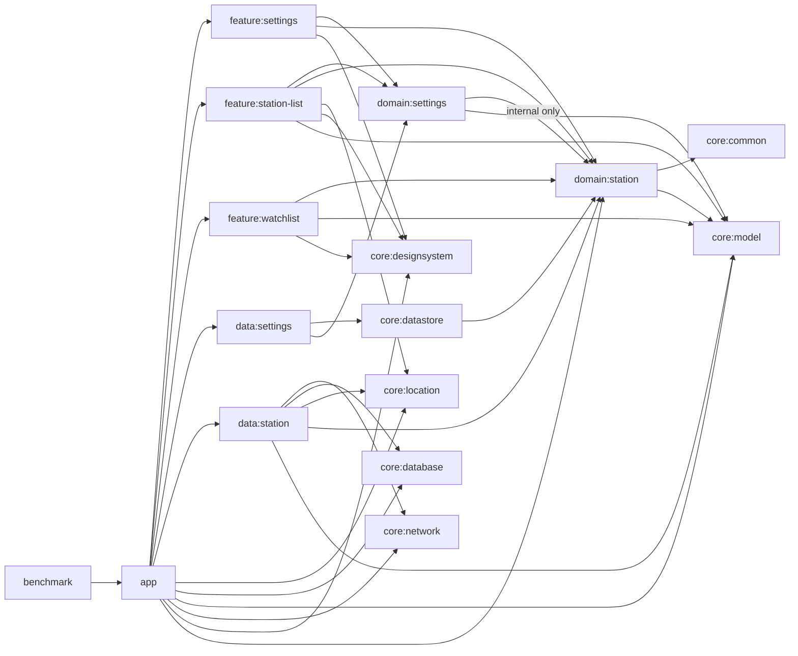

# 아키텍처

GasStation은 파일 종류가 아니라 제품 책임을 기준으로 모듈을 나눕니다. `app`은 안드로이드 시작 지점, 내비게이션, flavor별 온보딩 훅을 담당하고, feature 모듈은 Compose 화면과 상태 변환을 담당합니다. domain 모듈은 계약과 도메인 모델을 소유하고, data/core 모듈은 저장소, 네트워크, 공통 인프라를 담당합니다.

## 모듈 책임

- `core:*`는 공통 원시 타입과 인프라를 담습니다. `core:model` 값 객체, `core:location` 위치 계약과 안드로이드 전경 위치 구현, `core:database` Room 스냅샷/가격 히스토리/관심 주유소 저장, `core:network` Retrofit 서비스와 주입된 런타임 설정 소비, `core:datastore` 설정 저장소, `core:designsystem` 앱 테마 구현이 여기에 포함됩니다.
- `domain:settings`와 `domain:station`은 feature와 data 모듈이 의존하는 계약 계층을 정의합니다. `domain:settings`는 `domain:station`을 재노출하지 않습니다.
- `data:settings`는 DataStore에 장기 사용자 선호값을 저장합니다.
- `data:station`은 주유소 조회 파이프라인, `StationPriceHistory`, `WatchedStation`, 캐시 신선도, 오래된 데이터 및 오프라인 의미 체계를 담당하며 더 이상 `domain:settings`에 의존하지 않습니다.
- `feature:station-list`, `feature:watchlist`, `feature:settings`는 도메인 Flow를 화면 상태와 사용자 액션으로 변환합니다.
- `app`은 Hilt, 앱 시작 훅, 내비게이션, `demo`/`prod` flavor, 검토자 온보딩 기본값을 연결하는 composition root입니다.
- `benchmark`는 `:app`을 대상으로 하는 자체 계측 매크로벤치마크 모듈이며 `missingDimensionStrategy("environment", "demo")`를 통해 `demo` flavor를 고정합니다.

## 모듈 소유권

- `app`은 `App.kt`, `MainActivity.kt`, startup hooks, DI 모듈, `ExternalMapLauncher`, 내비게이션을 포함한 composition root입니다. demo/prod flavor 훅과 `androidTest` 그래프까지 포함해 필요한 최소 직접 의존만 유지하며, 현재 직접 의존은 `core:database`, `core:location`, `core:model`, `core:network`, `core:designsystem`, `domain:station`, `data:settings`, `data:station`, `feature:settings`, `feature:station-list`, `feature:watchlist`입니다.
- `core:designsystem`은 `GasStationTheme`, 색상, 타이포그래피를 포함한 실제 앱 테마 구현과 디자인 토큰을 소유합니다.
- `core:location`은 `ForegroundLocationProvider`, `LocationPermissionState`, `AndroidForegroundLocationProvider`, 그리고 core 모듈 내부 Hilt 바인딩을 포함한 위치 계약과 구현을 소유합니다. 앱은 demo 전용 좌표 override 바인딩과 외부 지도 바인딩만 소유합니다.
- `core:network`는 Retrofit 서비스와 `NetworkRuntimeConfig` 소비를 담당하며 `app`의 `BuildConfig`를 리플렉션으로 읽지 않습니다.
- `core:datastore`는 설정 저장소를 담당하며 필요한 `domain:station` 직접 의존을 자체적으로 가집니다.
- `core:database`는 `StationCache`, `StationPriceHistory`, `WatchedStation` 테이블과 migration을 소유합니다.
- `data:*`는 저장소 구현을 소유합니다.
- `domain:*`는 계약, 유스케이스, 순수 모델을 소유합니다.
- `feature:*`는 Compose 라우트, 화면, 뷰모델을 소유합니다. `feature:watchlist`는 관심 주유소 비교 읽기 모델을 렌더링합니다.

## 실행 모드

- `demo`는 기본 검토 경로입니다. 결정적인 캐시/히스토리 데이터를 미리 넣고, 앱이 소유한 demo 전용 좌표 override 바인딩으로 고정된 서울 좌표를 반환합니다. 이 연결은 리플렉션이 아니라 테스트로 검증됩니다.
- `prod`는 동일한 모듈 그래프를 유지하지만 `DemoLocationOverride`를 바인딩하지 않으므로 `core:location`의 `AndroidForegroundLocationProvider`가 실제 위치 API를 사용합니다. 네트워크 키는 `app`의 `AppConfigModule`이 `NetworkRuntimeConfig`로 주입하며, 실제 서비스 호출 전 로컬 Gradle 속성의 `opinet.apikey`, `kakao.apikey`가 필요합니다.
- `benchmark`는 `demo` 경로를 따르므로 벤치마크 빌드는 API 키 없이도 가능하며, cold start와 watchlist 진입 경로를 같은 검토자 온보딩 데이터셋으로 측정합니다.
