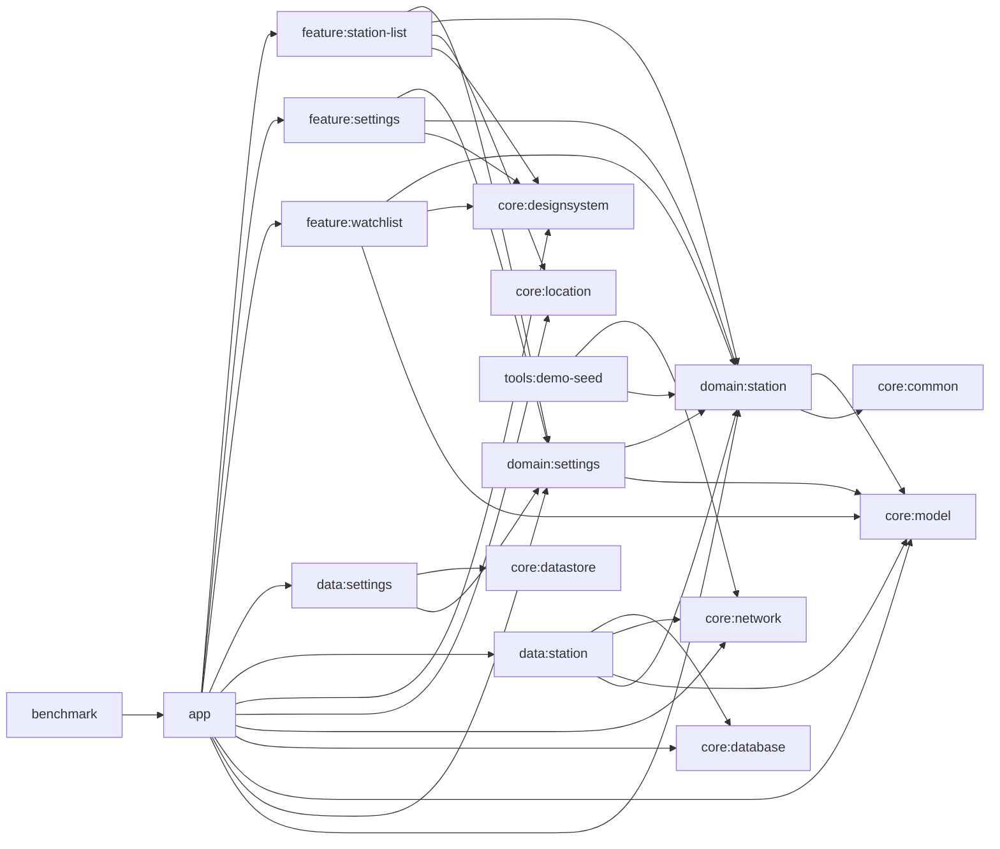

# 아키텍처

GasStation은 책임을 기준으로 멀티모듈을 나눈 Compose 안드로이드 앱입니다. `app`은 조립과 flavor 연결만 담당하고, 화면 상태는 `feature`, 계약은 `domain`, 저장소 구현은 `data`, 공통 모델과 인프라는 `core`에 둡니다. 문서 기준 현재 그래프는 `settings.gradle.kts`와 일치합니다.

## 모듈 책임

- `app`
  앱 시작점과 조립 계층입니다. `App.kt`, `MainActivity.kt`, `GasStationNavHost.kt`, startup hook, Hilt 모듈, `ExternalMapLauncher`, flavor별 바인딩이 여기에 있습니다. 설정 화면은 요약 목록(`SettingsRoute`)과 상세 선택 화면(`SettingsDetailRoute`)으로 분리되지만 둘 다 `feature:settings`의 같은 상태를 공유하도록 `app` 내비게이션이 back stack owner를 연결합니다.
- `feature:station-list`
  현재 위치, 권한, GPS 상태, 새로고침 액션을 묶어 목록 UI 상태를 만듭니다. 외부 지도 열기, 위치 설정 열기, 스낵바 같은 단발성 효과도 여기서 발생합니다.
- `feature:settings`
  `UserPreferences`를 섹션형 설정 화면으로 노출합니다. 상위 목록은 현재 선택값 요약만 보여주고, 상세 화면은 반경, 유종, 브랜드, 정렬, 외부 지도 앱을 각각 독립 라우트로 수정합니다.
- `feature:watchlist`
  관심 주유소 비교 화면입니다. 현재 목록에서 넘겨받은 기준 좌표를 nav argument로 받아 거리와 최근 가격 변화가 포함된 비교 읽기 모델을 렌더링합니다.
- `domain:settings`
  `SettingsRepository`, `ObserveUserPreferencesUseCase`, `UpdatePreferredSortOrderUseCase`, `UserPreferences`를 소유합니다.
- `domain:station`
  `StationRepository`, 검색/비교 유스케이스, 이벤트 계약(`StationEvent`, `StationEventLogger`), 검색/캐시/정렬/필터 모델을 소유합니다.
- `data:settings`
  DataStore 기반 설정 저장소 구현체입니다.
- `data:station`
  Room 스냅샷, 가격 히스토리, 관심 주유소, 원격 조회 결과를 조합해 `StationSearchResult`와 `WatchedStationSummary`를 만드는 저장소 구현체입니다.
- `core:model`
  `Coordinates`, `DistanceMeters`, `MoneyWon` 같은 값 객체를 제공합니다.
- `core:common`
  공통 결과 타입과 dispatcher 추상화를 제공합니다.
- `core:designsystem`
  `GasStationTheme`와 색상/타이포그래피 토큰, 그리고 현재 화면들이 사용하는 `LegacyTopBar`, `LegacyListRow`, `LegacyChromeCard` 같은 UI primitive를 소유합니다.
- `core:location`
  `ForegroundLocationProvider`, `LocationPermissionState`, `DemoLocationOverride`, 안드로이드 위치 구현을 포함합니다.
- `core:network`
  Opinet Retrofit 서비스, Kakao 서비스 생성기, `NetworkRuntimeConfig`, 좌표 변환 로직을 제공합니다. 실제 주유소 검색 파이프라인은 로컬 좌표 변환과 Opinet 호출만 사용합니다.
- `core:database`
  `GasStationDatabase`, `station_cache`, `station_price_history`, `watched_station` 테이블과 DAO, migration 테스트를 소유합니다.
- `core:datastore`
  `UserPreferences` serializer와 DataStore data source를 제공합니다.
- `core:testing`
  JUnit, AndroidX JUnit, Espresso를 묶는 테스트 전용 지원 모듈입니다.
- `tools:demo-seed`
  승인된 강남역 기준 질의 매트릭스를 실제 API로 한 번 수집해 `app/src/demo/assets/demo-station-seed.json`을 다시 생성하는 JVM CLI입니다.
- `benchmark`
  `demo` flavor를 기준으로 cold start와 주요 플로우를 측정하는 매크로벤치마크 모듈입니다.

## 핵심 데이터 흐름

1. `StationListRoute`가 권한/GPS 변화를 감시하고 액션을 `StationListViewModel`로 보냅니다.
2. `StationListViewModel`은 `UserPreferences`와 세션 상태를 결합해 `StationQuery`를 만들고 `ObserveNearbyStationsUseCase`를 구독합니다.
3. `DefaultStationRepository`는 Room 스냅샷을 관찰하면서 관심 목록과 가격 히스토리를 합쳐 화면용 읽기 모델을 만듭니다.
4. 새로고침 시 `RefreshNearbyStationsUseCase`가 실행되고, 성공하면 캐시 스냅샷과 가격 히스토리가 교체됩니다.
5. watchlist 화면은 저장된 관심 목록과 최신 캐시/히스토리를 다시 조합해 비교 뷰를 만듭니다.

## startup 과 flavor

- `demo`
  `DemoSeedStartupHook`이 앱 시작 시 Room을 비우고 demo seed 자산을 다시 적재합니다. 같은 시점에 `SettingsRepository`도 `UserPreferences.default()`로 초기화해 검토자 시작 상태를 항상 고정합니다. 위치는 `DemoLocationOverride`가 강남역 2번 출구 좌표를 강제로 공급합니다.
- `prod`
  `ProdSecretsStartupHook`이 `opinet.apikey` 존재만 강제합니다. `BuildConfig`에는 `KAKAO_API_KEY`도 들어가지만 현재 런타임 검색 파이프라인은 Kakao 키에 의존하지 않으므로 필수 시크릿은 아닙니다.
- `benchmark`
  `missingDimensionStrategy("environment", "demo")`로 `demo` 데이터를 고정해 반복 가능한 측정을 수행합니다.

## 운영 메모

- 캐시 키는 위치 버킷(250m), 검색 반경, 유종만으로 결정됩니다.
- 브랜드 필터와 정렬 순서는 캐시를 읽은 뒤 클라이언트에서 적용합니다.
- `StationCachePolicy`의 stale 기준은 5분입니다.
- `StationEventLogger`는 `app`에서 `LogcatStationEventLogger`로 바인딩되며, 현재는 목록 화면의 watch toggle 이벤트를 로그캣으로 기록합니다.
