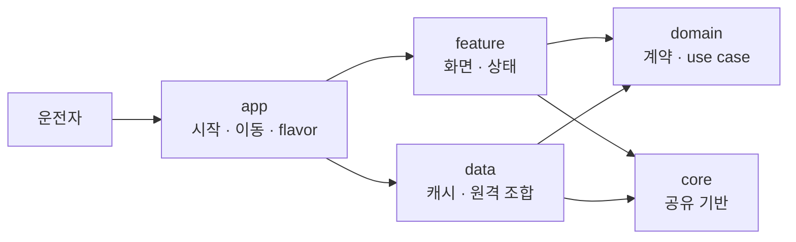
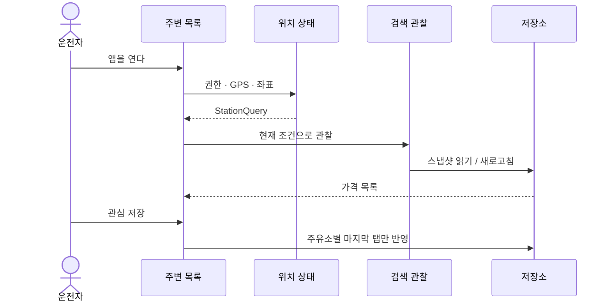
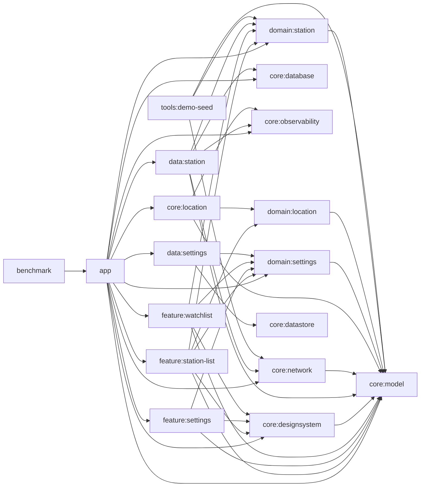

# 아키텍처

어디가 무엇을 맡고, 데이터가 어떻게 흐르는지 설명한다. 제품 소개는 `README.md`, 검증 명령은 `docs/verification-matrix.md`다.

## 쉬운 말

코드 이름은 그대로 두고, 뜻만 풀어 둔다.

| 쉬운 말 | 코드·문서에서 | 뜻 |
| --- | --- | --- |
| 관심 | `watchlist` | 저장한 주유소를 다시 비교하는 화면 |
| 스냅샷 | 캐시 목록 | 한 검색 칸의 마지막 성공 결과. 실패해도 버리지 않는다 |
| 스냅샷 마커 | `station_cache_snapshot` | 그 칸이 한 번이라도 성공했는지 표시. 0건 성공도 남긴다 |
| 오래됨 | `stale` | 신선도 기준을 넘긴 상태. 목록은 유지하고 안내만 한다 |
| 주소 라벨 | 표시용 주소 | 검색 입력이 아니다. 목록에는 행정동까지만 보여준다 |
| 요청 세대 | `generation` | 같은 종류의 요청 번호. 늦게 온 이전 결과는 버린다 |
| 명령 대기열 | FIFO `StationListCommandQueue` | 스낵바, 위치 설정, 외부 지도를 들어온 순서대로 처리 |
| 화면 조합 | `projection`, assembler | 여러 입력을 최종 화면 상태로 모은다. 저장·네트워크는 하지 않는다 |
| 지금 문서 | live 문서 | 현재 동작을 설명한다. 이력 폴더는 그때의 기록이다 |

캐시가 있는지는 `fetchedAt != null`이 아니라 `hasCachedSnapshot`으로 본다.

## 한눈에

화면은 저장 구현을 모르고, 계약은 화면을 모른다. `app`이 둘을 이어 준다.

```mermaid
flowchart LR
    User[운전자] --> App["app<br/>시작 · 이동 · flavor"]
    App --> Feature["feature<br/>화면 · 상태"]
    App --> Data["data<br/>캐시 · 원격 조합"]
    Feature --> Domain["domain<br/>계약 · use case"]
    Data --> Domain
    Feature --> Core["core<br/>공유 기반"]
    Data --> Core
```

`core:location`은 위치 구현이라 `feature`가 직접 부르지 않는다. 위치는 `feature:station-list -> domain:location -> core:location`이다.

사용자 흐름은 `위치 → 주변 비교 → 조건 조정 → 관심 저장 → 관심 비교 → 외부 지도`다.

## 데이터가 흐르는 길

주변 목록이 중심이다. 권한·GPS·좌표가 준비된 뒤에만 검색이 시작된다.

```mermaid
sequenceDiagram
    actor User as 운전자
    participant List as 주변 목록
    participant Location as 위치 상태
    participant Search as 검색 관찰
    participant Store as 저장소
    User->>List: 앱을 연다
    List->>Location: 권한 · GPS · 좌표
    Location-->>List: StationQuery
    List->>Search: 현재 조건으로 관찰
    Search->>Store: 스냅샷 읽기 / 새로고침
    Store-->>List: 가격 목록
    User->>List: 관심 저장
    List->>Store: 주유소별 마지막 탭만 반영
```

읽기는 `StationSearchOrchestrator`, 쓰기는 `RefreshCoordinator`, 화면 상태는 `StationListStateAssembler`가 맡는다.

## 모듈 그래프

```mermaid
flowchart LR
    app["app"] --> fstation["feature:station-list"]
    app --> fsettings["feature:settings"]
    app --> fwatch["feature:watchlist"]
    app --> dstation["data:station"]
    app --> dsettings["data:settings"]
    app --> cdesign["core:designsystem"]
    app --> clocation["core:location"]
    app --> cnetwork["core:network"]
    app --> cdatabase["core:database"]
    app --> cmodel["core:model"]
    app --> cobserve["core:observability"]
    app --> domSettings["domain:settings"]
    app --> domStation["domain:station"]

    fstation --> domSettings
    fstation --> domStation
    fstation --> domLocation["domain:location"]
    fstation --> cdesign
    fstation --> cmodel

    fsettings --> domSettings
    fsettings --> cdesign
    fsettings --> cmodel

    fwatch --> domStation
    fwatch --> domSettings
    fwatch --> cmodel
    fwatch --> cdesign
    cdesign --> cmodel

    dstation --> domStation
    dstation --> cnetwork
    dstation --> cdatabase
    dstation --> cmodel
    dstation --> cobserve

    dsettings --> domSettings
    dsettings --> cstore["core:datastore"]

    cnetwork --> cmodel

    clocation --> domLocation
    clocation --> cmodel
    clocation --> cobserve
    domSettings --> cmodel
    domLocation --> cmodel
    domStation --> cmodel

    tools["tools:demo-seed"] --> cnetwork
    tools --> domStation
    tools --> cmodel
    benchmark["benchmark"] --> app
```

그래프는 Gradle `implementation(project(...))`와 benchmark `targetProjectPath`를 따른다. `core:model`은 좌표·거리·가격·브랜드·유종 enum을 공유하므로 network, designsystem, settings가 `domain:station`을 거치지 않고 쓴다. 위치는 `feature:station-list -> domain:location -> core:location`만 탄다. `data:station`은 `core:location`을 모른다.

## 모듈 책임

| 모듈 | 맡는 일 |
| --- | --- |
| `app` | 시작, 화면 이동, flavor, 외부 지도, 이벤트 로거 연결. 정책을 두지 않는다 |
| `feature:station-list` | 위치 요청 세대, 검색 관찰, 새로고침, 명령 대기열, 화면 조합, 얇은 ViewModel |
| `feature:settings` | 설정 요약/상세. 같은 ViewModel을 공유한다 |
| `feature:watchlist` | 저장한 주유소 비교 |
| `domain:location` | 위치 계약과 use case |
| `domain:settings` | 설정 계약과 `UserPreferences` |
| `domain:station` | 검색/비교 계약, `StationEvent` |
| `data:settings` | DataStore → domain 매핑 |
| `data:station` | Room 스냅샷/히스토리/관심과 원격 조회 조합, 재시도, 캐시 정리 |
| `core:model` | 값 객체와 공유 enum |
| `core:observability` | SDK에 묶이지 않은 관찰 계약 |
| `core:designsystem` | Urban Signal 토큰, 공통 뼈대, 브랜드 그림 |
| `core:location` | 위치 provider, 지오코더, demo 고정 좌표 |
| `core:network` | Opinet/proxy 조회. 모드 선택은 `app` |
| `core:database` | Room DB, DAO, migration |
| `core:datastore` | 설정 DTO 저장 |
| `tools:demo-seed` | demo seed JSON 생성 |
| `benchmark` | demo 성능 측정, baseline profile |

어디에 두지 말지는 [모듈 계약](module-contracts.md)이다.

## UI

공통 색은 캔버스 `#FFFCF2`, 뼈대 `#222222`, 신호 `#FFDC00`이다. 가격·거리는 metric, Nearby/Watchlist는 테두리 없는 행, Settings는 평평한 행, 권한/GPS/empty/failure는 안내다. 화면별 문구와 분기는 `feature:*`가 맡는다.

- Nearby: 32sp 가격이 먼저. 브랜드는 아이콘만.
- Watchlist: 28sp 가격, 108–116dp 행, 360dp × 800dp에서 5행. 200% 글꼴이면 늘어나고 스크롤된다.
- Settings: 공유 행. 저장은 `domain:settings` use case.
- `app`: `주변·관심·설정` 하단 탐색. 설정 상세에서만 숨긴다.

RTO/RTX/NHO는 `ic_rtx`, ETC는 `ic_etc`다. 실제 identity는 세 Brand를 유지하고, 필터만 `알뜰`로 묶는다.

Launcher, 단색 아이콘, splash는 `ic_brand_drop` 같은 물방울이다. `installSplashScreen()`은 `super.onCreate()` 직전이다. 첫 frame이 준비되면 180ms fade/scale로 빠져나가고, 시스템 애니메이션이 꺼져 있으면 바로 제거한다. splash는 권한·seed·네트워크를 기다리지 않는다.

## 런타임

### 목록

1. `GasStationNavHost`가 주변 목록을 연다. 입장만으로 권한 창을 열지 않는다. 버튼이 요청하고, 거부가 반복되면 앱 설정으로 바뀐다.
2. DataStore 첫 설정값이 오기 전에는 Nearby가 `UserPreferences.default()`를 쓰지 않는다.
3. 권한, GPS, 좌표, 설정이 준비되면 `StationQuery`가 생긴다. 권한 거부는 demo 좌표나 캐시보다 먼저다.
4. 읽기는 `StationSearchOrchestrator`가 관찰하고, 쓰기는 `RefreshCoordinator`가 한 번에 하나씩 한다.
5. 저장소는 마커와 행을 한 트랜잭션으로 읽어 `StationSearchResult`를 만든다. 캐시 정책은 [오프라인 전략](offline-strategy.md)이다.
6. `StationListStateAssembler`가 최종 `StationListUiState`를 만든다. 본문 순서는 권한 → GPS → 설정 실패/로딩 → 스냅샷 없는 실패/로딩 → 결과다.

<!-- station-list-state-contract-ref -->[상태 모델의 구조화된 station-list 계약](state-model.md#station-list-결정적-상태-계약)

첫 쓸 수 있는 내용이 그려지면 `app`이 `reportFullyDrawn()`을 한 번 호출한다. 검색 정책은 이 신호와 무관하다.

### 새로고침

위치를 얻고, `demo`는 seed 원격, `prod`는 실제 provider다. 재시도는 `StationRetryPolicy`가 한 번만 한다. 성공하면 최신 요청 세대만 스냅샷과 히스토리를 바꾸고 7일보다 오래된 캐시를 정리한다. 실패해도 기존 스냅샷은 남는다. 캐시 있음은 `hasCachedSnapshot`이다.

### 설정

요약과 상세가 같은 `SettingsViewModel`을 쓴다. 저장 성공 뒤에만 상세에서 돌아간다. Kakao 저장 이름은 `KAKAO_MAP`이다. 옛 `KAKAO_NAVI`는 읽을 때 복원하고 다음 쓰기부터 현재 이름을 쓴다.

### 관심

목록이 넘긴 좌표가 없으면 관심 탭은 비활성이다. 좌표가 바뀌면 이전 화면을 버린다. 저장 항목은 선택 유종의 캐시·히스토리로 비교하고, 가격이 없어도 행을 지우지 않는다. 관심 변경은 주유소 ID별 마지막 의도만 Room에 들어간다.

### 외부 지도

TMAP, 카카오맵, 네이버 지도 패키지를 명시한다. 앱이 없으면 Play Store 앱 URI → HTTPS Store 순이다. 전부 실패하면 화면 안내다.

## flavor

| flavor | 시작 | 동작 |
| --- | --- | --- |
| `demo` | `DemoSeedStartupHook` | DB를 비우고 seed를 넣으며, 설정을 기본값으로 돌린다 |
| `prod` | `ProdSecretsStartupHook` | `opinet.apikey`가 있는지 확인한다 |

`demo`는 권한 허용 뒤 강남역 2번 출구 고정 좌표와 seed 원격 조회를 붙인다.

## 기억할 규칙

- 빈 성공을 남기려고 `station_cache`와 `station_cache_snapshot`을 나눈다.
- 캐시 키는 위치 칸(250m), 반경, 유종이다. 브랜드·정렬은 읽은 뒤에 적용한다.
- 좌표는 앱 안에서 WGS84 → KATEC으로 바꾼다.
- Opinet HTTP는 `www.opinet.co.kr`에만 연다.
- `prod` 키는 `BuildConfig`라서 APK에서 숨기지 못한다. proxy 승격은 ADR을 본다.
- endpoint 모드는 `app`이 `NetworkRuntimeConfig`로 주입한다. proxy URL은 `/`로 끝나는 절대 http(s)만 통과한다.
- Room/DataStore는 Android backup을 끈다.
- 주소는 검색 입력이 아니라 표시용이다. 행정동까지만 보여준다.
- `UserPreferences`는 Proto가 아니라 key-value DataStore다.
- `StationEvent`는 새로고침, 관심, 비교, 지도, 실패, 재시도다. 로깅 예외가 사용자 흐름을 실패로 바꾸지 않는다.
- release는 R8 minify를 켠다. 리소스 shrinking은 splash/icon 확인 전까지 보류한다.
