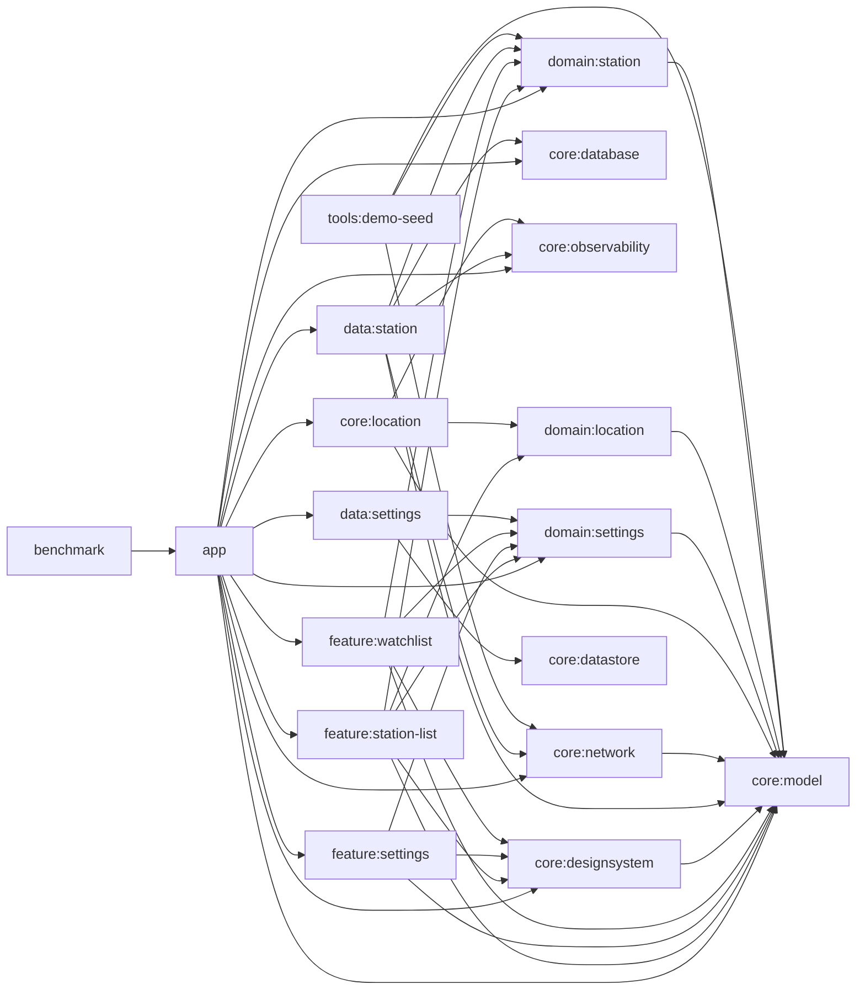

# 아키텍처

이 문서는 현재 코드 기준 GasStation의 모듈 그래프와 런타임 흐름을 설명하는 단일 출처입니다. 제품 소개나 검증 명령은 `README.md`와 `docs/verification-matrix.md`에 두고, 여기서는 "어디가 무엇을 소유하는가"와 "데이터가 어떻게 흐르는가"에 집중합니다.

## 용어 정리

| 용어 | 뜻 |
| --- | --- |
| watchlist(관심) | UI에서 저장한 주유소를 비교하는 기능. 코드와 모듈 이름은 `watchlist`, 화면 문구는 "관심"을 사용 |
| 스냅샷 | 특정 캐시 버킷에 대해 마지막으로 저장한 주유소 목록 |
| 스냅샷 마커 | `station_cache_snapshot` 한 행. 빈 결과도 "성공한 조회"로 구분하기 위해 따로 유지 |
| stale | 저장된 결과는 있지만 `StationCachePolicy` 기준 5분을 넘긴 상태 |
| 주소 라벨 | 현재 좌표를 지오코더로 변환한 표시용 주소. 목록에서는 `서울특별시 강남구 역삼동`처럼 행정동까지만 보여줌 |

## 모듈 그래프

```mermaid
flowchart LR
    app["app"] --> fstation["feature:station-list"]
    app --> fsettings["feature:settings"]
    app --> fwatch["feature:watchlist"]
    app --> dstation["data:station"]
    app --> dsettings["data:settings"]
    app --> cdesign["core:designsystem"]
    app --> clocation["core:location"]
    app --> cnetwork["core:network"]
    app --> cdatabase["core:database"]
    app --> cmodel["core:model"]
    app --> cobserve["core:observability"]
    app --> domSettings["domain:settings"]
    app --> domStation["domain:station"]

    fstation --> domSettings
    fstation --> domStation
    fstation --> domLocation["domain:location"]
    fstation --> cdesign
    fstation --> cmodel

    fsettings --> domSettings
    fsettings --> cdesign
    fsettings --> cmodel

    fwatch --> domStation
    fwatch --> domSettings
    fwatch --> cmodel
    fwatch --> cdesign
    cdesign --> cmodel

    dstation --> domStation
    dstation --> cnetwork
    dstation --> cdatabase
    dstation --> cmodel
    dstation --> cobserve

    dsettings --> domSettings
    dsettings --> cstore["core:datastore"]

    cnetwork --> cmodel

    clocation --> domLocation
    clocation --> cmodel
    clocation --> cobserve
    domSettings --> cmodel
    domLocation --> cmodel
    domStation --> cmodel

    tools["tools:demo-seed"] --> cnetwork
    tools --> domStation
    tools --> cmodel
    benchmark["benchmark"] --> app
```

## 모듈별 책임

| 모듈 | 책임 |
| --- | --- |
| `app` | Hilt 조립, startup hook 실행, navigation, flavor별 바인딩, first-content startup reporting bridge, 외부 지도 런처 연결, Logcat 기반 이벤트 로거 연결, flavor별 `CrashReporter` 구현(NoOp/Logcat) Hilt 바인딩 |
| `feature:station-list` | 권한/GPS/위치/새로고침을 포함한 목록 화면 상태와 effect 처리 |
| `feature:settings` | 설정 요약 목록과 상세 선택 화면 렌더링, 같은 `SettingsViewModel` 공유 |
| `feature:watchlist` | 저장한 주유소 비교 화면 렌더링 |
| `domain:location` | `LocationRepository`, 위치 permission/result 모델, 위치 조회/availability 유스케이스 |
| `domain:settings` | `SettingsRepository`, `UserPreferences`, 관찰/업데이트 유스케이스 |
| `domain:station` | `StationRepository`, 검색/비교 유스케이스, 도메인 모델, `StationEvent`/`StationEventLogger` 이벤트 계약 |
| `data:settings` | DataStore data source를 domain `UserPreferences`로 매핑하는 설정 저장소 구현 |
| `data:station` | Room 스냅샷/히스토리/watchlist와 원격 조회를 조합하는 저장소 구현, 검색 결과/watchlist 읽기 모델 조립, 일시적 refresh 실패 1회 재시도, 성공 refresh 이후 캐시 정리 |
| `core:model` | `Coordinates`, `DistanceMeters`, `MoneyWon` 값 객체, `Coordinates.distanceTo`, `Brand.fromCode`, `Brand`, `BrandFilter`, `FuelType`, `MapProvider`, `SearchRadius`, `SortOrder` 공유 enum vocabulary |
| `core:observability` | `CrashReporter` 같은 SDK-agnostic 관찰/진단 계약 |
| `core:designsystem` | `GasStationTheme`, Urban Signal 색상/타이포/spacing token, bottom/top chrome, metric/row/guidance 공유 UI primitive, 실제 브랜드 drawable 매핑 |
| `core:location` | `domain:location` 구현체, Android 위치 provider, availability flow, API 33+ 지오코더 callback과 pre-33 fallback, Android 주소 후보를 domain 정규화 규칙으로 변환, `DemoLocationOverride` 계약, repository/provider Hilt 바인딩 |
| `core:network` | direct Opinet과 proxy 두 endpoint 모드를 `StationNetworkSource` 계약으로 추상화(`NetworkStationFetcher` vs `ProxyStationFetcher`), Opinet Retrofit 서비스, 로컬 KATEC 변환, 원격 fetcher. `FuelType`, `SearchRadius` 같은 공유 검색 입력만 받아 원격 DTO를 정규화. endpoint 모드와 base URL은 `app`이 주입한 `NetworkRuntimeConfig`만 따름 |
| `core:database` | Room DB, DAO, migration |
| `core:datastore` | storage-local `StoredUserPreferences` DataStore와 커스텀 serializer. 선호값은 primitive/string enum name으로 저장 |
| `tools:demo-seed` | Opinet 결과를 기준으로 demo seed JSON을 다시 생성하는 JVM CLI |
| `benchmark` | `demo` 경로를 대상으로 startup-to-first-content, list scroll, refresh, watchlist 진입 macrobenchmark와 baseline profile journey 측정 |

## 의존성 해석 기준

문서의 모듈 그래프는 Gradle 프로젝트 간 연결(`implementation(project(...))`, benchmark의 `targetProjectPath`)을 기준으로 맞춥니다. `core:model`은 좌표/거리/가격 값 객체, 거리 계산, 브랜드 fallback, 브랜드/유종/설정 enum vocabulary를 공유하므로 `core:network`, `core:designsystem`, `domain:settings`, `data:station`이 `domain:station`을 거치지 않고 이 모듈에 직접 의존합니다. `domain:settings`의 `UserPreferences` public model은 `core:model` enum을 노출하므로 `domain:settings`는 `core:model`을 public API로 게시합니다. `core:datastore`는 storage-local DTO만 저장하고, `data:settings`가 이를 `domain:settings.UserPreferences`로 매핑하므로 storage module은 domain settings model에 의존하지 않습니다. `core:designsystem`은 `Brand`와 `BrandFilter`를 리소스/표시 라벨에 매핑하지만 주유소 검색 정책이나 화면 상태는 소유하지 않습니다. 반대로 저장소 구현(`data:station`)은 위치 인프라를 직접 알 필요가 없으므로 `core:location`에 의존하지 않고, 위치는 `feature:station-list -> domain:location -> core:location` 경로로만 들어옵니다.

## Presentation hierarchy

화면 정보 위계는 `core:designsystem`의 공통 primitive를 먼저 통과합니다. canvas는 `#FFFCF2`, black chrome은 `#222222`, yellow decision signal은 `#FFDC00`입니다. 가격과 거리처럼 비교 판단에 쓰이는 숫자는 metric primitive를 사용하고, Nearby/Watchlist는 borderless row, Settings는 flat row, 권한/GPS/loading/empty/failure는 guidance primitive, stale/approximate는 status banner로 표현합니다.

이 primitive들은 배치와 텍스트 역할만 소유합니다. "브랜드 label을 숨긴다", "GPS가 loading보다 먼저 보인다", "어떤 실패 문구를 쓴다" 같은 화면별 판단은 계속 `feature:*`가 소유합니다.

화면별 핵심 계약:

- `feature:station-list`: 32sp 가격을 첫 번째 읽기 대상으로 두고, 거리와 역명을 이어 보여줍니다. 브랜드는 실제 drawable 아이콘만 노출하고 visible brand label은 렌더링하지 않습니다.
- Station-list 파일 소유: `StationListScreen.kt`는 screen scaffold와 refresh를, `StationListFilterRail.kt`와 `StationListFilterMenu.kt`는 filter chip과 anchored menu를, `StationListCards.kt`는 borderless row와 watch toggle을, `StationListPriceHistoryUiModel.kt`는 명시적인 가격 이력 표시 상태를, `StationListStates.kt`는 permission/GPS/loading/empty/failure 안내를, `StationListQuerySummary.kt`와 `StationListBodyState.kt`는 typed summary와 body 분기를 맡습니다.
- `feature:watchlist`: 28sp 가격과 108–116dp 기본 row로 저장 항목을 비교합니다. 실제 brand icon만 보여주며 visible label은 반복하지 않고, 200% 글꼴에서는 row가 확장되어 scroll됩니다.
- `feature:settings`: 설정 main/detail 모두 shared row rhythm을 쓰되, 값 저장은 기존 `domain:settings` update use case 경로를 유지합니다.
- `app`: `주변·관심·설정` bottom navigation의 tab별 state/scroll을 `saveState`/`restoreState`로 보존하고 SettingsDetail에서만 bottom navigation을 숨깁니다.

브랜드 자산은 생성하거나 recolor하지 않습니다. RTO/RTX/NHO는 `ic_rtx`, ETC는 `ic_etc`, SKE/GSC/HDO/SOL/E1G/SKG는 각 checked-in drawable을 사용합니다.

실제 주유소 identity는 `Brand.RTO`, `Brand.RTX`, `Brand.NHO`로 보존합니다. 선택 UI만 `BrandFilter.ALTEUL` 하나로 그룹화하고 `matches()`가 세 identity를 모두 포함합니다. 화면에 표시하는 이름과 drawable은 계속 개별 `Brand`가 결정하며, `BrandFilter.ETC`는 선택 목록의 마지막에 둡니다.

## Launch splash

`MainActivity`는 `super.onCreate()` 직전에 AndroidX `installSplashScreen()`을 호출합니다. API 24–30은 launcher yellow와 정적 검정 물방울을, API 31 이상은 같은 final symbol의 300ms `Signal Pulse` AVD를 사용합니다. 첫 Activity frame이 준비되면 app-owned `SplashExitAnimator`가 180ms fade/scale exit를 적용하며, system animator scale이 0이면 즉시 제거합니다. Splash는 permission, location, demo seed, preferences, network readiness를 기다리지 않습니다.

## 런타임 흐름

### 1. 목록 화면

1. `GasStationNavHost`가 시작 화면으로 `StationListRoute`를 띄웁니다.
2. Route는 위치 권한 상태를 `StationListViewModel` 액션으로 전달하고, started 구간에서 위치 availability 수집을 시작합니다. 앱 진입은 Android permission dialog를 열지 않습니다. 권한 안내 CTA만 permission request를 시작하며, terminal denial이 두 번 이상이고 rationale을 더 보여 줄 수 없으면 같은 CTA가 앱 설정 화면을 엽니다.
3. ViewModel은 `LocationStateMachine`을 통해 `ObserveLocationAvailabilityUseCase`와 새로고침 시점의 `GetCurrentLocationUseCase`를 다루고, 별도로 `ObserveUserPreferencesUseCase`를 구독합니다. DataStore의 첫 선호값 emission이 readiness 경계이므로 Nearby는 그 전 `UserPreferences.default()`를 렌더링하거나 action에 쓰지 않습니다.
4. 위치 조회가 성공하면 현재 좌표를 먼저 검색에 연결하고, `GetCurrentAddressUseCase` 주소 라벨 조회는 non-blocking 표시용 context로 뒤따릅니다. `core:location`은 Android 주소 후보를 `domain:location` 정규화 함수로 변환하고, `LocationStateMachine`은 정규화된 라벨을 표시용으로 저장합니다.
5. `StationListViewModel`은 permission, GPS, 현재 좌표, loaded preferences가 모두 준비된 경우에만 검색 입력(`radius`, `fuelType`, `brandFilter`, `sortOrder`)으로 active `StationQuery`를 만듭니다. denied permission은 body state에서 가장 먼저 평가되어 demo override, retained coordinate, cache result, auto/manual refresh보다 우선합니다. GPS 비활성화는 permission과 별도 body state와 location-settings CTA를 사용합니다. `StationSearchOrchestrator`는 usable location으로 만든 query만 관찰하고 `ObserveNearbyStationsUseCase` 결과, cache snapshot state, pending blocking refresh failure를 조합합니다.
6. 현재 좌표가 유지된 상태에서 반경, 유종, 브랜드, 정렬 조건이 바뀌면 ViewModel은 active query를 새 조건으로 전환하고 `RefreshNearbyStationsUseCase`를 호출합니다. 브랜드 필터와 정렬은 캐시 키에는 없지만, 화면은 새 조건으로 즉시 읽기 모델을 다시 만들고 원격 성공 시 같은 버킷 스냅샷을 최신 데이터로 교체합니다.
7. `DefaultStationRepository.observeNearbyStations()`는 Room 스냅샷, watch 상태, 가격 히스토리를 결합해 `StationSearchResult`를 만듭니다.
8. ViewModel은 loading flag, 사용자 action dispatch, one-shot effect, 최종 `StationListUiState` 조합을 맡고, UI는 목록, stale 배너, 전면 오류, snackbar, 외부 지도 effect를 구분해 렌더링합니다. 목록 row의 브랜드 영역은 실제 브랜드 아이콘만 보여주고 브랜드 텍스트는 생략합니다.

첫 usable content가 렌더링되면 `feature:station-list`가 순수 policy로 이 상태를 판단하고, `app`의 Compose host가 그 신호를 받아 `reportFullyDrawn()`을 한 번 호출합니다. 이 연결은 startup metric 보고용이며, 검색 정책이나 cache/stale 판단은 계속 feature/data/domain 경계에 남습니다.

### 2. 새로고침과 실패 처리

1. 새로고침은 먼저 현재 위치를 얻습니다.
2. 위치 조회 계약은 `domain:location`의 `GetCurrentLocationUseCase`가 담당하고, 실제 구현은 `core:location`의 `DefaultLocationRepository`가 제공합니다.
3. `demo`에서는 `DemoLocationOverride`가 approximate 또는 precise grant 뒤에만 고정 좌표를 공급하고, 새로고침 자체는 seed 기반 `SeedStationRemoteDataSource`를 통해 같은 저장소 갱신 경로를 탑니다. permission denial은 이 override보다 먼저 종료됩니다.
4. `prod`에서는 `ForegroundLocationProvider`가 성공, timeout, unavailable, permission denied, 예외를 `LocationLookupResult`로 돌려줍니다.
5. `refreshNearbyStations()`는 원격 조회를 `StationRetryPolicy`로 감싸고, `Timeout`/`Network` 실패만 500ms 뒤 한 번 재시도합니다. `InvalidPayload`, `Unknown`, cancellation은 재시도하지 않습니다.
6. 성공 시 저장소는 스냅샷과 가격 히스토리를 갱신하고, `StationCachePolicy.retainFor` 기준 7일보다 오래된 캐시 행과 스냅샷 마커를 정리합니다.
7. 최종 실패 시 `StationRefreshException(reason)`이 올라오고, 기존 캐시는 그대로 유지됩니다.
8. 전면 실패 여부는 `StationListUiState.blockingFailure`와 `StationSearchResult.hasCachedSnapshot` 조합으로 결정합니다.

중요한 점은 `fetchedAt`만으로 캐시 존재를 판단하지 않는다는 것입니다. 코드가 실제로 보는 기준은 `StationSearchResult.hasCachedSnapshot`이며, 이 값은 `station_cache_snapshot` 행 존재 여부와 맞물립니다.

### 3. 설정 화면

1. `SettingsRoute`는 DataStore의 첫 선호값 emission 전에는 loading만 렌더링하고 action을 받지 않습니다. emission 뒤에는 설정 요약 목록을, `SettingsDetailRoute`는 항목별 상세 선택 화면을 렌더링합니다. 이 경계 전 `UserPreferences.default()`는 화면 기본값으로 사용하지 않습니다.
2. 상세 화면은 별도 ViewModel을 만들지 않고, `GasStationNavHost`에서 settings back stack owner를 공유받아 같은 `SettingsViewModel`을 사용합니다.
3. 사용자가 값을 바꾸면 `UpdateFuelTypeUseCase`, `UpdateSearchRadiusUseCase`, `UpdateBrandFilterUseCase`, `UpdateMapProviderUseCase`, `UpdatePreferredSortOrderUseCase` 같은 명시적 설정 유스케이스를 통해 `UserPreferences`가 갱신됩니다. mutation은 DataStore가 실제로 commit한 값을 반환하며, Settings detail은 그 성공 반환 뒤에만 목록으로 돌아갑니다. 실패하면 detail은 이전 값을 유지한 채 실패를 표시합니다. 목록 화면, 관심 화면의 유종 context, 외부 지도 handoff도 같은 committed 값을 반영합니다.
4. 지도 provider의 현재 Kakao identity는 `KAKAO_MAP`입니다. `data:settings`는 legacy 저장값 `KAKAO_NAVI`를 `KAKAO_MAP`으로 읽고, 다음 쓰기부터 현재 enum name을 저장합니다.

### 4. watchlist(관심) 화면

1. 목록 화면이 전달한 최신 좌표는 app navigation state의 payload로 유지됩니다. 좌표가 없으면 관심 tab은 disabled semantics를 노출하며, 좌표가 바뀌면 이전 concrete route를 제거하고 새 payload route로 이동합니다.
2. `WatchlistViewModel`은 `SavedStateHandle`에서 기준 좌표를 읽고 `ObserveUserPreferencesUseCase`의 선택 유종을 결합해 `WatchlistQuery(origin, fuelType)`로 `ObserveWatchlistUseCase`를 구독합니다.
3. 저장소는 `watched_station`, 선택 유종의 station별 최신 캐시, 같은 유종의 가격 히스토리를 조합해 `WatchedStationSummary`를 만듭니다. 최신 캐시는 DAO가 stationId 선행 index와 deterministic tie-breaker로 station별 한 행만 반환합니다.
4. 선택 유종의 캐시와 히스토리가 모두 없어도 저장 당시 identity·좌표·브랜드를 유지하고 nullable price를 명시적 unavailable 상태로 렌더링합니다. 반경·브랜드 필터·Nearby 정렬은 저장 항목을 제거하거나 watched-time 순서를 바꾸지 않습니다.
5. 설정 또는 watchlist 관찰이 실패하면 `WatchlistUiState.loadFailed`로 전면 실패와 retry action을 노출하며, retry는 두 흐름을 처음부터 다시 구독합니다.
6. 화면은 별도 위치 조회, refresh session, snackbar undo 없이 summary와 저장 행을 렌더링합니다. 이 좌표 payload는 navigation state이며 검색/위치 비즈니스 정책은 아닙니다.

### 5. 외부 지도 handoff

1. `GasStationNavHost`는 committed `UserPreferences.mapProvider`를 Nearby row click의 `ExternalMapLauncher` 호출에 전달합니다.
2. `IntentExternalMapLauncher`는 TMAP(`com.skt.tmap.ku`), 카카오맵(`net.daum.android.map`), 네이버 지도(`com.nhn.android.nmap`) package를 route intent에 명시합니다. NAVER URI의 `appname`은 runtime application ID입니다.
3. route 실행이 불가능하면 Play Store app URI, HTTPS Store 순으로 fallback합니다. `ActivityNotFoundException`과 `SecurityException`은 다음 fallback으로 이어지고, 모든 경로가 실패한 `ExternalMapLaunchResult.Failed`는 feature callback의 `false`와 사용자 feedback으로 변환됩니다.

## flavor와 startup hook

| flavor | startup hook | 실제 동작 |
| --- | --- | --- |
| `demo` | `DemoSeedStartupHook` | DB 비우기 -> seed 적재 -> `UserPreferences.default()`로 재설정 |
| `prod` | `ProdSecretsStartupHook` | 사용자 로컬 `opinet.apikey` 존재 확인 |

추가로 `demo`는 다음 두 바인딩이 함께 들어갑니다.

- `DemoLocationModule`: permission grant 뒤 강남역 2번 출구 고정 좌표를 위치로 공급
- `DemoStationRemoteDataSourceModule`: seed 자산 기반 원격 데이터 소스를 optional binding으로 주입

## 핵심 구현 결정

- 스냅샷 저장은 `station_cache`와 `station_cache_snapshot` 두 테이블로 나눕니다.
  이유: 빈 결과도 "성공한 마지막 조회"로 남겨야 하기 때문입니다.
- 캐시 키는 위치 버킷(250m), 반경, 유종만 포함합니다.
  브랜드 필터와 정렬은 읽기 모델에서 적용해 캐시 재사용률을 높입니다.
- 위치 좌표는 앱 안에서 WGS84 -> KATEC으로 변환한 뒤 Opinet에 넘깁니다.
  별도 좌표 변환 API를 호출하지 않습니다.
- Opinet base URL이 HTTP를 사용하므로 앱 network security config는 cleartext 예외를 `www.opinet.co.kr` 정확한 도메인에만 둡니다.
- `prod` API key는 `BuildConfig`를 통해 클라이언트에 들어가므로 APK에서 완전히 숨길 수 있는 secret boundary가 아닙니다. 현재 범위에서는 수용하지만 공개 서비스 배포 전에는 backend proxy, key restriction, quota monitoring을 별도 설계합니다.
- 원격 조회 endpoint는 `core:network`의 `StationNetworkSource`로 추상화하고, `StationEndpointMode.DirectOpinet`(기본)와 `Proxy` 중 무엇을 쓸지는 `app/src/main/java/com/gasstation/di/AppConfigModule.kt`가 `BuildConfig.STATION_ENDPOINT_MODE`/`PROXY_BASE_URL`(Gradle property `gasstation.stationEndpointMode`/`gasstation.proxyBaseUrl`)로 결정해 `NetworkRuntimeConfig`로 주입합니다. proxy 모드에서는 `NetworkModule.requireValidProxyBaseUrl`이 `/`로 끝나는 절대 http(s) URL만 통과시키고 blank/malformed base URL은 Retrofit 생성 전에 설정 오류로 거부합니다. proxy 서버 자체는 배포돼 있지 않으며 승격 조건은 `docs/adr/2026-05-18-backend-proxy-escalation.md`를 따릅니다.
- 로컬 Room/DataStore 상태는 재생성 가능한 캐시와 reference watchlist/settings로 보고 Android backup/data extraction을 비활성화합니다.
- 현재 주소는 검색 입력이 아니라 표시용 컨텍스트입니다. 지오코더가 도로명, 국가 코드, 건물 동을 섞어 주더라도 목록 상단에는 행정동 단위 라벨만 노출합니다.
- API 33 이상 주소 조회는 지오코더 callback API를 coroutine으로 감싸고, pre-33은 기존 동기 API를 I/O dispatcher에서 fallback으로 사용합니다. callback error는 `LocationAddressLookupResult.Error`, 성공했지만 빈 결과는 `Unavailable`, cancellation은 그대로 전파됩니다.
- `UserPreferences`는 Proto가 아니라 커스텀 key-value serializer를 쓰는 DataStore로 저장합니다. 저장 모듈은 `StoredUserPreferences` string DTO만 알고, enum name의 domain fallback은 `data:settings` mapper가 담당합니다.
- Kakao provider는 `KAKAO_MAP`을 현재 저장 identity로 사용합니다. `data:settings`는 legacy `KAKAO_NAVI`를 읽을 때만 migration하고 새 쓰기는 현재 이름만 저장합니다.
- 외부 지도 route intent는 provider package를 명시합니다. NAVER는 runtime application ID를 `appname`으로 직렬화하고, app route -> Play Store app URI -> HTTPS Store 순으로 fallback한 뒤 최종 실패를 UI에 반환합니다.
- `StationEvent` 계약은 `SearchRefreshed`, `WatchToggled`, `CompareViewed`, `ExternalMapOpened`, `RefreshFailed`, `LocationFailed`, `RetryAttempted`를 정의합니다. 실제 emit 경로는 저장소 refresh 성공, watch toggle, watchlist 비교 표시, 외부 지도 handoff 요청, refresh 실패, 위치 실패, retry 결과이며, Logcat 구현은 모든 variant를 문자열로 매핑합니다. 이벤트 로깅 중 일반 예외는 사용자 흐름이나 저장소 성공을 실패로 바꾸지 않도록 격리하지만, cancellation과 fatal error는 삼키지 않습니다.
- release build는 R8 minification을 켜지만, resource shrinking은 splash/icon/external map 리소스 확인 전까지 의도적으로 보류합니다.
