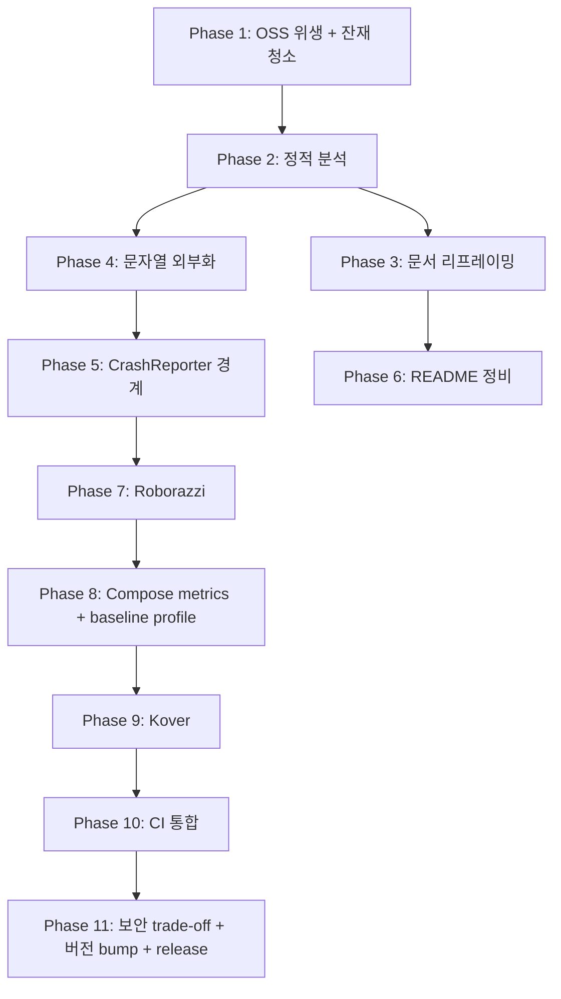

# GasStation Production Baseline (v1.1) — 설계 스펙

> 작성일: 2026-05-11
> 기준 커밋: `main` (`1.0.2`, `versionCode 3`)
> 목표 버전: `1.1.0` (`versionCode 4`)
> 본 문서는 단일 출처 스펙이며, 구현 단계의 task 분해와 명령은 [`docs/superpowers/plans/2026-05-11-production-baseline.md`](../plans/2026-05-11-production-baseline.md)가 소유한다.

---

## 1. 배경과 동기

GasStation은 한국 운전자가 현재 위치 기반으로 가까운 주유소를 가격, 거리, 브랜드, 유종, 북마크 상태, 외부 지도 연결 기준으로 비교하는 Android 앱이다. 1.0.x 라인은 멀티모듈/클린아키텍처, demo/prod 정식 경로, Room 캐시 정책, Compose UI, 자체 검증 매트릭스를 갖춘 baseline을 확립했다.

이 스펙은 GasStation을 "프로덕션 안드로이드 앱이 갖춰야 하는 운영 위생, 정적 검증, 화면 회귀 보호, 국제화 준비, 장애 보고 인프라"를 모두 충족하는 1.1 baseline으로 격상한다. 동시에 기존 문서에서 reference/portfolio/reviewer/interviewer 같은 작업 맥락에 종속된 표현을 제거하고, "실사용자를 위한 안드로이드 앱"이라는 단일 프레이밍으로 정렬한다.

## 2. 현재 상태 진단

### 2.1 강점 (유지)

- 17개 활성 Gradle 모듈, convention plugin으로 build script 단일화
- `feature -> domain -> data -> core` 단방향 의존, `core:model` 공유
- `LocationStateMachine` + `StationSearchOrchestrator`로 ViewModel 책임 분리
- `station_cache_snapshot`으로 "성공한 빈 결과"와 "캐시 자체 없음" 구분
- demo/prod 모두 정식 실행 경로, demo는 deterministic seed
- Hilt 조립을 `app`에 격리, R8 minify on, backup 비활성화, cleartext 화이트리스트
- 단위/Robolectric/기기/매크로벤치마크의 4단계 검증

### 2.2 결핍 (이번 스펙 범위)

- 정적 분석/포맷터 부재 (Spotless, ktlint, detekt, compose lint 모두 없음)
- `LICENSE`, PR/Issue 템플릿, `CONTRIBUTING.md`, dependabot 등 OSS 위생 결핍
- Compose 화면 회귀 테스트 부재 (디자인시스템 공유 primitive를 보유했음에도 시각 회귀 보호 없음)
- 사용자 노출 문자열이 Kotlin 코드에 하드코딩, `strings.xml`/`i18n` 경로 미개통
- 장애 보고/원격 분석 추상화 부재 (`StationEventLogger`가 Logcat 단일 구현)
- CI가 unit test + assemble만 실행. lint, spotless check, release minify, 화면 회귀, 커버리지 누락
- README 영문 진입점, 동영상/GIF, 5분 코드 투어, 배지 부재
- Compose stability metrics와 baseline profile 결과물이 repo에 노출되지 않음
- `core/common`, `core/ui` 등 미사용 디렉토리 잔재
- 운영 문서 전반에서 "포트폴리오/reference/reviewer" 프레이밍이 제품 정의를 흐림

## 3. 목표

1. **단일 정적 분석 파이프라인**: 모든 모듈이 `spotlessCheck`, `ktlintCheck`, Android `lint`를 동일 옵션으로 통과한다.
2. **OSS 위생 baseline**: `LICENSE`, `CONTRIBUTING.md`, PR/Issue 템플릿, `dependabot.yml`이 존재한다.
3. **화면 회귀 보호**: `core:designsystem` 핵심 primitive와 `feature:station-list` 주요 상태를 Roborazzi 골든 이미지로 보호한다.
4. **국제화 준비 완료**: 사용자 노출 문자열은 모두 `strings.xml`에 존재하고, ViewModel은 `StringResource`(또는 `@StringRes`) ID만 emit한다. ko가 기본 locale로 명시되고 en strings 한 세트가 동반된다.
5. **장애 보고 추상화**: `CrashReporter`, `nonFatal(throwable, metadata)` 계약이 도메인에 있고, `app`에서 demo는 NoOp, prod는 Logcat-stub 구현을 바인딩한다. 추후 Firebase Crashlytics 등으로 교체 가능한 단일 경계만 노출한다.
6. **확장된 CI**: PR마다 unit + lint + spotless + release minify + screenshot regression + Kover coverage가 실행되고, 결과 아티팩트가 PR에 첨부된다.
7. **Compose 품질 가시화**: Compose stability metrics가 `docs/compose-metrics/`에 commit되고, baseline profile이 `app/src/main/baseline-prof.txt`로 commit되며 startup metric이 README에 표로 노출된다.
8. **README 첫 인상 정비**: 영문 elevator pitch 5줄, 배지, 데모 GIF, 5분 코드 투어, module graph PNG가 README에 포함된다.
9. **i18n 운영 경로**: hard-coded 문자열 제거 + Compose `stringResource(...)`로 통일.
10. **문서 리프레이밍**: README/AGENTS/.impeccable/architecture/agent-workflow/module-contracts/state-model/offline-strategy/test-strategy/verification-matrix/improvement-analysis/deep-analysis-report에서 "포트폴리오/reference/reviewer/interviewer/면접" 프레이밍을 제거하고 "한국 운전자용 안드로이드 앱"으로 정렬한다. 단, `docs/superpowers/specs/`와 `docs/superpowers/plans/`의 과거 히스토리는 보존한다.
11. **보안 trade-off 단일 출처**: `docs/security-trade-offs.md`를 신설해 API key 노출, cleartext, backup 비활성화 결정의 근거/현 한계/승격 조건을 명시한다.
12. **잔재 청소**: `core/common`, `core/ui` 미사용 디렉토리 제거 + `.gitignore` 정비.
13. **버전 bump**: `versionCode = 4`, `versionName = "1.1.0"`. CHANGELOG와 release note 작성.

## 4. 비목표

- 새로운 사용자 기능 추가 (지도 임베드, 회원 가입, 즐겨찾기 동기화 등).
- backend proxy 도입 — `docs/security-trade-offs.md`에 승격 조건만 명시, 구현은 별도 스펙.
- Firebase Crashlytics 실제 SDK 통합 — 추상화 경계까지만 만들고 구현은 환경 결정 후.
- 영문 사용자 번역 품질 보증 — en `strings.xml`은 string id 커버리지를 100%로 만들고, 카피 품질 검수는 별도 작업.
- 다크 모드 출시 — yellow/black/white identity 유지. semantic color 마이그레이션은 별도 backlog.
- Gradle parallel/configuration-cache 활성화 — correctness가 아닌 속도 작업. 별도 후속.
- Renovate 도입 (dependabot으로 충분).
- 17개 모듈 재편 — 현 구조 유지.

## 5. 이해관계자

- **사용자**: 한국 운전자. 가격/거리 기반 빠른 비교, 외부 지도 길찾기 연결. 변경 없음.
- **앱 개발자**: 단일 명령으로 `spotlessApply`, `ktlintFormat`, `lint`, `roborazziDebug`를 돌려 회귀를 사전 차단한다.
- **머지 검토자**: PR 페이지에서 CI 그린, screenshot diff, lint 보고서를 일관된 위치에서 확인한다.

## 6. 영역별 요구사항

### R1. OSS / 저장소 위생

- R1.1 `LICENSE`는 MIT 텍스트로 저장. 저작권자 `kws`, 연도 `2026`.
- R1.2 `README.md` 상단에 라이선스 배지 + CI 배지 + Kotlin/AGP/minSdk 배지 5개 라인.
- R1.3 `.github/PULL_REQUEST_TEMPLATE.md`는 변경 요약, 사용자 영향, 검증 명령, 문서 갱신 체크리스트를 포함.
- R1.4 `.github/ISSUE_TEMPLATE/bug_report.md`, `.github/ISSUE_TEMPLATE/feature_request.md` 두 파일.
- R1.5 `.github/dependabot.yml`은 `gradle` ecosystem `daily`, `github-actions` ecosystem `weekly`로 설정.
- R1.6 `CONTRIBUTING.md`는 `AGENTS.md`의 운영 계약 일부를 외부 기여자용으로 발췌(검증 명령, 커밋 컨벤션, PR 절차).
- R1.7 `core/common`, `core/ui` 빈 디렉토리 삭제. `.gitignore`에서 IDE 산출물 정비.

### R2. 정적 분석 파이프라인

- R2.1 `build-logic/convention`에 `GasStationSpotlessConventionPlugin` 추가. 모든 Android/JVM 모듈 convention plugin이 이 plugin을 자동 적용.
- R2.2 ktlint version은 `gradle/libs.versions.toml`에 명시. 현 표준: `1.5.0` 이상 최신.
- R2.3 spotless format 대상: `**/*.kt`, `**/*.kts`, `*.md` (license header 제외). Kotlin은 `ktlint`로 포맷.
- R2.4 `.editorconfig`는 Kotlin official style + max line length 140 + indent 4 + final newline.
- R2.5 모든 모듈 `build.gradle.kts`는 `lint { warningsAsErrors = false; abortOnError = true; checkDependencies = true }`. `lint.xml`은 false-positive만 ignore.
- R2.6 `:app:lint`, `:app:lintDemoDebug`가 CI에서 통과.
- R2.7 신규 task: `./gradlew spotlessApply ktlintFormat lint` 명령으로 전체 정렬 가능.
- 완료 기준: `./gradlew spotlessCheck ktlintCheck lint`가 cold cache에서 통과. CI에 추가됨.

### R3. 화면 회귀 (Roborazzi)

- R3.1 Roborazzi `1.+ stable` 의존성을 catalog 등록.
- R3.2 `build-logic/convention`에 `GasStationRoborazziConventionPlugin` 추가. Compose library 모듈만 opt-in.
- R3.3 첫 적용 대상: `core:designsystem`의 `GasStationMetricBlock`, `GasStationStatusBanner`, `GasStationGuidanceCard`, `GasStationRow`, `GasStationSupportingInfo`, station card 골든 이미지.
- R3.4 두 번째 적용 대상: `feature:station-list`의 `StationListScreen`을 4개 상태(empty/loading-with-cache/stale/error)로 캡처.
- R3.5 골든 이미지는 `core/designsystem/src/test/snapshots/`, `feature/station-list/src/test/snapshots/`에 commit.
- R3.6 비교 방식: pixel-perfect (`compareOnly` X). 실패 시 PR에 diff PNG 첨부.
- R3.7 CI에서 `:core:designsystem:verifyRoborazziDebug`, `:feature:station-list:verifyRoborazziDebug` 실행.
- 완료 기준: 신규 추가 화면도 같은 plugin opt-in으로 골든 가능. CI 통과.

### R4. 국제화 / 문자열 외부화

- R4.1 모든 사용자 노출 문자열은 `*/src/main/res/values/strings.xml`로 이전. 한국어가 default. `values-en/strings.xml`에 영문 한 세트.
- R4.2 ViewModel은 `StringResource` sealed interface 또는 `@StringRes Int` + 인자(`vararg Any`)만 emit. Compose 레이어에서 `stringResource(id, *args)`로 렌더.
  - 신규 인터페이스: `core/ui/StringResource.kt` — `data class FromId(@StringRes val id: Int, val args: List<Any> = emptyList()) : StringResource` 형태.
  - **결정**: 새 모듈 `core:ui`를 다시 만들지 않고, `core:designsystem`이 `StringResource` 추상화를 소유한다. 디자인시스템이 이미 모든 feature가 의존하는 공유 UI 경계이므로 추가 모듈을 만들지 않는다.
- R4.3 `feature:station-list`의 `"위치 권한을 허용해주세요."`, `"현재 위치 확인이 지연되고 있습니다."`, `"현재 위치를 확인하지 못했습니다."`, `"서버 응답이 늦어 가격을 새로고침하지 못했습니다."`, `"주유소 목록을 새로고침하지 못했습니다."`는 string resource id로 이전.
- R4.4 `StationListEffect.ShowSnackbar`는 `String`이 아닌 `StringResource`를 보유.
- R4.5 `Activity`/Compose context는 `StringResource.resolve(context: Context): String` extension으로 평가.
- R4.6 `feature:settings`, `feature:watchlist`, `app`의 사용자 노출 문자열도 동일하게 이전.
- R4.7 `AndroidManifest.xml` 안의 라벨, splash 텍스트도 strings.xml 참조.
- R4.8 `lint`에서 `MissingTranslation`은 warning, `HardcodedText`는 error.
- 완료 기준: `rg -n "\"[가-힣].*\"" --type kt feature app | wc -l`로 도출되는 ko literal이 0. en strings에 동일 id 100%.

### R5. CrashReporter 추상화

- R5.1 `domain:station`에 `CrashReporter` 인터페이스 추가:
  ```kotlin
  interface CrashReporter {
      fun recordNonFatal(throwable: Throwable, metadata: Map<String, String> = emptyMap())
      fun log(message: String)
  }
  ```
- R5.2 demo 구현 `NoOpCrashReporter`: 모든 호출 무시.
- R5.3 prod 구현 `LogcatCrashReporter`: Timber로 ERROR 레벨 출력. 메타데이터는 key=value 형태로 메시지 prefix.
- R5.4 `data:station`의 `DefaultStationRepository`에서 cancellation이 아닌 refresh 실패 분기에서 `CrashReporter.recordNonFatal(...)` 호출. 단, `StationRefreshException`은 사용자 흐름 일부이므로 recordNonFatal에는 보내지 않는다.
- R5.5 `feature:station-list`의 `handleRefreshFailure`는 사용자 메시지만 담당. 비기대 throwable은 `viewModelScope` `CoroutineExceptionHandler`로 잡아 `CrashReporter`에 위임.
- R5.6 `core:location` `AndroidAddressResolver`의 IO/timeout이 아닌 예외(예: `IllegalStateException`)는 record.
- R5.7 향후 Firebase Crashlytics 등으로 교체 시 `app/src/prod/.../CrashReporterModule.kt`의 binding만 변경.
- 완료 기준: 단위 테스트가 NoOp/Logcat 구현 검증. 신규 호출 지점은 unit test로 보호.

### R6. CI 확장

- R6.1 `.github/workflows/android.yml`의 단일 job을 여러 job으로 분리:
  - `static-analysis`: `spotlessCheck`, `ktlintCheck`, `lint`
  - `unit-tests`: 현 verification matrix 명령
  - `screenshot-tests`: `verifyRoborazziDebug` 모듈 집합
  - `assemble`: `assembleDemoDebug`, `assembleProdDebug`, `assembleProdRelease`
  - `coverage`: `koverXmlReport` + Codecov upload
- R6.2 모든 job은 `gradle/actions/setup-gradle@v4`의 `cache-cleanup: on-success`로 read/write 캐시.
- R6.3 `screenshot-tests` 실패 시 `*/build/outputs/roborazzi/`를 artifact로 업로드.
- R6.4 PR comment에 coverage delta와 screenshot diff 링크를 첨부 (`actions/upload-artifact@v4` + 별도 PR-comment step).
- R6.5 `concurrency: { group: 'ci-${{ github.ref }}', cancel-in-progress: true }`로 중복 실행 차단.
- R6.6 `assembleProdRelease`는 R8 회귀 보호용. 매 PR 실행.
- R6.7 `pull_request` + `push`에 한정, schedule은 없음.
- 완료 기준: PR 페이지에서 5개 job이 보이고 그린.

### R7. Kover (커버리지)

- R7.1 root `build.gradle.kts`에 `id("org.jetbrains.kotlinx.kover")` 적용. 버전 catalog 등록.
- R7.2 `build-logic/convention`의 Android Library / JVM Library convention plugin이 kover를 자동 적용.
- R7.3 커버리지 exclude: generated, Hilt, navigation, Compose preview-only 파일.
- R7.4 `./gradlew koverHtmlReport koverXmlReport`로 통합 리포트 생성.
- R7.5 README에 커버리지 배지 (Codecov 또는 ShieldsIO + 자체 호스팅 percentage). 최소 baseline은 측정 후 결정, 80% 미만이면 별도 backlog.

### R8. Compose stability metrics + Baseline profile

- R8.1 모든 Compose library 모듈에 Kotlin Compose Compiler `reportsDestination`/`metricsDestination`를 `build/compose-reports/<module>/`로 설정.
- R8.2 `./gradlew assembleDemoDebug -Pcompose.reports=true` 실행 후 `core/designsystem`, `feature/station-list`, `feature/watchlist`, `feature/settings`의 stability 리포트를 `docs/compose-metrics/<module>.md`로 commit.
- R8.3 `feature/station-list`의 `StationListUiState`, `StationListItemUiModel`, `StationListBannerModel`, `StationListEffect` 가 `stable`로 분류되도록 `kotlin.compose.stability.config` 또는 data class immutability 보강.
- R8.4 Baseline profile: `:benchmark:connectedBenchmarkAndroidTest -Pandroidx.benchmark.enabledRules=BaselineProfile` (또는 `:app:generateBaselineProfile` 태스크)로 생성. 결과 `baseline-prof.txt`를 `app/src/main/`에 commit.
- R8.5 README에 cold/warm/hot startup 측정 값 표. 측정 환경은 README 부록.

### R9. README 정비

- R9.1 README 첫 섹션은 영문 elevator pitch 5줄 (제품 한 문장, 사용자, 핵심 차별, 기술 스택, 라이선스).
- R9.2 한국어 본문은 elevator 아래에 그대로 유지하되, "포트폴리오" 프레이밍 제거.
- R9.3 데모 GIF는 `docs/readme-assets/demo.gif` (10~15초). 미생성 상태면 `TODO`가 아닌 placeholder PNG와 함께 commit 후 follow-up issue 발급.
- R9.4 배지 5개 라인: `CI`, `License`, `Kotlin`, `Compose BOM`, `minSdk`.
- R9.5 5분 코드 투어 섹션: `App.kt → MainActivity → StationListRoute → StationListViewModel → StationSearchOrchestrator → DefaultStationRepository → NetworkStationFetcher` 7단계 경로, 각 단계 1줄 설명.
- R9.6 module graph는 mermaid + PNG 동시 노출. PNG는 `docs/readme-assets/module-graph.png`.
- R9.7 startup metric 표는 R8.5 결과로 채움.

### R10. 보안 trade-off 단일 출처

- R10.1 `docs/security-trade-offs.md` 신설. 항목:
  - Opinet API key를 client `BuildConfig`에 두는 결정과 한계
  - HTTP cleartext가 opinet 호스트로만 허용되는 이유와 https 마이그레이션 전제
  - Android backup 비활성화 근거
  - certificate pinning을 도입하지 않은 이유와 승격 조건
  - 향후 backend proxy 도입 시 변경할 모듈
- R10.2 README, AGENTS.md에서 보안 한계 언급은 본 문서로 링크.

### R11. 문서 리프레이밍

- R11.1 다음 문서에서 `포트폴리오/reference/reviewer/interviewer/면접` 관련 표현을 모두 제품 중심 표현으로 교체:
  - `README.md`, `AGENTS.md`, `.impeccable.md`, `CHANGELOG.md`
  - `docs/architecture.md`, `docs/agent-workflow.md`, `docs/module-contracts.md`(확인), `docs/state-model.md`(확인), `docs/offline-strategy.md`(확인), `docs/test-strategy.md`(확인), `docs/verification-matrix.md`(확인), `docs/project-reading-guide.md`(확인)
  - `docs/improvement-analysis.md`, `docs/deep-analysis-report.md`
- R11.2 `docs/superpowers/specs/`, `docs/superpowers/plans/`는 과거 작업 이력이므로 본문 수정 금지. README/project-reading-guide의 해당 섹션 안내 문구만 정리.
- R11.3 새로운 단일 제품 정의: "GasStation은 한국 운전자가 현재 위치 기반으로 가까운 주유소를 가격, 거리, 브랜드, 유종 기준으로 비교하고 외부 지도 앱으로 길안내까지 한 흐름으로 연결하는 Android 앱이다."
- R11.4 `.impeccable.md`의 "Users" 섹션에서 reviewer/interviewer 언급 삭제, 디자인 의도는 유지.
- R11.5 `docs/improvement-analysis.md`와 `docs/deep-analysis-report.md`는 본 스펙으로 대체된다는 안내를 상단에 추가하고, 본문은 history로 보존 또는 `docs/history/`로 이동.
  - **결정**: 두 문서는 `docs/history/`로 이동하고 README 링크는 history 디렉터리로 갱신한다.
- R11.6 `docs/architecture.md`의 "Module ownership" 표, 데이터 흐름 다이어그램은 그대로 유지하되 "포트폴리오/reference" 형용사만 제거.

## 7. 비기능 요구사항

- 빌드 시간 회귀가 cold cache 기준 15% 이내. Spotless/Roborazzi 추가로 인한 증가를 측정해 PR 본문에 기록.
- 모든 신규 의존성은 catalog 등록. 라이브러리는 가능한 한 안정 release만 사용.
- 모든 코드 변경은 TDD 또는 최소한 회귀 단위 테스트 동반.
- 문서 변경은 영어 keyword 검색 가능한 형태로 단어 선택 (`production`, `static analysis`, `screenshot`, `i18n`, `crash reporter`).
- 신규 task가 `./gradlew --offline` (캐시 채워진 상태) 에서 동작.

## 8. 의존성과 순서



Phase 1~2는 다른 모든 작업의 전제이며, Phase 3과 Phase 4는 병렬 가능. CI 통합(Phase 10)은 다른 phase의 task 산출물이 모두 존재해야 의미가 있으므로 마지막에 묶는다.

## 9. 검증 전략

- 각 phase 종료 시 `./gradlew spotlessCheck lint :app:assembleDemoDebug :app:assembleProdDebug :app:assembleProdRelease`를 cold cache에서 통과해야 한다.
- 화면 회귀는 `./gradlew verifyRoborazziDebug` 통합 명령으로 일괄 실행.
- 문자열 외부화는 `rg -n "stringResource|\"[가-힣]" feature app`로 잔존 ko literal을 0으로 만든다.
- 보안 변경 없음을 보장하기 위해 매 PR `git diff --check`로 secret 패턴 스캔.
- `docs/verification-matrix.md`는 Phase 10에서 본 스펙의 최종 명령으로 갱신.

## 10. 리스크와 완화

| 리스크 | 영향 | 완화 |
|---|---|---|
| Roborazzi 도입 시 layoutlib 차이로 골든 불안정 | screenshot job flake | record/verify 분리, `compareStyle`을 LSD로 조정, baseline 재기록 절차 문서화 |
| 문자열 외부화 중 string id 누락 → 런타임 NPE | 사용자 흐름 차단 | sealed `StringResource` + when exhaustive + unit test로 모든 path 검증 |
| Spotless가 다량의 reformat을 만들어 PR 리뷰 부담 | 머지 지연 | 도입 PR 직후 `spotlessApply` 단독 PR을 머지하고 history는 ignore-revs 등록 |
| Kover가 Hilt generated 코드를 포함해 커버리지 왜곡 | 신뢰성 저하 | exclude 패턴을 plugin에서 보장 |
| CI 시간 증가로 머지 속도 저하 | 협업 비용 | job 병렬화 + concurrency cancel-in-progress + Gradle 캐시 활용 |
| baseline profile 측정 환경 불일치 | startup metric 신뢰성 | README 부록에 측정 기기/AGP/Gradle 버전 명시 |
| Crashlytics 미구현 상태에서 prod LogcatCrashReporter만 존재 | 실제 장애 가시성 부재 | 본 스펙 범위는 경계까지. R10의 승격 조건 문서화 |

## 11. 완료 정의 (DoD)

본 스펙은 다음이 모두 참일 때 완료된다.

1. `./gradlew spotlessCheck ktlintCheck lint verifyRoborazziDebug koverXmlReport :app:assembleProdRelease`가 main에서 통과.
2. `LICENSE`, `CONTRIBUTING.md`, `.github/PULL_REQUEST_TEMPLATE.md`, `.github/ISSUE_TEMPLATE/*`, `.github/dependabot.yml`이 존재.
3. `rg -n "포트폴리오|portfolio|reference 앱|reviewer|interviewer|면접" -g '!docs/superpowers/**'`의 결과가 0건.
4. `rg -n "\"[가-힣]" --type kt -g '!*/test/**' -g '!*/androidTest/**' feature app`의 결과가 0건.
5. `app/src/main/baseline-prof.txt`가 commit되어 있고, README에 startup metric 표가 채워져 있음.
6. `docs/compose-metrics/`가 commit되어 있고 4개 Compose 모듈의 stability report가 존재.
7. CI YAML이 5개 job으로 분리되어 PR에서 모두 green.
8. `versionCode = 4`, `versionName = "1.1.0"`. `CHANGELOG.md`에 1.1.0 섹션과 `docs/release-notes/2026-05-XX-v1.1.0.md`.
9. `docs/security-trade-offs.md` 신설 + README에서 보안 한계 언급은 본 문서로 링크.
10. `core/common`, `core/ui` 디렉토리 부재.

## 12. 향후 후속 (Out of scope, but tracked)

- backend proxy 도입과 client BuildConfig 키 제거.
- Firebase Crashlytics 또는 Sentry 실제 SDK 연결.
- 다크 모드 surface/text color migration.
- Renovate + 자동 PR 라벨.
- Gradle configuration cache 활성화.
- 영문 카피 품질 검수와 추가 locale (en-US 이외).
- Compose preview 자동 screenshot (Showkase 등).

---

## 부록 A. 새 디렉토리/파일 인벤토리

```
LICENSE                                   # MIT
CONTRIBUTING.md                           # 외부 기여자 가이드
.github/PULL_REQUEST_TEMPLATE.md
.github/ISSUE_TEMPLATE/bug_report.md
.github/ISSUE_TEMPLATE/feature_request.md
.github/dependabot.yml
.editorconfig                             # ktlint/Spotless 기준
build-logic/convention/src/main/kotlin/
  GasStationSpotlessConventionPlugin.kt
  GasStationRoborazziConventionPlugin.kt
  GasStationKoverConventionPlugin.kt
core/designsystem/src/main/kotlin/com/gasstation/core/designsystem/string/
  StringResource.kt
domain/station/src/main/kotlin/com/gasstation/domain/station/
  CrashReporter.kt
app/src/demo/kotlin/com/gasstation/analytics/
  NoOpCrashReporter.kt
app/src/prod/kotlin/com/gasstation/analytics/
  LogcatCrashReporter.kt
app/src/demo/kotlin/com/gasstation/di/
  DemoCrashReporterModule.kt
app/src/prod/kotlin/com/gasstation/di/
  ProdCrashReporterModule.kt
core/designsystem/src/test/snapshots/...
feature/station-list/src/test/snapshots/...
docs/compose-metrics/core-designsystem.md
docs/compose-metrics/feature-station-list.md
docs/compose-metrics/feature-watchlist.md
docs/compose-metrics/feature-settings.md
docs/security-trade-offs.md
docs/release-notes/2026-05-XX-v1.1.0.md
docs/history/improvement-analysis.md      # 이동
docs/history/deep-analysis-report.md      # 이동
docs/readme-assets/demo.gif               # placeholder 가능
docs/readme-assets/module-graph.png
app/src/main/baseline-prof.txt
```

## 부록 B. 삭제/이동 대상

- 삭제: `core/common/`, `core/ui/` (settings.gradle.kts에 미등록인 빈 디렉토리)
- 이동: `docs/improvement-analysis.md`, `docs/deep-analysis-report.md` → `docs/history/`
- 갱신: `docs/project-reading-guide.md`의 해당 링크
