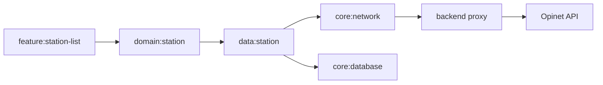

# GasStation v1.2 Evidence, Operations, and Developer Velocity Hardening Design

> 작성일: 2026-05-31
> 목적: GasStation v1.1.3 이후 남은 성능 증거, 공개 배포 운영 경계, 개발 검증 속도 리스크를 하나의 v1.2 hardening scope로 묶되, 구현은 독립 track으로 분리한다.

## 1. 배경

GasStation은 현재 위치 기반 주유소 비교, `demo`/`prod` 정식 경로, Room cache/stale fallback, watchlist 비교, 외부 지도 handoff, 멀티모듈 Clean Architecture, CI, screenshot regression, release 문서, hero benchmark evidence를 갖춘 Android 앱이다.

v1.1.3에서는 `reportFullyDrawn()` 연결, startup/list scroll/refresh macrobenchmark, physical-device 성능 수치, APK size baseline, backend proxy escalation ADR이 들어갔다. 남은 개선 기회는 새 사용자 기능보다 "증거와 운영 마감"에 가깝다.

- `docs/performance.md`에는 baseline profile과 watchlist benchmark가 아직 known limitation으로 남아 있다.
- backend proxy는 ADR로 승격 조건만 기록되어 있고, 실제 전환 계약과 운영 체크리스트는 아직 구현 스펙으로 닫히지 않았다.
- Gradle parallel/build cache, release assemble gate, CI matrix 비용은 조건부 backlog로 남아 있고 측정 기반 결정이 필요하다.

이번 스펙은 이 세 영역을 하나의 umbrella scope로 묶는다. 단, benchmark 안정화, proxy readiness, build/CI velocity는 실패 모드와 검증 환경이 다르므로 구현 계획에서는 별도 track으로 나눈다.

## 2. 목표

1. `openWatchlistFrameTiming`과 `BaselineProfileGenerator.collectHeroJourney`의 불안정성을 닫거나, 닫지 못하면 재현 가능한 원인과 보류 기준을 명확히 남긴다.
2. baseline profile이 생성 가능해지면 app에 적용 가능한 산출물과 측정 절차를 문서화한다.
3. Opinet backend proxy 전환을 Android 계약을 흔들지 않는 방식으로 설계하고, 최소 contract test와 운영 체크리스트를 둔다.
4. Gradle/CI 속도 개선은 before/after timing과 correctness 결과를 기준으로 채택 여부를 결정한다.
5. README, `docs/performance.md`, `docs/verification-matrix.md`, `docs/security-trade-offs.md`, ADR이 서로 모순 없이 v1.2 상태를 설명하게 한다.
6. `demo`와 `prod`가 모두 정식 경로라는 현재 제품 계약을 유지한다.

## 3. 비목표

- station list, watchlist, settings의 사용자 기능 변경
- 전체 UI 리디자인
- 모듈 재편 또는 clean architecture 경계 재작성
- proxy 도입을 이유로 `domain:station`, `feature:*`, cache/watchlist 정책을 바꾸는 작업
- PR CI에 physical-device benchmark를 필수 gate로 추가
- 실제 공개 배포, Play Store release, 운영 서버 배포 자동화
- 성능 수치가 없는 상태에서 README나 문서에 benchmark 개선값을 쓰는 작업

## 4. 접근안 비교

### 4.1 추천안: Umbrella Spec + 3 Independent Tracks

A/B/C를 하나의 v1.2 hardening spec으로 묶고, 구현은 다음 track으로 분리한다.

- Track A: Performance evidence closure
- Track B: Backend proxy readiness
- Track C: Build and verification velocity

장점:

- 외부 메시지는 "v1.2에서 증거, 운영, 검증을 닫았다"로 선명하다.
- benchmark, network operations, CI 변경을 독립적으로 검증할 수 있다.
- 한 track이 blocked되어도 다른 track의 설계와 구현이 진행 가능하다.

단점:

- 구현 계획에서 dependency와 commit boundary를 엄격히 나눠야 한다.
- 문서 업데이트가 여러 곳에 걸쳐 있어 최종 consistency check가 필요하다.

### 4.2 Mega Plan

세 영역을 하나의 구현 pass로 처리한다.

장점:

- 계획 문서가 짧아진다.
- 릴리즈 메시지를 한 번에 만들기 쉽다.

단점:

- physical-device benchmark, proxy contract, CI timing이 서로 다른 실패 모드를 가져 검증이 지저분해진다.
- 한 영역의 blocker가 전체 v1.2 작업을 멈추게 한다.

### 4.3 Three Separate Specs

benchmark, proxy, build/CI를 완전히 별도 spec으로 분리한다.

장점:

- 각 spec의 scope가 가장 작고 명확하다.
- 구현 계획과 review가 단순해진다.

단점:

- GasStation v1.2의 고도화 메시지가 흩어진다.
- README/릴리즈 문서에서 세 작업의 연결 의도가 약해진다.

결정: 4.1을 채택한다.

## 5. Architecture

상위 원칙은 사용자 기능을 유지하고, 증거/운영/검증 레이어를 강화하는 것이다.

### 5.1 Track A: Performance Evidence Closure

소유 경계:

- `benchmark`: hero journey 정의, benchmark helper, baseline profile generator
- `app`: startup/fully-drawn reporting 연결, 필요한 경우 demo/internal entry point 조립
- `feature:station-list`, `feature:watchlist`: 기존 UI, semantics, state contract 유지
- `docs/performance.md`: 측정 정의, 결과, known limitation, 재현 명령

Track A는 production semantics를 benchmark 편의를 위해 망가뜨리지 않는다. selector 안정화가 필요하면 다음 순서로 낮은 위험의 방법을 검토한다.

1. existing semantics와 content description을 유지하면서 UiAutomator selector를 더 구체화한다.
2. demo seed 또는 benchmark setup을 조정해 첫 화면에 bookmark 가능한 station이 안정적으로 노출되게 한다.
3. app이 조립하는 demo/internal-only deep link 또는 benchmark-only entry point로 watchlist state를 만들 수 있게 한다.
4. production user path 자체를 바꾸는 선택지는 마지막 수단으로 두며, 선택 시 feature test와 README/demo story 영향을 같이 점검한다.

### 5.2 Track B: Backend Proxy Readiness

소유 경계:

- proxy design: Opinet API key storage, HTTPS edge, rate limit, upstream HTTP call, response normalization, optional server cache, metrics/alerting
- Android `core:network`: endpoint/runtime config, remote response DTO and mapper
- `data:station`: existing repository orchestration, cache/stale/watchlist fallback 유지
- `domain:station`: `StationQuery`, `StationRepository`, `StationSearchResult`, refresh exception contract 유지
- docs: `docs/security-trade-offs.md`, backend proxy ADR, README/project reading guide links

Android data flow는 다음처럼 유지한다.



`demo`는 proxy 없이 deterministic seed로 계속 동작해야 한다. proxy readiness가 demo seed를 app runtime 우회 경로로 만들면 안 된다.

### 5.3 Track C: Build And Verification Velocity

소유 경계:

- `gradle.properties`: parallel/build cache 같은 repo-wide defaults
- `build-logic`: 반복 Gradle/test convention
- `.github/workflows/android.yml`: PR fast feedback, main/tag confidence gates
- `docs/verification-matrix.md`: 실제 명령의 단일 출처
- `docs/test-strategy.md`: gate가 어떤 리스크를 막는지 설명

Track C는 "빠를 것 같다"가 아니라 측정으로 결정한다. 기본 흐름은 다음이다.

1. 현재 fast path와 머지 전 권장 회귀 세트의 baseline timing을 기록한다.
2. parallel/build cache/release gate 변경을 하나씩 적용해 correctness와 timing을 비교한다.
3. flaky하거나 환경 의존이 큰 설정은 기본값으로 켜지 않는다.
4. 채택한 설정과 보류한 설정을 `docs/verification-matrix.md`와 release notes에 기록한다.

## 6. Track A Requirements

### A1. Current Limitation Reproduction

- physical device 또는 emulator smoke에서 `openWatchlistFrameTiming`과 `BaselineProfileGenerator.collectHeroJourney`가 현재 어떻게 실패하는지 재현한다.
- 실패 메시지는 selector, phase, setupBlock/measureBlock 여부, device state를 구분할 수 있어야 한다.
- 재현 없이 helper를 바꾸지 않는다.

### A2. Stable Watchlist Benchmark Path

- watchlist benchmark는 seeded station list에서 실제 저장 action을 통하거나, demo/internal-only state setup을 통해 저장된 station이 있는 상태로 시작한다.
- "관심 주유소 카드" 표시 여부는 existing accessibility semantics 또는 명시적 stable test tag로 확인한다.
- benchmark helper는 selector timeout과 stale object retry를 단계별 message로 드러낸다.

### A3. Baseline Profile Generation

- baseline profile journey는 startup, first station-list content, refresh, scroll, watchlist entry를 포함한다.
- generation path와 measurement path를 혼동하지 않는다. Measurement benchmark는 좁고 안정적인 hero journey를 유지하고, baseline profile generation은 앱 사용 경로 커버리지를 넓게 가져간다.
- baseline profile이 성공하면 generated profile 적용 위치와 재생성 명령을 문서화한다.

### A4. Documentation

- 성공한 physical-device 측정값만 README 성능 수치로 사용한다.
- 실패한 경우에도 invented number를 쓰지 않고 known limitation을 최신 원인/다음 조사 후보로 갱신한다.
- `docs/performance.md`는 device model, Android version, variant, compilation mode, iteration count, measurement date, JSON path 확인 명령을 포함한다.

## 7. Track B Requirements

### B1. Proxy Contract

Proxy response는 Android-ready normalized payload를 제공한다. Opinet raw DTO를 Android feature나 domain으로 leak하지 않는다.

최소 contract:

- station id
- station name
- brand code or normalized brand
- fuel type
- price in won
- coordinates
- distance source assumptions
- fetched-at timestamp or upstream freshness
- upstream error classification that can map to current `StationRefreshException`

### B2. Android Endpoint Swap Boundary

- `core:network`는 direct Opinet endpoint와 proxy endpoint를 runtime config로 선택 가능해야 한다.
- `domain:station` public contract는 바꾸지 않는다.
- `data:station` cache key, retry policy, pruning, watchlist summary assembly는 그대로 유지한다.
- `prod` direct Opinet path는 proxy가 준비되기 전까지 계속 assemble/test 가능해야 한다.

### B3. Operational Checklist

Proxy readiness 문서는 최소한 다음 운영 질문에 답해야 한다.

- Opinet key는 어디에 저장하고 어떻게 rotate하는가?
- Android client와 proxy 사이 traffic은 HTTPS인가?
- quota/rate limit 초과 시 Android에는 어떤 failure type으로 보이는가?
- upstream HTTP cleartext는 server boundary 안에만 남는가?
- proxy cache가 Android Room stale fallback과 충돌하지 않는가?
- metrics와 alert은 어떤 event를 기준으로 잡는가?

### B4. Security Documentation

- `docs/security-trade-offs.md`와 backend proxy ADR은 서로 같은 escalation condition을 말해야 한다.
- README는 proxy를 이미 운영 중인 것처럼 표현하지 않는다.
- 공개 배포 전 필수 조건과 현재 portfolio/demo scope의 수용 근거를 구분한다.

## 8. Track C Requirements

### C1. Baseline Timing

다음 명령 또는 repo가 정한 동등한 fast path의 before timing을 남긴다.

```bash
./gradlew \
  :core:model:test \
  :domain:location:test \
  :core:observability:test \
  :core:designsystem:testDebugUnitTest \
  :feature:station-list:testDebugUnitTest \
  :feature:watchlist:testDebugUnitTest \
  :feature:settings:testDebugUnitTest \
  :app:assembleDemoDebug \
  :app:testDemoDebugUnitTest \
  :app:testProdDebugUnitTest \
  :benchmark:assemble
```

Timing은 local machine과 CI를 구분한다. 로컬 timing만으로 CI default를 바꾸지 않는다.

### C2. Parallel And Build Cache Decision

- `org.gradle.parallel=true`는 correctness가 확인되면 기본 활성화 후보가 된다.
- `org.gradle.caching=true`는 local/CI cache hit rate와 output correctness를 같이 확인한다.
- `org.gradle.configuration-cache=true`는 Hilt/KSP/Room, demo seed task, benchmark task compatibility를 별도 판단하기 전까지 기본 scope에 포함하지 않는다.

### C3. Release Assemble Gate

- `:app:assembleProdRelease`는 R8/minify 회귀를 잡는 장점이 있다.
- 모든 PR에서 너무 느리면 main/tag push 또는 release-related path condition으로 둔다.
- gate 위치는 `.github/workflows/android.yml`과 `docs/verification-matrix.md`가 같은 내용을 말해야 한다.

### C4. Verification Matrix Update

`docs/verification-matrix.md`는 다음을 구분한다.

- quick local check
- path-specific confidence check
- merge-before recommended regression set
- release/deployment check
- physical-device benchmark evidence
- CI job scope

## 9. Error Handling

### 9.1 Track A

- benchmark가 실기기/환경 의존으로 실패하면 숫자를 만들지 않는다.
- selector 안정화는 accessibility semantics 제거가 아니라 stable selector 보강으로 해결한다.
- baseline profile generation이 계속 실패하면 failure phase와 attempted remediation을 문서화하고 implementation plan의 후속 blocker로 남긴다.

### 9.2 Track B

- proxy schema가 Opinet raw shape에 결합되면 실패로 본다.
- proxy가 없을 때 Android `demo`와 existing direct `prod` assemble이 깨지면 실패로 본다.
- key handling, rate limit, monitoring이 구체적인 owner와 decision 없이 남으면 readiness scope가 미완료다.

### 9.3 Track C

- parallel/cache가 flaky test나 incorrect task output을 만들면 기본값으로 채택하지 않는다.
- release assemble gate가 feedback time을 과하게 늘리면 조건부 gate로 둔다.
- timing 자료가 없으면 velocity 개선을 완료로 보지 않는다.

## 10. Testing Strategy

### Track A Tests

Required checks:

```bash
./gradlew :app:assembleDemoBenchmark :benchmark:assembleBenchmark
ANDROID_SERIAL=<device serial> ./gradlew :benchmark:connectedBenchmarkAndroidTest
```

If no physical device is available during implementation, the plan must stop before publishing new committed performance numbers. Emulator smoke may be used only to validate selectors and build wiring.

Targeted source tests depend on the chosen solution:

- benchmark-only deep link or state setup: app demo/debug unit or instrumentation coverage
- semantics/test tag adjustment: relevant `feature:*:testDebugUnitTest`
- fully drawn reporting adjustment: `app:testDemoDebugUnitTest` or existing startup reporter tests

### Track B Tests

Required checks:

```bash
./gradlew :core:network:test :data:station:testDebugUnitTest
./gradlew :app:assembleDemoDebug :app:assembleProdDebug
```

Proxy contract tests should run without live Opinet or live proxy dependency. If a proxy implementation is added in this repo, it needs its own unit/contract test command and documentation.

### Track C Tests

Required checks depend on touched files, but the expected verification set is:

```bash
./gradlew spotlessCheck lint
./gradlew \
  :core:model:test \
  :domain:location:test \
  :core:observability:test \
  :core:designsystem:testDebugUnitTest \
  :feature:station-list:testDebugUnitTest \
  :feature:watchlist:testDebugUnitTest \
  :feature:settings:testDebugUnitTest \
  :app:assembleDemoDebug \
  :app:testDemoDebugUnitTest \
  :app:testProdDebugUnitTest \
  :benchmark:assemble
./gradlew verifyRoborazziDebug
```

Release gate decisions require:

```bash
./gradlew :app:assembleProdRelease
```

## 11. Documentation Updates

Expected live docs affected by implementation:

- `README.md`: v1.2 summary, performance snapshot only if real numbers exist, proxy readiness wording if applicable
- `CHANGELOG.md`: Unreleased entry for benchmark/proxy/build hardening
- `docs/performance.md`: Track A source of truth
- `docs/verification-matrix.md`: Track C source of truth
- `docs/test-strategy.md`: benchmark and CI gate meaning
- `docs/security-trade-offs.md`: Track B security trade-off alignment
- `docs/adr/2026-05-18-backend-proxy-escalation.md`: update only if the accepted escalation path changes
- `docs/deployment.md`: release gate changes if Track C changes main/tag requirements

`AGENTS.md` should not grow unless a principle applies to every future worker. Track-specific details belong in the specialist docs above.

## 12. Acceptance Criteria

This v1.2 hardening scope is complete when all selected implementation tracks satisfy these conditions.

### Track A Acceptance

- watchlist benchmark and baseline profile path either pass on a physical device or have a current, concrete limitation entry with reproduction evidence.
- `docs/performance.md` no longer contains stale remediation history that contradicts current code.
- README performance numbers are updated only from physical-device output.
- benchmark commands in `docs/verification-matrix.md` match actual Gradle tasks.

### Track B Acceptance

- proxy contract and Android endpoint swap boundary are specified and tested without requiring live Opinet.
- Android `demo` stays deterministic and proxy-independent.
- existing `prod` direct path still assembles unless a separately approved implementation explicitly replaces it.
- security docs and ADR agree on escalation conditions.

### Track C Acceptance

- before/after timing is recorded for every adopted build/CI change.
- parallel/build cache defaults are adopted only after correctness checks pass.
- CI gate changes are reflected in both workflow and verification matrix.
- release assemble gate has an explicit placement decision.

### Overall Acceptance

- no feature module directly depends on Room, Retrofit, DataStore, or `core:location` implementation because of this work.
- no domain model exposes Android/UI/storage DTO types.
- no invented benchmark or performance claim is committed.
- all changed docs pass `git diff --check`.

## 13. Implementation Planning Notes

The implementation plan should split work into track commits with clear stop points:

1. Track A investigation and reproduction.
2. Track A stable benchmark/baseline profile remediation.
3. Track B proxy contract and Android boundary readiness.
4. Track C baseline timing and build/CI decisions.
5. Final docs consistency and verification.

If Track A physical-device access is unavailable, the plan should still complete Track B and Track C, then leave Track A performance numbers unchanged with a documented blocker. This avoids blocking non-device work on hardware availability while preserving source fidelity.
