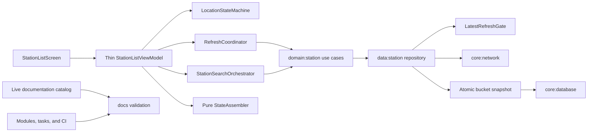

# Architecture, Code, And Documentation Quality Hardening Design

**Date:** 2026-08-12

**Status:** Approved design

**Baseline:** `main` at `66b350f`

**Scope:** Station data correctness, feature state concurrency, responsibility boundaries, test and CI quality gates, build reproducibility, and documentation information architecture

## Goal

Raise GasStation's engineering quality without changing its product identity or expanding its runtime module graph unnecessarily.

The program must make price and location decisions trustworthy under concurrency, make screen state transitions deterministic, keep business policy in the existing domain/data boundaries, turn quality reports into low-noise regression gates, and make current documentation easy to find and mechanically verifiable.

The desired outcome is not a large rewrite. It is a staged hardening of the current architecture in which every new invariant is protected by a focused test and reflected in the live documentation that owns it.

## Product Invariants

The following behavior remains unchanged unless a later approved design explicitly replaces it:

- `demo` and `prod` are both first-class runtime paths.
- Price remains the first reading target. Distance, station identity, brand, fuel, watch state, freshness, and failure state remain supporting context.
- The Urban Signal yellow, black, and white identity remains intact.
- A successful empty result is distinct from no cache.
- A refresh failure preserves the previous usable snapshot.
- Watchlist remains a saved-item comparison surface, not a duplicate of the nearby list.
- Cancellation is not converted into a retry, analytics failure, crash report, or user-visible error.

## Baseline Findings

The design is based on the active modules in `settings.gradle.kts`, current production and test code, live contracts, and focused verification at `66b350f`.

### Existing strengths

- The 18 active Gradle modules already express useful app, feature, domain, data, and core boundaries.
- `StationSearchResult.hasCachedSnapshot` distinguishes a valid empty snapshot from no cached search.
- Snapshot replacement, price history insertion, and pruning already share an outer persistence transaction.
- Direct and proxy network paths already share `StationNetworkSource` and perform substantial payload validation.
- Settings and location have explicit domain contracts rather than exposing DataStore or Android providers to features.
- Static analysis, module-boundary checks, Compose test API checks, Roborazzi, aggregate coverage reporting, and domain mutation testing already exist.
- Live documentation is explicitly separated from plans, evidence, and history by `docs/AGENTS.md` and `docs/agent-workflow.md`.

### Verified risks

#### P1: same-bucket refresh response inversion

Two refreshes for the same cache key can complete in reverse order. The older request can persist after the newer request and replace a newer snapshot with older prices and an older timestamp.

#### P1: freshness does not advance without a database emission

Freshness is recalculated when Room emits. A screen opened just before the five-minute boundary can continue to display a fresh state after the snapshot has aged beyond the documented threshold if the database does not change.

#### P1: proxy fuel context is not enforced

The proxy response includes a fuel type, but the current mapper does not require it to match the request. A mismatched response can therefore contaminate the requested fuel bucket and its price history.

#### P1: location and observation races

A precise-to-approximate permission change can allow an older location result to commit after a newer permission state. An exception from the search observation flow can also end collection permanently instead of leaving a retryable state.

#### P1: quality-gate blind spots

The default lint path does not check test sources. The opt-in path currently fails with four errors and fifty warnings. Root lint primarily exercises the demo Android variant, while several JVM modules are reported as external dependencies. Aggregate coverage is reported but not verified against a threshold.

#### P2: non-atomic marker and row observation

The repository combines separate Room flows for the snapshot marker and station rows. Even though writes are transactional, the two reads do not guarantee that every emitted pair came from the same database read snapshot.

#### P2: incomplete error and schema contracts

HTTP status codes do not have an explicit retry classification, Room schema export is disabled, and best-effort crash reporting can theoretically replace the recoverable error it was meant to record.

#### P2: documentation navigation and drift

The repository has strong live-document ownership rules, but current contracts and historical evidence share a physically large tree without a compact `docs/` landing page or directory indexes. Exact module graphs and long verification commands are duplicated across documents, while existing contract checks do not provide a general live-document link and catalog gate.

## Architectural Direction

Keep the current Gradle module graph. Improve boundaries inside the modules that already own the behavior.



The ViewModel remains the lifecycle owner and composition point, but it no longer owns every transition, job, and projection itself. Data correctness remains in `data:station` and `core:database`; feature code must not compensate for repository races.

No new Gradle module, global MVI framework, generic effect framework, or application-wide coordinator is introduced by this program.

## Decision 1: Latest-Intent Refresh Persistence

### Contract

`data:station` introduces a cache-key-scoped `LatestRefreshGate`.

1. Starting a refresh registers a monotonically increasing generation for its `StationQueryCacheKey`.
2. Remote requests for different keys remain independent.
3. Multiple requests for the same key may perform remote work concurrently.
4. A completed request can persist only through `commitIfLatest(key, generation)`.
5. Generation registration, the latest-generation check, and the snapshot transaction are serialized for that key.
6. If a newer generation was registered first, the older completion is superseded and performs no database mutation.
7. `fetchedAt` is assigned when the validated latest result enters the write path, not when the remote request started.

This defines “latest” as the most recently started user/system refresh intent for the cache key, not the last network response to arrive.

### Cancellation and failures

- Cancellation before persistence exits silently and preserves the current snapshot.
- A superseded response is not an error and emits no failure UI.
- Invalid payloads never enter `commitIfLatest`.
- Persistence failure preserves the prior snapshot and is reported through the existing refresh failure contract.
- Gate state is bounded: a key entry is removable only after every registered generation has completed, so an older in-flight response cannot outlive the latest-generation tombstone.

### Required tests

- Reverse A/B completion order and prove that only B becomes the final snapshot.
- Register B before A commits and prove that A performs no database write.
- Cancel A after B succeeds and prove that A cannot overwrite B.
- Prove that different cache keys can progress independently.
- Prove that empty successful results obey the same latest-generation rule.

## Decision 2: Atomic Bucket Snapshot Observation

`core:database` exposes one bucket snapshot read contract containing both the marker and its rows.

```text
StationBucketSnapshot(
  marker: StationCacheSnapshotEntity?,
  rows: List<StationCacheEntity>
)
```

The public observation path is a single `Flow<StationBucketSnapshot>`. Its implementation observes invalidations for both participating tables and performs each marker-plus-rows read through one Room transaction. Repository code no longer combines two independently read Room flows.

Every emitted value must satisfy:

- no marker means no cached snapshot and no rows;
- an empty successful snapshot has a marker and zero rows;
- non-empty rows all belong to the marker's cache key and share its persisted snapshot timestamp;
- marker and rows reflect the same transactional read;
- pruning and replacement cannot expose a mixed old/new pair.

The database contract remains storage-specific. Domain and feature modules receive only the existing domain search result.

## Decision 3: Time-Driven Freshness

Freshness remains a `data:station` cache policy, not a feature timer.

- `age <= 5 minutes` is fresh.
- `age > 5 minutes` is stale.
- Each observed snapshot schedules one cancellable boundary emission for the first clock precision unit after five minutes.
- A new snapshot cancels the previous boundary job and schedules its own.
- Collector cancellation cancels the timer.
- No database mutation is performed merely to update freshness.

Tests use a fake clock and virtual coroutine time. They must cover exactly five minutes, five minutes plus one clock unit, rescheduling, and cancellation.

## Decision 4: Direct And Proxy Semantic Parity

Both endpoint modes normalize into the same domain meaning.

- Proxy mapping receives the expected `FuelType`.
- A response fuel type that does not exactly match the request makes the response invalid; its rows are not cached under another fuel bucket.
- Direct and proxy paths share a contract-test corpus for valid, partially invalid, wholly invalid, empty, out-of-range coordinate, and non-positive price payloads.
- If the proxy timestamp is not trusted as the local cache acquisition time, `fetchedAtEpochMillis` is removed from the client DTO. It is not silently retained as an unused alternative truth.
- The local validated write time remains the cache freshness timestamp.

This change does not add a third endpoint mode or move endpoint selection out of `app` wiring.

## Decision 5: Typed Failure And Retry Policy

Remote and persistence failures retain enough type information for deterministic policy.

| Failure | Retry | User-facing result |
| --- | --- | --- |
| Timeout | Once after the existing bounded delay | Cached result plus refresh failure, or blocking failure without cache |
| Network I/O | Once | Same as timeout |
| HTTP 408 or 429 | Once | Same as network |
| HTTP 5xx | Once | Same as network |
| HTTP 4xx other than 408/429 | No | Non-retryable refresh failure |
| Malformed or invalid payload | No | Invalid payload failure |
| Persistence failure | No remote retry | Preserve previous snapshot and report failure |
| Cancellation | Never | Propagate cancellation |
| Superseded generation | Never | Silent completion |

Observation failure does not permanently terminate the feature. `StationSearchOrchestrator` exposes a recoverable failure and can resubscribe when the active query changes or the user retries. It does not spin in an unbounded automatic retry loop.

`core:observability` supplies a best-effort non-fatal reporting helper that catches ordinary reporter exceptions while allowing fatal `Error` and coroutine cancellation to preserve their normal meaning.

## Decision 6: Room Schema Evidence

Enable Room schema export and check versioned schema JSON into the repository.

- Migration tests use exported schemas as their historical starting evidence.
- Every supported start version is migrated to the current version.
- The intentional version 2 to 3 price-history reset remains explicit in the migration name, test, and live storage documentation.
- Future schema changes fail verification if the exported schema changes without the matching migration evidence.

This does not promise recovery of explicitly disposable historical price data that older migrations intentionally discarded.

## Decision 7: Deterministic Feature State Ownership

### Thin `StationListViewModel`

The ViewModel owns lifecycle collection, receives user actions, coordinates collaborators, and publishes `StationListUiState`. It does not directly contain every permission, address, refresh, search, command, and display-reduction rule.

### `LocationStateMachine`

It owns:

- permission and location-availability transitions;
- precise/approximate permission generation;
- current-location request generation;
- address-resolution generation;
- rejection of results that do not match the active generation;
- cancellation of obsolete location and address work.

A permission downgrade invalidates any in-flight result started under the previous permission precision. Address labels follow the same latest-generation rule as coordinates.

### `RefreshCoordinator`

It owns:

- refresh eligibility;
- manual versus automatic refresh intent;
- the active refresh job per query;
- progress and retry indicators;
- cancellation when permission, location, or query eligibility changes;
- delegation to station refresh use cases.

It does not read Room or network implementations directly.

### `StationSearchOrchestrator`

It owns the active query observation, cached-result interpretation, search failure, and explicit resubscription. Refresh job ownership moves out of this component so observation and mutation lifecycles are not conflated.

### Pure `StationListStateAssembler`

The assembler receives immutable location, preferences, search, refresh, watch, and command inputs and returns `StationListUiState`. It performs no I/O, starts no coroutine, and reads no clock. A transition table test protects priority among permission guidance, GPS guidance, loading, cached content, empty content, stale content, and blocking failure.

## Decision 8: Durable One-Shot UI Commands

One-shot UI work that must survive a temporary absence of collectors is represented as a small FIFO queue in feature state.

- Every command has a stable unique ID.
- The UI handles only the head command.
- After an attempt, the UI acknowledges that exact ID.
- The ViewModel removes a command only if the acknowledgement matches the current head.
- Recomposition does not repeat an acknowledged command.
- Collector gaps do not drop a pending command.
- `collectLatest` cancellation cannot silently discard a queued command.

The queue is for bounded UI commands such as opening system settings, external-map handoff, or visible transient feedback. Continuous screen state remains ordinary `StateFlow`; bulk event sourcing and a generic application effect bus are outside scope.

The queue protects lifecycle collector gaps and recomposition. It does not promise command persistence across process death unless an existing command has a separately documented saved-state requirement.

Watch mutations follow the same latest-user-intent principle. Changes for one station ID are serialized or coalesced so a rapid ON then OFF cannot finish as ON. Reapplying ON to an already watched station does not unintentionally change `watchedAt` ordering.

## Decision 9: Architecture And API Boundary Gates

The existing module-boundary task remains, but its contract expands beyond `api` and `implementation` project edges.

- Inspect every production compile configuration through which a project dependency can affect compilation.
- Declare allowed project and external dependency families per architectural layer.
- Fail if domain public signatures expose Android, Compose, Room, Retrofit, or DataStore types.
- Introduce explicit API mode first as warning for `domain:*`, `core:model`, and `core:observability`, then promote it after the current surface is reviewed.
- Add binary API dumps only for modules whose public contracts are consumed across module boundaries.
- Protect convention plugins and root quality tasks with focused Gradle TestKit tests.

The design does not attempt to prove semantic architecture solely through dependency graphs. Focused contract tests continue to protect policy placement and public types.

## Decision 10: Staged Static Analysis And Warning Ratchets

The first quality-gate objective is to remove blind spots without turning existing debt into noise.

1. Fix the four current test-source lint errors.
2. Run demo and prod app lint explicitly.
3. Add a separate blocking test-source lint path.
4. Review existing production warnings, suppress only intentional cases, and freeze the remainder as a baseline.
5. Reject new warnings relative to the reviewed baseline.
6. Enable Kotlin warnings-as-errors incrementally for changed or cleaned modules.
7. Validate that coverage XML contains expected source files and non-zero totals so a broken class-directory path cannot look like successful coverage.

Adding Detekt, Sonar, or another formatter is not part of this program. Existing Spotless and Android/Kotlin analysis are strengthened first.

## Decision 11: Coverage, Mutation, And Device Gates

The observed aggregate baseline at the design commit is approximately 41.95% line and 46.59% branch coverage. It includes generated and compiler-shaped surfaces and is not used as a single global blocking threshold.

### Coverage policy

- Changed code: at least 80% line and 70% branch coverage.
- Domain and core policy targets: 90% line and 80% branch.
- Data and state-holder targets: 85% line and 70% branch.
- Compose rendering is protected primarily by semantics, state projection, and Roborazzi contracts rather than a raw global line threshold.
- Per-module baselines start from a clean CI measurement and may not decrease by more than 0.5 percentage points without an explicit reviewed exception.
- Ratchets rise gradually; a release raises a floor by no more than two percentage points at once.

### Mutation policy

- `domain:station`: blocking threshold 45%.
- `domain:location`: blocking threshold 75%.
- `domain:settings`: remains report-only until equivalent and coroutine mutants are reviewed, then starts at a justified floor rather than inheriting a guessed target.
- No-coverage mutant count may not increase in a changed policy package.
- PIT remains limited to high-value JVM policy modules rather than Android and Compose surfaces.

### Device policy

- API 24 protects the minimum supported runtime.
- API 28 protects permission and legacy platform behavior implicated by current lint findings.
- API 36 protects the current target-era runtime.
- PRs keep a focused, bounded device path; a scheduled matrix provides broader API coverage.
- Failed device jobs upload JUnit XML, logcat, and screenshots.
- Automatic retry does not hide flaky tests. A quarantine requires an owner, issue, and seven-day expiry.

## Decision 12: Build Reproducibility

Apply reproducibility controls in reviewable increments:

1. add the Gradle wrapper distribution checksum;
2. generate and review dependency verification metadata;
3. pin GitHub Actions to reviewed commit SHAs;
4. replace floating runner assumptions where a stable supported image is available;
5. add TestKit coverage for convention behavior and quality-task discovery.

Dependency locking or verification updates must be narrow and reviewable. Generated verification metadata is not accepted without checking its resolved artifacts.

## Decision 13: Documentation As Architecture

Documentation is a parallel engineering track, not a final cleanup task.

### Stable paths with a new hub

Add `docs/README.md` as the compact documentation portal. Preserve existing live-document paths to avoid unnecessary link churn.

The hub exposes four reader paths:

1. new contributor and local execution;
2. architecture or feature change;
3. testing, release, and operational verification;
4. ADR, evidence, plans, and historical research.

`docs/project-reading-guide.md` then focuses on question-to-code and change-to-contract navigation instead of also serving as the full document catalog.

### Document classes

| Class | Meaning | Examples |
| --- | --- | --- |
| Product | User value, supported runtime, quick start | Root `README.md` |
| Contract | Current behavior and ownership | architecture, state, offline, module contracts |
| Runbook | Repeatable verification or operation | verification, deployment, performance |
| Decision | Accepted architectural decision | Current ADRs |
| Evidence | Dated measurement tied to commit and environment | Compose metrics, release evidence |
| History | Past proposal, plan, or completed-work record | superpowers, history, improvements |

### Machine-readable catalog

Add `docs/documentation-catalog.json` for live documents. Each entry contains:

- `path`;
- `kind`;
- `owner`;
- `authoritativeSources`;
- `reviewTriggers`;
- `verificationScope`.

Historical directories are classified by their directory hubs and are not individually promoted to current contracts.

### Split oversized documents without breaking entry paths

- Keep `docs/onboarding/developer-onboarding-guide.md` as the onboarding hub and extract getting started, architecture tour, change playbook, and verification/delivery guides beneath `docs/onboarding/`.
- Keep `docs/verification-matrix.md` as the canonical change-to-verification selector. Device execution details move to `docs/runbooks/device-verification.md`; deployment and performance details remain owned by their existing specialist documents.
- Root README keeps product overview and quick start. The exact active module graph is owned only by `docs/architecture.md`.
- Long Gradle commands have one canonical runbook owner; other documents link to that owner.

### Historical navigation

Add concise hubs for:

- `docs/adr/`;
- `docs/superpowers/`;
- `docs/history/`;
- `docs/improvements/`;
- `docs/compose-metrics/`;
- `docs/release-notes/`.

Generate a deterministic filename-and-date index for the large `docs/superpowers/` tree. Do not infer approval or completion status from filenames. Do not rewrite historical claims to match current code.

### Documentation style

- Korean prose is the default for live documentation; code identifiers and official technology names keep their source spelling.
- State the current answer or contract before background detail.
- One current fact has one owning document.
- Commands include prerequisites, expected output, failure action, and verification depth.
- Measurements include date, commit, environment, and evidence path.
- A recent edit date alone is not evidence that a document is current.

Provide focused templates for a live contract, ADR, runbook, and dated evidence report.

### Automated documentation gate

Add a deterministic standard-library validator under `scripts/docs/` and invoke it from `scripts/agent/verify.sh docs`.

PR-blocking checks cover:

- every live document appears exactly once in the catalog;
- required catalog fields are present;
- internal links from live documents resolve;
- every live document is reachable from the documentation hub;
- referenced modules, repository paths, Gradle tasks, and CI jobs exist;
- generated historical indexes are current;
- live documents contain no unresolved placeholder markers, local absolute paths, or likely secret values;
- exact command ownership markers do not nominate multiple canonical owners.

External links are checked on a scheduled non-blocking path because network availability is not a stable PR signal. Historical placeholder links are reported separately; the validator does not force a mass rewrite of immutable design history.

## Cross-Cutting Data Flow

```text
permission/settings/location readiness
  -> LocationStateMachine generation
  -> active StationQuery
  -> StationSearchOrchestrator observes cached bucket
  -> RefreshCoordinator registers refresh generation
  -> repository fetches and validates remote response
  -> LatestRefreshGate accepts only current generation
  -> one Room transaction replaces snapshot/history
  -> atomic bucket observation emits marker + rows
  -> time-driven cache policy emits Fresh, then Stale
  -> pure StateAssembler projects StationListUiState
  -> screen renders state and acknowledges queued commands by ID
```

Every asynchronous boundary has an explicit owner, generation or cancellation rule, and failure meaning.

## Execution Phases

### Phase 0: Baseline and guardrail readiness

- Capture clean unit, lint, coverage, mutation, docs, and assemble evidence.
- Fix the four current test-source lint errors before enabling the gate.
- Add documentation catalog/validator foundations without reorganizing historical content.
- Add failing regression tests for the P1 data and state races.

Exit condition: the existing baseline is reproducible, known debt is recorded, and each P1 defect has a deterministic RED test.

### Phase 1: Data correctness

- Implement latest-generation refresh persistence.
- Introduce atomic bucket snapshot observation.
- Add time-driven stale emission.
- Enforce proxy fuel parity and shared normalization contracts.
- Add typed HTTP retry policy and safe crash reporting.
- Enable Room schema export and migration evidence.
- Update `docs/offline-strategy.md`, `docs/architecture.md`, and relevant testing contracts in the same phase.

Exit condition: reverse-order, mixed-snapshot, stale-boundary, payload-parity, retry, and migration tests pass.

### Phase 2: State and concurrency integrity

- Add permission, location, and address generations.
- Make observation failure recoverable.
- Introduce durable FIFO UI commands with acknowledgement.
- Serialize or coalesce watch mutation by station ID.
- Update `docs/state-model.md` and user-flow tests.

Exit condition: obsolete async results cannot commit, command gaps do not lose work, and rapid watch changes preserve final user intent.

### Phase 3: Responsibility split

- Extract `RefreshCoordinator` and pure `StationListStateAssembler`.
- Narrow `StationSearchOrchestrator` to observation and cached-result interpretation.
- Reduce `StationListViewModel` to lifecycle coordination and action routing.
- Split large tests by behavior while retaining shared fixtures only where they clarify contracts.
- Update architecture and module contracts.

Exit condition: each collaborator has one documented purpose, focused unit tests, and no new forbidden dependency.

### Phase 4: Quality and reproducibility gates

- Enable explicit demo/prod and test-source lint paths.
- Add new-warning, changed-code coverage, module/API, and selected mutation ratchets.
- Add TestKit coverage for build logic.
- Add scheduled API-level device evidence and diagnostic artifacts.
- Apply wrapper, dependency, Actions, and runner reproducibility controls incrementally.
- Update test strategy, verification matrix, deployment, and performance runbooks.

Exit condition: every new blocking gate passes at the same final commit and has a documented local reproduction command.

### Phase 5: Documentation information architecture

- Complete the docs hub, catalog, directory indexes, style guidance, and templates.
- Split onboarding and verification content while preserving stable entry paths.
- Remove exact module-graph and canonical-command duplication.
- Classify historical areas without rewriting their claims.
- Run the full live-document validation.

This phase completes structural cleanup, but live documents are updated during every earlier phase rather than deferred here.

## Verification Strategy

Implementation follows test-driven development for every behavioral change.

### Focused tests

- `core:network`: direct/proxy normalization and requested-fuel parity.
- `core:database`: atomic bucket read, replacement, pruning, and migrations.
- `core:observability`: reporter failure isolation.
- `data:station`: refresh generation, freshness boundary, retry classification, cache preservation, and watch intent.
- `domain:*`: policy and public contract tests plus selected PIT.
- `feature:station-list`: location generations, observation recovery, refresh coordination, state projection, and command acknowledgement.
- `feature:watchlist`: rapid mutation and selected-fuel fallback behavior.
- `app`: flavor assembly, navigation, permission, and external handoff contracts.

### Layered regression

1. changed-module unit tests;
2. adjacent feature and repository tests;
3. static analysis and architecture gates;
4. aggregate coverage and selected mutation tests;
5. Roborazzi and semantics contracts;
6. demo/prod assembly;
7. bounded API 24, 28, and 36 device flows where available;
8. documentation validation;
9. `scripts/agent/verify.sh auto` at final HEAD.

No completion claim is made from a partial or stale verification run. Device or production-network evidence that is unavailable is reported explicitly rather than inferred from unit tests.

## Documentation Definition Of Done

- A reader can reach every current contract from `docs/README.md` in at most two links.
- Every current architectural or operational fact has one owning live document.
- Live internal links have zero unresolved targets.
- Root README no longer duplicates the exact active module graph.
- Canonical long commands are not duplicated across live documents.
- Historical documents are visibly classified and are not silently rewritten as current truth.
- The documentation catalog and generated indexes are deterministic and current.
- `scripts/agent/verify.sh docs` passes at the final commit.

## Program Definition Of Done

- An older same-bucket response cannot overwrite the latest refresh intent.
- Marker, rows, and freshness never expose a mixed database snapshot.
- Freshness changes after time passes even without a database mutation.
- A proxy response cannot contaminate another fuel bucket.
- Retry behavior is deterministic by failure type and preserves cancellation.
- Permission, coordinate, and address results commit only for their current generation.
- Search observation can recover after failure.
- Queued UI commands survive collector gaps and execute at most once after acknowledgement.
- Rapid watch changes preserve the last user intent.
- `StationListViewModel` is a coordinator rather than the owner of independent policies.
- Test-source and prod lint blind spots are closed.
- Changed-code coverage and selected mutation gates meet their approved floors without applying a noisy global threshold.
- Public API and dependency rules protect the documented module boundaries.
- Build and CI inputs have reviewed reproducibility controls.
- Live code, tests, and documentation describe the same final behavior.

## Non-Goals

- Adding new product features or redesigning the visual interface.
- Creating new Gradle modules solely to reduce file size.
- Replacing the current architecture with global MVI, Redux, event sourcing, or a generic use-case framework.
- Introducing Detekt, Sonar, a second formatter, or Android-wide mutation testing before existing tools are made effective.
- Making all connected tests blocking on every pull request.
- Hiding flaky tests behind automatic retries.
- Setting the current aggregate coverage percentage as a universal gate.
- Rewriting all historical plans and evidence to match the present repository.
- Using external-link network failures as a pull-request blocker.
- Pushing, opening a pull request, releasing, or deploying as part of this design-only step.

## Implementation Planning Constraints

The implementation plan must:

- preserve the phase order above;
- use RED/GREEN focused tests before production changes;
- keep commits narrow enough to review data, state, quality-gate, and documentation effects independently;
- update live documentation in the same phase as the code contract it describes;
- record every baseline and ratchet from a clean run rather than copying the observational values in this design;
- include explicit rollback points for new CI gates;
- end with independent code review, `git diff --check`, full relevant verification, and an exact local-versus-remote status report.

The plan may refine filenames and private implementation details after focused test discovery, but it may not weaken the invariants, ownership boundaries, failure meanings, or quality floors approved here without returning for design review.
